### Режимы работы закладки T-FLEX DOCs в CAD
Необходимо ввести четыре варианта (разный набор команд) отображения закладки интеграции T-FLEX DOCs в CAD:
*   — Открыта файловая сборка (открытие файла с локали или файла из DOCs) - **Режим Ф**
*   — Открыта рабочая сессия - **Режим РС**
*   — Открыта динамическая сборка - **Режим ДС**
*   — Ничего не открыто, "Приветствие" - **Режим 0**

### Важные изменения в работе в режиме интеграции:
*   В заголовке вкладки CAD объекта из DOCs **должна быть иконка объекта DOCs**.
*   При работе в CAD с объектами DOCs (не с файлами) взятие в редактирование объекта и файла **должно происходить синхронно**.
	* **Вывод:** Даже в пользовательском контексте для утвержденных объектов нельзя открыть в редактирование (динамич. сборку).
*    На закладке "Приветствие" отображаем команды **Режима 0**
*    При открытии объекта в **Режиме ДС** никогда не выводим диалог "Параметры открытия документа"
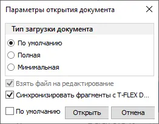
*    При открытии файла в Режиме Ф, на диалоге "Параметры открытия документа" никогда не отображаем флаг "Синхронизировать фрагменты с T-FLEX DOCs"

### Панель "Структура объекта" в CAD
*   Для панели «Структура объекта» в CAD должны сохраняться свои виды (которые не показываются в справочнике). Это важно, т.к. в CAD мы ограничены шириной панели. 
*   Сейчас когда открываешь объект в редактирование, панель «Структура объекта» сбрасывает вид окна (включает вид «Основной»). Нужно чтобы включался **"вид для редактирования"**, который выбрал пользователь.
*   Если в CAD открыт объект в рабочей сессии, панель «Структура объекта» должна подстраиваться под информационную модель изделия и отображать структуру рабочей сессии (сейчас показывает просто дерево ЭСИ). Решается **"видом для редактирования"**.

### Динамическом меню при выборе компонента в сцене
**Добавить:**
*   — погасить
*   — прозрачность
*   — открыть
*   — измерить
*   — преобразование
*   — загрузка геометрии / выгрузка
*   — показать в дереве
*   — открыть в контексте сборки
Убрать:
*   — Создать проекцию
*   — Создать ссылочную геометрию

**Вообще в рабочей сессии:**
*   Заблокировать все инструменты работы в 2D (проецирование). Сейчас создаются проекции в рабочей сессии. Какой в этом смысл?
*   Заблокировать все операции получения ссылочной геометрии в раб. сессии. Сейчас создаются ссылочные элементы в рабочей сессии. Какой в этом смысл?
### Команды закладки T-FLEX DOCs в CAD

#### Изменения в командах интеграции T-FLEX DOCs в CAD

На текущий момент панель выглядит следующим образом:
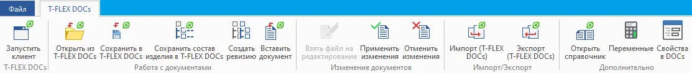

**Команда "Запустить клиент T-FLEX DOCs**
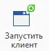
*   — Скрыть с панели во всех режимах

**Команда «Открыть из T-FLEX DOCs»**
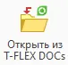
*Сейчас кнопка выполняет действие открытия **файла** из DOCs*
*   — Неправильная иконка. Требуется перерисовать, чтобы она отражала суть открытия файла из DOCs
*   — Переименовать в **"Открыть файл из T-FLEX DOCs"**
*   — Отображать в **Режиме Ф** и **Режиме 0**

**Новая команда "Открыть"**
*   — Отображать в **Режиме РС**, **Режиме ДС** и **Режиме 0**
*   — Сценарий:
	1.  Система предлагает на выбор справочники, перечисленные в информационной модели изделия
	2.  Пользователь выбирает справочник
	3.  Пользователь выбирает объект справочника.
	4.  Пользователь выбирает действие - две кнопки внизу окна:
	    1.   «Открыть» — открыть объект в рабочей сессии.
	    2.   «Редактировать» — открыть в редактирование динамическую сборку.

**Внимание:** Файлы пользователю не показываем (как это сделано сейчас, см. ниже)
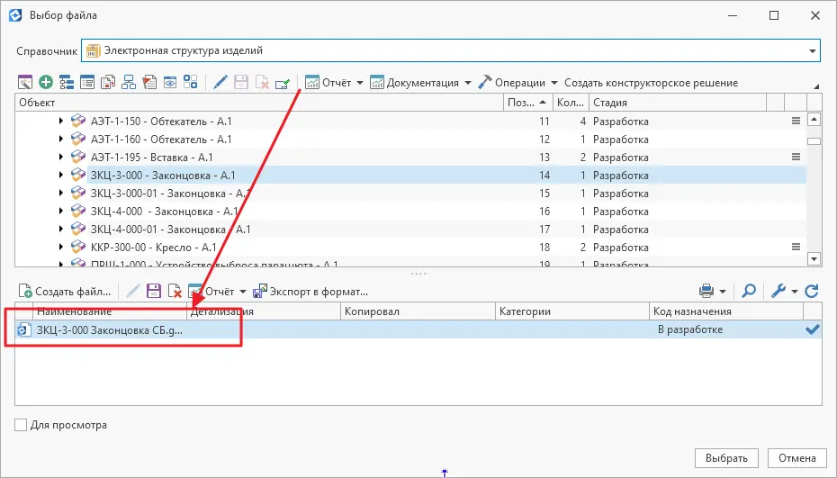

**Команда «Сохранить в T-FLEX DOCs»**
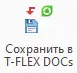
*Сейчас кнопка выполняет действие которое можно интерпретировать «Сохранить **файл** как… в DOCs»*
*   — Только в **Режиме Ф**. 
*   — Необходимо переименовать в **«Импортировать открытый файл в T-FLEX DOCs»**.
*   — Неправильная иконка. Перерисовать иконку, чтобы она отражала суть *импорта файла в DOCs*

**Команда «Сохранить состав изделия в DOCs»**
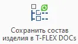
*   — Только в **Режиме Ф** 
*   — Переименовать в **«Импортировать состав изделия в DOCs»**
*   — Сценарий:
	1.  Система предлагает на выбор справочники, перечисленные в правиле интеграции с CAD
	2. Пользователь выбирает справочник
	3. Система выводит привычное окно "Сохранения состава изделия" для выбранного справочника
	4. Пользователь проводит настройку, нажимает "Сохранить"
	5. Система проверяет, возможность сохранения указанной структуры ДО начала выполнения сохранения
	6. Система выполняет импорт состава изделия
**Внимание:** Все действия импорта должны выполняться **единой** транзакцией! Отказ на любом этапе должен приводит к полной отмене всей транзакции.

***Новая* команда "Сохранить"**
*   — В **Режиме ДС** 
*   — Отображает **новое** окно, с указанием:
	* какие параметры объектов будут изменены\обновлены в DOCs (масса объекта, основной материал)
	* как изменится количество подключений
	* оповещение об изменении координат у подключений

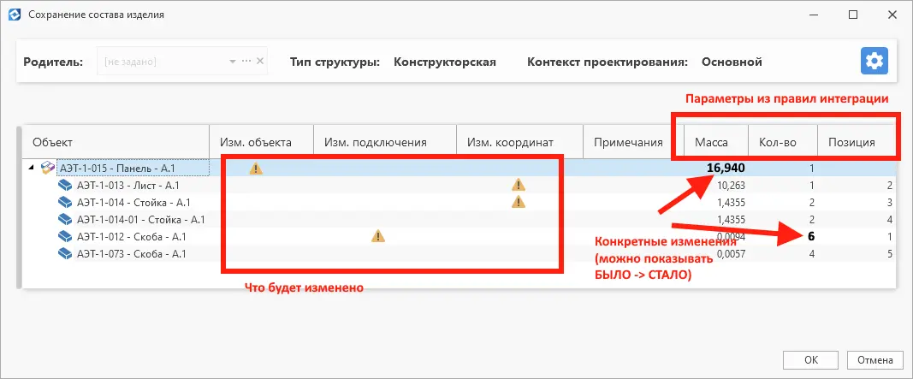

**Внимание:** Команда принципиально **не может создать новый объект или добавить** в состав объект, ни одного экземпляра которого там раньше не было! Команда может увеличить или уменьшить количество объектов в составе (добавить или удалить подключения).
**Внимание:** Все действия сохранения (обновления) данных состава должны выполняться **единой** транзакцией! Отказ на любом этапе должен приводит к полной отмене всей транзакции.

**Команда «Вставить документ»**
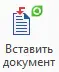
*   — Заменить стандартной командой "3D фрагмент"
*   — Отображать на панели только в **Режиме Ф**

***Новая* команда «Вставить объект»**
*   — Отображать в **Режиме РС** и **Режиме ДС**
*   — Команда контекстно-зависимая. В зависимости от селектированного объекта в дереве рабочей сессии предлагает вставку объектов, определенных по информационной модели изделия (дочерние или по связи).
*   — Сценарий:
	1.  Система предлагает на выбор связи (если есть варианты) и справочники, перечисленные в информационной модели изделия, с учетом селектированного объекта
	2. Пользователь выбирает связь и справочник.
	3. Пользователь выбирает объект справочника.
	4. Пользователь нажимает кнопку "Вставить"
*   — На уровне модельного дерева, фрагмент, вставленный по этой команде, вставляется с опцией "с вложенными элементами" (включена принудительно)
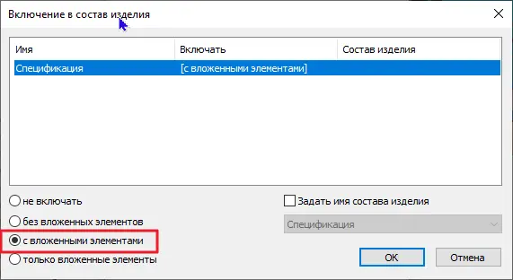

**Внимание:** В динамической сборке должно быть **ЗАПРЕЩЕНО** вставить  объект **НЕ** того справочника, который открыт в дин. сборке.
**Внимание:** Если надо вставить объект, которого еще нет в DOCs его сначала надо импортировать - открыть как файл и импортировать, чтобы он стал объектом DOCs!

***Новая команда "Создать"**
*   — Отображать в **Режиме РС**, **Режиме ДС** и **Режиме 0**
*   — Команда контекстно-зависимая. В зависимости от селектированного объекта в дереве рабочей сессии предлагает вставку объектов, определенных по информационной модели изделия (дочерние или по связи).
*   — Сценарий:
	1.  Система предлагает на выбор связи (если есть варианты) и справочники, перечисленные в информационной модели изделия, с учетом селектированного объекта (в **Режиме 0** - доступны любые объекты ИМИ)
	2. Пользователь выбирает связь и справочник
	3. Пользователь выбирает тип объекта справочника.
	4. Пользователь выбирает действие - две кнопки внизу окна:
	    1.   «Добавить» — добавить объект в указанное место.
	    2.   «Добавить и редактировать» — открыть объект в редактирование в динамической сборке в контексте рабочей сессии (в **Режиме 0** - просто сам объект открыть в редактирование в динамической сборке)
	5. Система открывает диалог свойств нового объекта DOCs
	6. Пользователь заполняет свойства нового объекта
	7. Новый объект помещается в выбранное место
	8. Выполняется ранее выбранная команда

**Команда «Экспорт (T-FLEX DOCs)»**
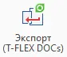
*Выполняет сохранение файла в DOCs*
*   — **Режим Ф** и **Режим ДС**
*   — Команда должна отображать все справочники DOCs у объектов которых есть связь на справочник "Файлы" + сам справочник "Файлы"
*   — Сценарий:
	1.  Система предлагает выбрать формат экспорта и его настройки
	2.  Система предлагает выбрать справочник (все справочники DOCs у объектов которых есть связь на справочник "Файлы" + сам справочник "Файлы")
	3.  Пользователь выбирает справочник
		1. Если это справочник "Файлы"
			1. Пользователь указывает папку в которую нужно сохранить файл
		2. Если это любой другой справочник
			1. Выбирает объект справочника
			2. Пользователь выбирает связь, по которой нужно прикрепить файл к выбранному объекту
	4.  Пользователь нажимает "Сохранить"

**Команда** **«Импорт»**
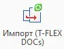
*   — Только в **Режиме Ф**
*   — Команда должна отображать все справочники DOCs у объектов которых есть связь на справочник "Файлы" + сам справочник "Файлы"
*   — Сценарий:
	1.  Система предлагает выбрать справочник (все справочники DOCs у объектов которых есть связь на справочник "Файлы" + сам справочник "Файлы")
	2.  Пользователь выбирает справочник
		1. Если это справочник "Файлы"
			1. Пользователь указывает нужный файл, в поддерживаемом формате
		2. Если это любой другой справочник
			1. Выбирает объект справочника
			2. Пользователь выбирает связь, по которой нужно получить файл 
			3. Пользователь выбирает файл поддерживаемого формата
	3. Пользователь подтверждает выбор
	4. Пользователь указывает параметры импорта
	5. Пользователь нажимает "ОК"

**Команда** **«Создать ревизию»**
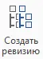
*   — Убрать из всех режимов. Выполняет неадекватные действия

**Команда «Взять файл на ред.»** 
*   — Только Режим Ф

**Команда «Примен. изм.»**
*   — Только Режим Ф
*   — Переименовать в **«Примен. изм. файла»**

**Команда «Отменить измен.»** 
*   — Только Режим Ф
*   — Переименовать в **«Отменить измен. файла»**

### Текущие странности поведения

*   Если отменить добавление объекта в раб. (рабочую) сессию — выдает ошибку!
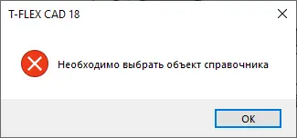
*   Команда ПКМ **«Создать объект»** на объекте "Рабочая сессия"  — должно быть возможно создать объект любого справочника из **ИМИ** и добавить в раб. сессию (сейчас можно только объекты справочника Рабочие сессии добавлять)
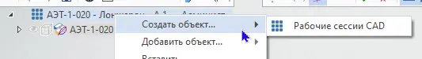
*   Команда ПКМ **«Добавить»** на объекте **ВНУТРИ** раб. сессии должна предлагать добавить объект в соответствии с **ИМИ** (сейчас предлагает добавить файлы!)
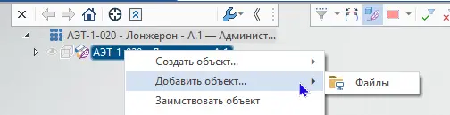

### Команды **"3D фрагмент"**, "**Создать 3D фрагмент**" и "**Внешняя модель**" (и прочие) в **Режиме РС** и **Режиме ДС**

На уровне работы с фрагментами CAD следует явно различать действия:
1. Создание дочернего объекта состава
	1. С точки зрения DOCs - **создание дочернего подключения между объектами состава**
	2. С точки зрения CAD - вставка фрагмента с опцией "с вложенными элементами" 
	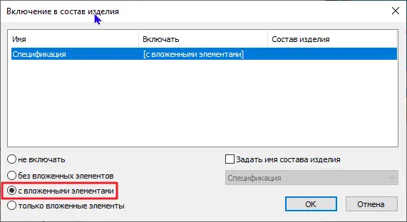
2. Использование **геометрии** внешнего файла
	1. С точки зрения DOCs - **заполнение связи "Связанные файлы" между файлами**. Файл 1 не может быть правильно отредактирован без подгрузки геометрии из файла 2
	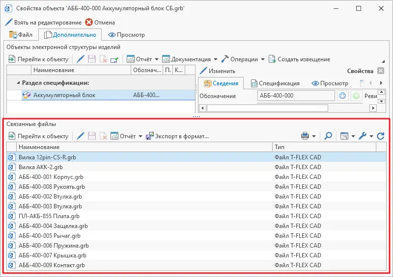
	2. С точки зрения CAD - вставка фрагмента с опцией "не включать"
	 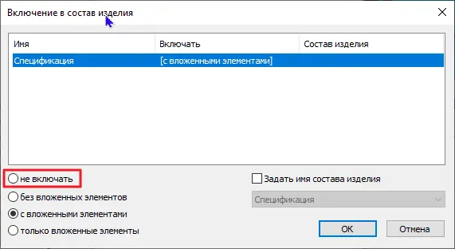

***Нужно явно разделить команды CAD, работающие с фрагментами, на две этих группы.***
Например, команды **"3D фрагмент"**, "**Создать 3D фрагмент**" и "**Внешняя модель**", строго должны реализовывать действия типа 2.
Команда **"Неразъемное соединение"** - строго реализует действия типа 1.