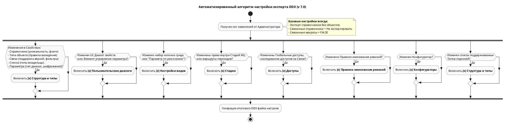

# 📄 Алгоритм формирования DDX: Структурные изменения модели данных (v 7.0)

## 1. Архитектура настраиваемых сущностей и маппинг DDX

Модель данных T-FLEX DOCs формируется путем настройки конфигурационных сущностей. В таблицах ниже приведено строгое соответствие опций пользовательского интерфейса (UI) XML-тегам и атрибутам файла конфигурации `ddx`.

### 1.1 Справочник (Reference)
Корневая сущность-контейнер. В DDX описывается в блоке `<Reference>` и корневом теге `<ParameterGroup>`.

| Опции в интерфейсе                          | Тег / Атрибут в DDX                                             | Варианты значений                            | Примечания                                                                              |
| :------------------------------------------ | :-------------------------------------------------------------- | :------------------------------------------- | :-------------------------------------------------------------------------------------- |
| **Наименование**                            | Тег `<Reference>`, атрибут `Caption`                            | Произвольная строка                          | Имя справочника                                                                         |
| **Имя таблицы в БД**                        | Тег `<ParameterGroup>`, атрибут `TableName`                     | Строка на латинице                           | Например: `Zameny`                                                                      |
| **Комментарий**                             | Тег `<Description>`                                             | Произвольная строка                          |                                                                                         |
| **Иконка**                                  | Тег `<Icon>`                                                    | Base64 строка                                |                                                                                         |
| **Видимость справочника в интерфейсе**      | Тег `<ParameterGroup>`, атрибут `Visibility`                    | `Visible`, `Invisible`, `InvisibleInCatalog` |                                                                                         |
| **Условие уникальности объектов**           | Тег `<Index>`, атрибут `UniqueKey`                              | `true`, `false`                              | Уникальность формируется из набора вложенных тегов `<Parameter>`                        |
| **Параметр, отображаемый по умолчанию**     | Тег `<ParameterGroup>`, атрибут `DefaultParameterId`            | ID параметра                                 |                                                                                         |
| **Использовать специальное форматирование** | Тег `<ObjectFormatInfo>`, атрибут `Format`                      | Строка формата                               | Например: `{0} - {1}`                                                                   |
| **Иерархия объектов**                       | Тег `<ParameterGroup>`, атрибут `HierarchyType`                 | `Simple`, `Tree`, `Complex`                  | Список, Дерево, Сложная иерархия                                                        |
| **Поддержка истории изменений**             | Тег `<ParameterGroup>`, атрибут `LogData`                       | `true`, `false`                              |                                                                                         |
| **Поддержка ревизий**                       | Тег `<ParameterGroup>`, атрибут `SupportsRevisions`             | `true`, `false`                              | Включает версионирование объектов                                                       |
| **Поддержка дополнительных параметров**     | Тег `<ParameterGroup>`, атрибут `SupportsExtendedParameters`    | `true`, `false`                              |                                                                                         |
| **Поддержка механизма подписей**            | Тег `<ParameterGroup>`, атрибут `SupportsSignature`             | `true`, `false`                              |                                                                                         |
| **Использовать все типы подписей**          | Тег `<ParameterGroup>`, атрибут `UseAllSignatureTypes`          | `true`, `false`                              | При `false` генерируется список `<SignatureTypes>`                                      |
| **Поддержка параметра "Владелец"**          | Тег `<ParameterGroup>`, атрибут `SupportsOwner`                 | `true`, `false`                              |                                                                                         |
| **Доступ владельца**                        | Тег `<ParameterGroup>`, атрибут `AuthorAccessGroup`             | GUID группы доступа                          | Например, "Авторский"                                                                   |
| **Допускается изменение типа объектов**     | Тег `<ParameterGroup>`, атрибут `CanChangeClass`                | `true`, `false`                              | Разрешение смены типа "на лету"                                                         |
| **Поддержка экземпляров изделий**           | Тег `<ParameterGroup>`, атрибут `SupportsObjectsInstances`      | `true`, `false`                              | Используется для ЭСИ                                                                    |
| **Поддержка дат действия**                  | Тег `<ParameterGroup>`, атрибут `SupportsActivityDates`         | `true`, `false`                              |                                                                                         |
| **Поддержка структур изделия**              | Тег `<ParameterGroup>`, атрибут `SupportsStructureTypes`        | `true`, `false`                              |                                                                                         |
| **Поддержка применяемости**                 | Тег `<ParameterGroup>`, атрибут `SupportsApplicability`         | `true`, `false`                              |                                                                                         |
| **Поддержка контекстов проектирования**     | Тег `<ParameterGroup>`, атрибут `SupportsDesignContexts`        | `true`, `false`                              |                                                                                         |
| **Поддержка конфигурирования**              | Тег `<ParameterGroup>`, атрибут `SupportsConfigurationSettings` | `true`, `false`                              |                                                                                         |
| **Управление доступом на объекты**          | Тег `<ParameterGroup>`, атрибут `CheckAccessMode`               | `0`, `1`                                     |                                                                                         |
| **Поддержка стадий**                        | Тег `<ParameterGroup>`, атрибут `SupportsStages`                | `true`, `false`                              | Включает жизненный цикл                                                                 |
| **Схема переходов стадий**                  | Тег `<ParameterGroup>`, атрибут `SchemeId`                      | GUID схемы                                   |                                                                                         |
| **Стадия по умолчанию**                     | Тег `<ParameterGroup>`, атрибут `DefaultStageId`                | ID стадии                                    |                                                                                         |
| **Правило именования ревизий**              | Тег `<ParameterGroup>`, атрибут `RevisionNamingRule`            | GUID алгоритма                               |                                                                                         |
| **Конфигуратор**                            | Тег `<ParameterGroup>`, атрибут `Configurator`                  | GUID конфигуратора                           | Отвечает за критерии фильтрации объектов системы для формирования точной выборки данных |

### 1.2 Тип объекта (Object Type)
Наследуемый шаблон поведения объекта внутри справочника. Описывается в блоке `<ClassObject>`.

| Опции в интерфейсе                                                     | Тег / Атрибут в DDX                                        | Варианты значений                     | Примечания                                                  |
| :--------------------------------------------------------------------- | :--------------------------------------------------------- | :------------------------------------ | :---------------------------------------------------------- |
| **Наименование**                                                       | Тег `<ClassObject>`, атрибут `Name`                        | Произвольная строка                   |                                                             |
| **Комментарий**                                                        | Тег `<ClassObject>`, атрибут `Description`                 | Произвольная строка                   |                                                             |
| **Иконка объектов типа**                                               | Тег `<Icon>`                                               | Base64 строка                         |                                                             |
| **Отображать команду "Сохранить и создать"**                           | Тег `<ClassObject>`, атрибут `SupportsSaveAndCreate`       | `true`, `false`                       |                                                             |
| **Отображать команду "Изменить..."**                                   | Тег `<ClassObject>`, атрибут `CanChange`                   | `Allowed`, `Denied`                   |                                                             |
| **Запрет изменения порожденных типов**                                 | Тег `<ClassObject>`, атрибут `Sealed`                      | `true`, `false`                       |                                                             |
| **Абстрактный тип**                                                    | Тег `<ClassObject>`, атрибут `Abstract`                    | `true`, `false`                       | Запрет на создание объектов этого типа                      |
| **Правила вхождения (Состоит из)**                                     | Тег `<ChildObjectClasses>`, тег `<guid>`                   | GUID дочерних типов                   | Структурное взаимодействие                                  |
| **Правила вхождения (Входит в)**                                       | Тег `<MasterObjectClasses>`, тег `<guid>`                  | GUID родительских типов               | Структурное взаимодействие                                  |
| **Значения параметров по умолчанию ("Параметры подключения" для ЭСИ)** | Тег `<attrib>`, атрибуты `Caption`, `Type`, `DefaultValue` | Строка, тип (напр. `Int32`), значение | Переопределение значений по умолчанию для подключений в ЭСИ |

### 1.3 Списки объектов (Object List)
Контейнер для подчиненных объектов (например, список "Заменяющие объекты"). Описывается как `<ParameterGroup>`.

| Опции в интерфейсе | Тег / Атрибут в DDX | Варианты значений | Примечания |
| :--- | :--- | :--- | :--- |
| **Наименование** | Тег `<ParameterGroup>`, атрибут `Caption` | Произвольная строка | |
| **Имя таблицы в БД** | Тег `<ParameterGroup>`, атрибут `TableName` | Строка на латинице | |
| **Поддержка сортировки** | Тег `<ParameterGroup>`, атрибут `SupportsOrder` | `true`, `false` | |
| **Поддержка механизма подписей** | Тег `<ParameterGroup>`, атрибут `SupportsSignature`| `true`, `false` | Включает использование ЭП на списке |
| **Допускается изменение типа объектов** | Тег `<ParameterGroup>`, атрибут `CanChangeClass` | `true`, `false` | |

### 1.4 Тип списка объектов (Object List Type)
Шаблон объекта, хранящегося внутри Списка объектов.

| Опции в интерфейсе | Тег / Атрибут в DDX | Варианты значений | Примечания |
| :--- | :--- | :--- | :--- |
| **Наименование** | Тег `<ClassObject>`, атрибут `Name` | Произвольная строка | |
| **Не наследуемый** | Тег `<ClassObject>`, атрибут `Sealed` | `true`, `false` | |
| **Абстрактный тип** | Тег `<ClassObject>`, атрибут `Abstract` | `true`, `false` | |
| **Входит в (Типы справочника)** | Тег `<ClassObject>`, атрибут `InheritMasterObjectClasses` и тег `<MasterObjectClasses>` | `false`, GUID типов-владельцев | Указывает, для каких типов-владельцев корневого Справочника данный список может быть создан |

### 1.5 Связь (Link)
Механизм соединения справочников. Описывается как `<ParameterGroup>`.

| Опции в интерфейсе | Тег / Атрибут в DDX | Варианты значений | Примечания |
| :--- | :--- | :--- | :--- |
| **Тип связи** | Тег `<ParameterGroup>`, атрибут `LinkType` | `ManyToMany`, `ManyToOne`, `OneToMany`, `OneToOne`, `SearchQuery`, `AnyReference` | |
| **Имя таблицы в БД** | Тег `<ParameterGroup>`, атрибут `TableName` | Строка на латинице | |
| **Обязательная для заполнения** | Тег `<ParameterGroup>`, атрибут `LinkRequired` | `MasterOnly`, `None` | |
| **Показывать связь** | Тег `<ParameterGroup>`, атрибут `LinkVisibility` | `Anywhere`, `MasterOnly`, `None` | |
| **Поддержка версий** | Тег `<ParameterGroup>`, атрибут `SupportsVersions` | `true`, `false` | Связь хранит указание на конкретную версию связанного объекта (на момент подключения), а не только его GUID |
| **Асимметричная** | Тег `<ParameterGroup>`, атрибут `Asymmetric` | `true`, `false` | |
| **Условия поиска (фильтры)** | Тег `<SearchQueryLinkFilter>`, тег `<Filter>` | Блок условий поиска | Для связи по условию |

### 1.6 Параметр (Parameter)
Описывается как `<ParameterInfo>`.

| Опции в интерфейсе | Тег / Атрибут в DDX | Варианты значений | Примечания |
| :--- | :--- | :--- | :--- |
| **Наименование** | Тег `<ParameterInfo>`, атрибут `Caption` | Произвольная строка | |
| **Имя поля в БД** | Тег `<ParameterInfo>`, атрибут `FieldName` | Системное имя колонки | |
| **Тип** | Тег `<ParameterInfo>`, атрибут `ParameterType`| `NVarChar`, `Int`, `Boolean`, `DateTime`, `Image`, `UniqueIdentifier` и др. | |
| **Ограничение длины** | Тег `<ParameterInfo>`, атрибут `Length` | Целое число | |
| **Обязательный для заполнения**| Тег `<ParameterInfo>`, атрибут `IsRequired` | `true`, `false` | |
| **Может быть NULL** | Тег `<ParameterInfo>`, атрибут `Nullable` | `true`, `false` | |
| **Только для чтения** | Тег `<ParameterInfo>`, атрибут `SystemType` | `ReadOnly` | |
| **Шифровать сертификатом** | Тег `<ParameterInfo>`, атрибут `CertificateGuid`| GUID сертификата | |
| **Элемент управления** | Тег `<UserControl>`, вложенные теги | Имя контрола, например `<ListFromLinkEdit>` | Определяет UI-компонент ввода |

---

## 2. Аксиомы выгрузки Корпоративного Ядра

1. **Структура без объектов:** При выгрузке каркаса системы (Справочников, Типов, Связей, Параметров) переключатель всегда установлен в `(•) Экспортировать справочники без объектов`.
2. **Изоляция связей:** `(•) Не экспортировать связанные справочники`.
3. **Разделение макросов:** Флаг `[ ] Связанные макросы` **всегда снят**. Структурная выгрузка переносит только факт назначения события (`<EventHandler>`), сам код скрипта переносится отдельным пакетом.

> [!warning] Проблема выгрузки Подписей
В текущей версии интерфейса выгрузки DDX **отсутствует флаг отказа от экспорта подписей**. Если справочник настроен как `UseAllSignatureTypes="true"` (поддерживает все подписи), при выгрузке структуры в DDX попадет избыточный объем данных по всем подписям системы.  
Ожидается доработка функционала от разработчиков. До тех пор необходимо учитывать, что справочники могут непреднамеренно "тащить" за собой реестр подписей.

---

## 3. Матрица выбора флагов DDX (Алгоритм)

Оценка лога изменений администратора приводит к выбору соответствующих флагов выгрузки. Данный алгоритм покрывает все возможные изменения в модели данных.

### Блок А: Изменение структурного "Каркаса"
*(Формирует структуру базы данных и базовое ООП-поведение)*

| Зафиксированное изменение (Что сделал администратор) | Необходимые флаги DDX |
| :--- | :--- |
| Создан/удален Справочник, Тип объекта, Список объектов, Связь или Параметр. | `[x] Структура и типы` |
| В Справочнике изменены опции (Уникальность, Поддержка ревизий/истории/экземпляров, Форматирование, Иерархия). | `[x] Структура и типы` |
| В Типе объекта изменены ООП-модификаторы (Sealed, Abstract) или дефолтные значения параметров подключения. | `[x] Структура и типы` |
| В Типе объекта изменены **Правила вхождения** (вкладки "Состоит из" / "Входит в"). | `[x] Структура и типы` |
| В Типе списка объектов изменено правило **"Входит в"** (разрешено создание списка для новых типов-владельцев). | `[x] Структура и типы` |
| Изменены настройки Связи (тип связи, поддержка версий, обязательность, фильтры, типы справочников А/Б). | `[x] Структура и типы` |
| В свойствах Параметра изменено: Тип данных, Ограничение длины, Обязательность, Шифрование сертификатом. | `[x] Структура и типы` |

### Блок B: Изменение Интерфейса (UI)
*(Отвечает за визуальное представление для пользователя)*

| Зафиксированное изменение (Что сделал администратор) | Необходимые флаги DDX |
| :--- | :--- |
| Изменена форма "Диалог свойств" (перекомпоновка полей, XtraSerializer). | `[x] Пользовательские диалоги` |
| Изменен "Элемент управления" параметра (UI-контрол в свойствах параметра). | `[x] Структура и типы` `[x] Пользовательские диалоги` |
| В Справочнике изменен "Параметр, отображаемый по умолчанию". | `[x] Структура и типы` `[x] Настройки видов` |
| Настроены видимые колонки грида/дерева или скрыты кнопки тулбара справочника. | `[x] Настройки видов` |

### Блок C: Бизнес-логика, Доступы и Жизненный цикл

| Зафиксированное изменение (Что сделал администратор)                                                     | Необходимые флаги DDX                                      |
| :------------------------------------------------------------------------------------------------------- | :--------------------------------------------------------- |
| Изменена схема стадий в Справочнике или переопределена в Типе объекта.                                   | `[x] Структура и типы`                                     |
| Изменены доступы внутри конкретной Стадии ЖЦ (переходы, права ролей на этапе).                           | `[x] Стадии`                                               |
| Изменена политика доступов (права на весь справочник, доступ владельца, наследование доступов на связи). | `[x] Доступы`                                              |
| Изменено Правило именования ревизий (в Справочнике или Типе).                                            | `[x] Структура и типы` `[x] Правила именования ревизий` |
| Изменен Конфигуратор (критерии фильтрации по применяемости/опциям).                                      | `[x] Структура и типы` `[x] Конфигураторы`              |
| Изменен состав поддерживаемых Типов подписей (использован выделенный список).                            | `[x] Структура и типы`                                     |

---

## 4. Графическая блок-схема (PlantUML)

