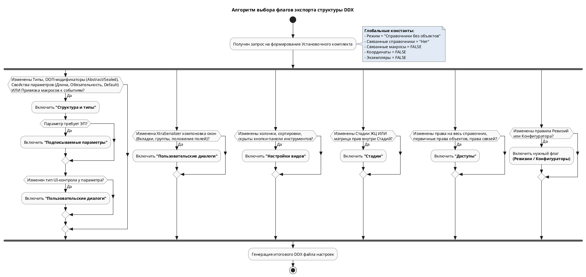

Изучение структуры предоставленного файла `ddx` дает отличное понимание того, как физически "под капотом" T-FLEX DOCs хранит свою конфигурацию. 

### Ключевые выводы из анализа XML (DDX):
1.  **Параметры (Атрибуты):** Тег `<ParameterInfo>` содержит множество модификаторов: `IsRequired` (обязательность), `DefaultValue` (значение по умолчанию), `ListType` (тип списка — фиксированный/расширяемый), `EditType` (запрет редактирования из UI). Изменение любого из них — это изменение структуры.
2.  **Элементы управления (UI параметров):** Тег `<UserControl>` жестко привязывает параметр к визуальному компоненту (например, `SelectConfigurationComboBox` или выбор из справочника).
3.  **Типы объектов (Классы):** Тег `<ClassObject>` содержит атрибуты объектно-ориентированной модели: `Abstract="true"` (нельзя создать объект этого типа, только дочерние), `Sealed="true"` (запрет наследования от этого типа), а также собственную иконку `<Icon>`.
4.  **Диалоги (Формы свойств):** Хранятся в `<ReferenceDialogs>`. Формы представляют собой сериализованный XML (внутри тега `XtraSerializer`), описывающий точное положение каждого поля, вкладки (`DialogPage`) и группы (`LayoutGroup`).
5.  **Настройки видов (Гриды и деревья):** Хранятся в `<ReferenceSettings>`. Описывают колонки, их ширину, сортировку и видимость интерфейсных кнопок (`XmlRestrictiveCommandsList`).

Основываясь на этом глубоком понимании модели данных, я **расширил и детализировал алгоритм** принятия решений.

---

Вот обновленный документ для базы знаний в Obsidian.

# 📄 Алгоритм формирования DDX: Структурные изменения модели данных (v 2.0)

> [!abstract] Назначение документа
> Документ описывает расширенный алгоритм выбора настроек выгрузки DDX для переноса конфигурации T-FLEX DOCs. Алгоритм учитывает глубинную XML-архитектуру системы (классы, свойства параметров, сериализацию форм).

## 1. Фундаментальные правила (Аксиомы выгрузки)

> [!danger] Аксиомы Корпоративного Ядра
> 1. **Структура отдельно, контент отдельно:** При экспорте структуры переключатель всегда в положении: `(•) Экспортировать справочники без объектов`.
> 2. **Связи без рекурсии:** `(•) Не экспортировать связанные справочники`.
> 3. **Макросы — это контент:** Флаг `[ ] Связанные макросы` **всегда отключен**. Код макроса выгружается отдельным DDX как объект справочника макросов. Структурная выгрузка переносит только *факт привязки* (тег `<EventHandler>`).
> 4. **Наследование нерушимо (по GUID):** Если тип был создан как производный от "Деталь", его нельзя перенести под тип "Документ". Запрещено менять `BaseClassId` у существующих классов. Только удаление и создание заново.

---

## 2. Матрица принятия решений (Детализированная)

В зависимости от того, что сделал системный администратор в модуле "Управление справочниками", необходимо выбрать соответствующие флаги.

### Блок А: Изменения Ядра Данных (Справочники, Классы, Параметры)
Отражается на тегах `<Structure>` и `<ReferenceClasses>`.

| Код | Действие администратора | Включаемые флаги |
| :--- | :--- | :--- |
| **A01** | Создан новый тип объекта, удален старый. Изменена иерархия справочника (Список -> Дерево -> Сложная иерархия). | `[x] Структура и типы` |
| **A02** | Изменена ООП-модель типа объекта: тип сделан **Абстрактным** (`Abstract="true"`), запрещено наследование (`Sealed="true"`), изменена иконка типа. | `[x] Структура и типы` |
| **A03** | Создан/удален параметр. Изменен тип данных (Строка -> Число), длина поля. | `[x] Структура и типы` |
| **A04** | Изменена бизнес-логика параметра: поле стало обязательным (`IsRequired`), изменено значение по умолчанию (`DefaultValue`), поле сделано системным/read-only (`EditType`). | `[x] Структура и типы` |
| **A05** | Изменен способ ввода: привязан другой элемент управления (`<UserControl>`), например, текстовое поле заменено на выпадающий список или выбор из НСИ. | `[x] Структура и типы` `[x] Пользовательские диалоги` *(т.к. меняется UI)* |
| **A06** | Добавлен параметр, требующий заверения электронной подписью. | `[x] Структура и типы` `[x] Подписываемые параметры` |

### Блок B: Изменения Интерфейса и Представления (UI)
Отражается на тегах `<ReferenceDialogs>` и `<ReferenceSettings>`.

| Код | Действие администратора | Включаемые флаги |
| :--- | :--- | :--- |
| **B01** | В карточку свойств добавлена новая вкладка (`DialogPage`), группа полей или изменено расположение полей (XtraSerializer layout). | `[x] Пользовательские диалоги` |
| **B02** | Изменен состав колонок в главном окне справочника, настроена ширина колонок, сортировка по умолчанию, правила раскраски строк. | `[x] Настройки видов` |
| **B03** | В интерфейсе справочника скрыты системные кнопки (например, запрещена кнопка "Создать" через `XmlRestrictiveCommandsList`). | `[x] Настройки видов` |

### Блок C: Бизнес-логика, События и Безопасность
Отражается на тегах `<EventHandlers>`, `<ReferenceAccesses>` и метаданных.

| Код | Действие администратора | Включаемые флаги |
| :--- | :--- | :--- |
| **C01** | На событие справочника (OnCreate, OnDelete) повешен новый макрос или изменен вызов старого. | `[x] Структура и типы` *(выгружает `<EventHandler>`, код скрипта выгружается отдельно)* |
| **C02** | Изменены доступы "в корне" справочника (кто видит справочник, кто может менять структуру), права на связи или фильтры по атрибутам. | `[x] Доступы` |
| **C03** | Создана новая Стадия Жизненного Цикла, изменен маршрут перехода или **доступы внутри конкретной стадии**. | `[x] Стадии` |
| **C04** | Изменена маска/правила автоматического формирования ревизий (версий) объекта. | `[x] Правила именования ревизий` |
| **C05** | Обновлена логика подбора компонентов в модуле "Конфигуратор". | `[x] Конфигураторы` |

---

## 3. Графическая схема алгоритма генерации (PlantUML)

## 4. Рекомендации по решению коллизий при импорте (Merge Conflicts)
Поскольку в T-FLEX DOCs используется принцип *«Корпоративное ядро + Расширения»*, при накатывании DDX-пакета на целевую БД могут возникать нюансы:

1.  **Добавление vs Обновление:** DDX использует `GuidKey` для идентификации. При импорте структура ядра обновит существующие параметры по их GUID, не затронув уникальные параметры локального расширения (с другими GUID).
2.  **Опасность флага "Пользовательские диалоги":** Т.к. диалог хранится как единый `XtraSerializer` XML, применение диалога из Корпоративного ядра **перезапишет** локальный диалог. Если площадка добавила свои локальные поля на форму, после импорта "Пользовательских диалогов" из Ядра локальные поля пропадут с экрана (хоть и останутся в БД). *Решение: Требуется организационный регламент по выделению отдельных "Вкладок" под локальные расширения, которые Ядро не будет перетирать, либо ручное слияние UI администраторами площадки.*