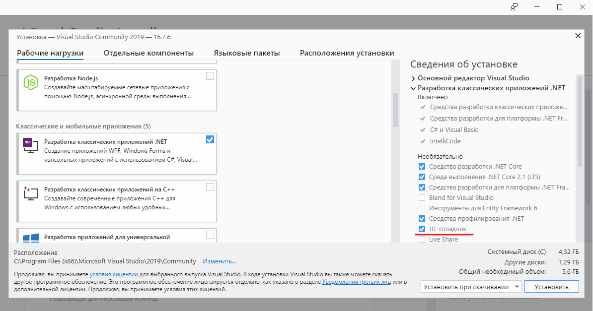
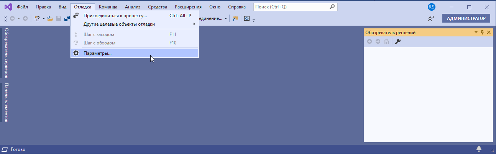
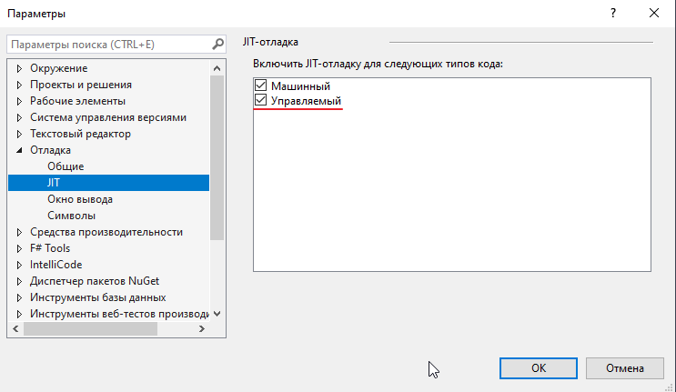
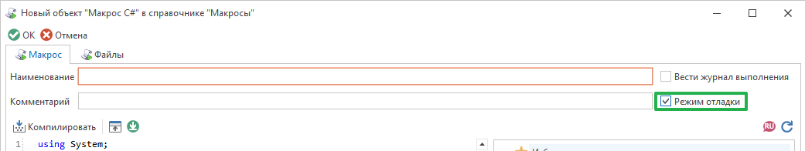
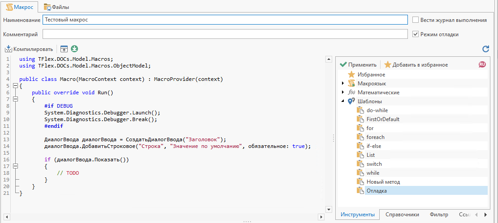
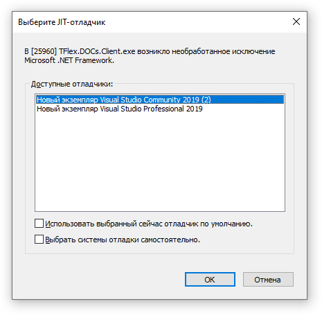
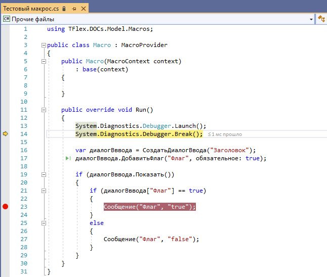

Руководство по T-FLEX DOCs Open API

|  |
| --- |
| Отладка макросов |

В процессе написания макросов может возникнуть необходимость отладки кода.
Отладка кода позволяет приостанавливать выполнение методов, проверять значения переменных, определять ход выполнения макроса и изменять его.
Для отладки можно воспользоваться JIT-отладчиком среды разработки Visual Studio (VS), который позволяет производить отладку приложения за пределами VS.

Установка и настройка VS с JIT-отладчиком

| Внимание  Внимание |
| --- |
| Бесплатная версия VS Community доступна на официальном сайте - <https://visualstudio.microsoft.com/ru/> |

Во время установки необходимо выставить флаг "JIT-отладчик":

| Внимание  Внимание |
| --- |
| Если у Вас имеется установленная версия VS, но без JIT-отладчика, то Вы можете установить его дополнительно, воспользовавшись программой «Visual Studio Installer», которая устанавливается вместе с VS |

Необходимо убедиться, что JIT-отладка включена в VS. Для этого нужно открыть «Параметры»:

В параметрах открыть раздел Отладка > JIT и проверить, что JIT-отладка включена для управляемого кода:

| Внимание  Внимание |
| --- |
| Для английской версии VS: Debug menu > Options > Debugging > Just-In-Time |

Внесение изменений в макрос C# для отладки

В окне макроса требуется включить режим отладки:

Далее необходимо присоединить и запустить отладчик при помощи метода System.Diagnostics.Debugger.Launch(), а также программно поставить точку останова (breakpoint) при помощи метода System.Diagnostics.Debugger.Break().
В инструментах имеется готовый шаблон, содержащий данные инструкции:

Отладка

Необходимо запустить макрос или выполнять действие, приводящее к выполнению макроса

Перед выполнением макроса JIT-отладчик предложит выбрать экземпляр VS, в котором будет осуществляться отладка:

Теперь можно приступить непосредственно к самой отладке:

| Внимание  Внимание |
| --- |
| Если под отладкой необходимо изучить ход выполнения программы в конкретном месте и изменение кода не планируется, то достаточно добавить только метод System.Diagnostics.Debugger.Launch(). В этом случае отладчик присоединиться к процессу и остановится на строке с данным методом. После этого можно поставить точку останова в интересующем месте кода в VS. При таком подходе повторное выполнение макроса приведет к тому, что отладчик будет сразу останавливаться на указанной в VS точке останова |

[Авторское право © 1989-2026 АО "Топ Системы". Все права защищены.](http://www.tflex.ru/)