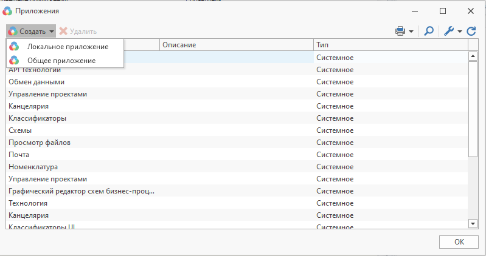

Руководство по T-FLEX DOCs Open API

|  |
| --- |
| Создание и использование приложений |

Создание приложения

Приложение реализуется путем создания библиотеки dll в любой среде разработки, поддерживающей .Net.
Для того, чтобы библиотека расширения могла использоваться системой, в ней должен быть открытый класс,
реализующий интерфейс [IPluginLibrary](A7B62431.htm).

Пример приложения с описанием можно найти в директории с установленным клиентом T-FLEX DOCs "..\Примеры использования API\Graphs"

Подключение приложения

Для подключения приложения к системе используется диалог "Управление приложениями" (меню "Сервис->Приложения")

Для добавления приложения необходимо воспользоваться соответствующей кнопкой и в открывшемся диалоге указать путь к сборке

[Авторское право © 1989-2026 АО "Топ Системы". Все права защищены.](http://www.tflex.ru/)