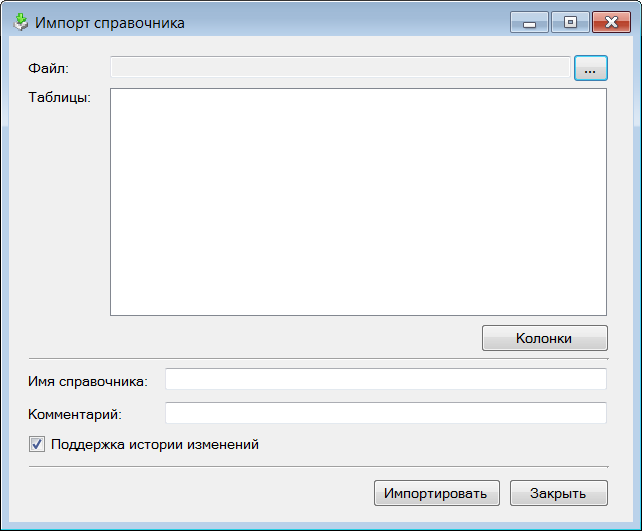

Руководство по T-FLEX DOCs Open API

|  |
| --- |
| Общие сведения |

Отдельные приложения

Используя API T-FLEX DOCs можно также разрабатывать самостоятельные приложения, а затем использовать их совместно с T-FLEX DOCs.

Примером такого приложения является "UnitConverter" (перевод различных математических и физических величин), входящее в комплект поставки T-FLEX DOCs.

Разработка отдельных приложений производится на платформе .NET Framework в среде Visual Studio. Готовое приложение предоставляется в виде скомпилированного исполняемого файла (EXE).

Вызов отдельных приложений (на примере "ImportReference")

[Авторское право © 1989-2026 АО "Топ Системы". Все права защищены.](http://www.tflex.ru/)