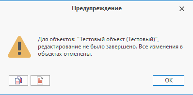

Руководство по T-FLEX DOCs Open API

|  |
| --- |
| Объекты справочника |

[ТекущийОбъект](3546A4B7.htm)
- возвращает
[объект](95E78982.htm)
, который редактируется в диалоге свойств/выбран в окне справочника/для которого вычисляется формула

[ВыбранныеОбъекты](56E8DEBA.htm)
- возвращает
[объекты](F1CB83DB.htm)
, выбранные в справочнике или ЭУ

[Объект.Тип](24BFD25A.htm)
- возвращает тип указанного
[объекта](95E78982.htm).

C#

[Копировать](# "Копировать")

```
if (ТекущийОбъект.Тип != "Деталь")
    return;
```

[Тип](18D0E753.htm)
- возвращает тип текущего объекта.

C#

[Копировать](# "Копировать")

```
if (Тип != "Деталь")
    return;
```

[Тип.Имя](D55B0FD3.htm)
- возвращает имя типа

C#

[Копировать](# "Копировать")

```
if (документ.Тип.Имя != "Изделие")
    return;
```

[Тип.ПорожденОт("имя или Guid базового типа")](E852000B.htm)
- проверяет, является ли тип объекта порожденным от указанного типа

C#

[Копировать](# "Копировать")

```
if (!документ.Тип.ПорожденОт("Материальный объект"))
    return;
```

[ПолучитьТипыОбъектов(справочник[, имена или Guid'ы типов])](B996C1DE.htm)
- возвращает типы объектов справочника

C#

[Копировать](# "Копировать")

```
ТипОбъекта[] всеТипыСправочника = ПолучитьТипыОбъектов("Электронная структура изделий");
ТипОбъекта[] конкретныеТипыСправочника = ПолучитьТипыОбъектов("Поручения", ["Служебная записка", "Поручение группе исполнителей"]);
```

Создание, редактирование, сохранение и удаление объектов

Порядок операций при создании/редактировании объекта справочника:

- Создание объекта или взятие на редактирование
- Редактирование параметров и/или связей
- Сохранение или отмена изменений

При изменении объекта, с последующим сохранением, необходимо учитывать следующий момент: методы изменения и сохранения (отмены изменений) должны выполняться попарно.
Если объект был взят на редактирование дважды, то и сохранить его тоже нужно дважды.
Созданные объекты справочника уже находятся в состоянии редактирования и для них не нужно вызывать методы изменения, т.к. в противном случае понадобится повторное сохранение

Необходимость в попарно вызываемых методах обусловлена тем, что объект справочника из одного макроса может быть передан в другой макрос, содержащий код, который редактирует передаваемый объект.
Т.к. каждый из вызываемых макросов может самостоятельно редактировать и сохранять передаваемый объект, то система контролирует цепочку вызываемых макросов и следит за тем, чтобы каждому изменению соответствовало сохранение или отмена.
Если по завершению основного макроса система зафиксирует нарушение попарно вызываемых методов, то выдаст соответствующую ошибку:



[СоздатьОбъект("имя справочника")](CD290CD8.htm)
- создает объект в заданном справочнике

[СоздатьОбъект("имя справочника", "имя типа объекта")](A1C6F8A7.htm)
- создает объект указанного типа в заданном справочнике

[СоздатьОбъект("имя справочника", "имя типа объекта", родительский объект)](B9D09AD6.htm)
- создает объект указанного типа в заданном справочнике с указанием родительского объекта

C#

[Копировать](# "Копировать")

```
Объект родительскийОбъект = НайтиОбъект("Договоры", "Наименование", "Новые договоры");

Объект новыйДоговор = СоздатьОбъект("Договоры", "Договор", родительскийОбъект);

var номерСледующегоДоговора = ГлобальныйПараметр["Номер следующего договора"];
новыйДоговор.Параметр["Номер"] = номерСледующегоДоговора;
новыйДоговор.Параметр["Наименование"] = "Договор №" + новыйДоговор.Параметр["Номер"];
ГлобальныйПараметр["Номер следующего договора"] = номерСледующегоДоговора + 1;

новыйДоговор.Сохранить();
```

[Объект.Изменить()](3618DB20.htm)
- переводит объект в состояние редактирования.

[Объект.ИзменитьСохранивПодписи()](F8D7116E.htm)
- переводит объект в состояние редактирования с сохранением подписей

| Внимание  Внимание |
| --- |
| Если у пользователя отсутствует доступ на изменение объекта с сохранением подписей, то взятие объекта на редактирование, при помощи метода ИзменитьСохранивПодписи(), позволит сохранить текущие подписи, сделав их неактуальными.  Использование метода Изменить() в данном случае приведет к удалению установленных подписей. |

[Объект.ИзменитьТип("имя типа объекта")](B122A33B.htm)
- изменяет тип объекта

C#

[Копировать](# "Копировать")

```
Объект деталь = НайтиОбъект("Документы", "Наименование", "Деталь 1");
деталь.ИзменитьТип("Изделие");
деталь["Наименование"] = "Изделие 1";
деталь["Является покупным изделием"] = true;
деталь.Сохранить();
```

[Объект.Редактируется](F21F875.htm)
- проверяет, находится ли объект в состоянии редактирования

[Объект.СкопироватьОбъект(прототип[, родительский объект, копировать дочерние объекты, копировать связанные прототипы])](EC92D4F.htm)
- создает объект на основе указанного прототипа

[Объект.НайтиПрототип("справочник", "фильтр")](6BF64657.htm)
- возвращает прототип справочника

C#

[Копировать](# "Копировать")

```
var прототип = НайтиПрототип("Документы", "[Наименование] = 'Прототип 1'"); // Находим прототип по фильтру

// Создаем объекты на основе указанного прототипа
var скопированныеОбъекты = СкопироватьОбъект(прототип,
    родитель: ТекущийОбъект, // В качестве родительского объекта передаем текущий
    копироватьДочерниеОбъекты: true, // Указываем, требуется ли копировать дочерние объекты прототипа
    копироватьСвязанныеПрототипы: true); // Указываем, требуется ли копировать связанные объекты прототипа

// Результатом метода СкопироватьОбъект() является набор созданных объектов на основе целевого прототипа и связанных с ним (дочерние прототипы и по связям)
// Для получения конкретного созданного объекта из набора, необходимо передать соответствующий прототип:
var копияПрототипа = скопированныеОбъекты.ПолучитьКопию(прототип); // Получаем созданный по прототипу объект

копияПрототипа["Название параметра"] = "Новое значение параметра"; // При необходимости редактируем созданный объект

скопированныеОбъекты.Сохранить(); // Сохраняем созданный набор
```

[Объект.Сохранить()](8FEA1531.htm)
- сохраняет произведенные изменения

Макроязык позволяет зафиксировать изменения для каждого объекта по отдельности при помощи метода «Объект.Сохранить()».
Можно зафиксировать все изменения для всех объектов при помощи метода «СохранитьВсё», т.к. объекты макроязыка регистрируются внутри системы.
Для объектов справочников, поддерживающих историю изменений, имеется возможность зафиксировать изменения и сразу же применить их при помощи перегрузки метода «СохранитьВсё»

[СохранитьВсё([применить изменения, "комментарий", показывать диалог подтверждения])](91D11C9F.htm)
- сохраняет все контекстные объекты с возможностью применения изменений

C#

[Копировать](# "Копировать")

```
Объекты объекты = НайтиОбъекты("Документы", "[Тип] = 'Сборочная единица'"); // Находим объекты

foreach (var объект in объекты)
{
    объект.Изменить(); // Переводим объект в состояние редактирования
    объект["Наименование"] = объект["Наименование"] + "*"; // Редактируем объект
}

СохранитьВсё(true, "Применены изменения", false); // Сохраняем все редактируемые объекты и применяем изменения без отображения диалога "Применение изменений"
```

[Объект.ОтменитьИзменения([отменить изменения на рабочем столе])](9EA727FF.htm)
- отменяет внесенные изменения. При помощи необязательного флага 'отменитьИзмененияНаРабочемСтоле' для объектов, поддерживающих историю изменений, возможно отменить изменения и на рабочем столе

| Внимание  Внимание |
| --- |
| Каждому вызову команды Изменить() должен соответствовать вызов команды Сохранить() или ОтменитьИзменения() |

C#

[Копировать](# "Копировать")

```
Объект договор = НайтиОбъект("Договоры", "Наименование", "Договор №1302");

if (договор is null)
    return;

договор.Изменить();
договор.Параметр["Комментарий"] = "Описание договора №1302.";
договор.Сохранить();
```

[Объект.Удалить()](8A29E828.htm)
- удаляет объект

[ИконкаСТекстом(имя или Guid иконки, текст)](90E7F1E1.htm)
- выполняет поиск растровой иконки в справочнике "Изображения" по имени или глобальному уникальному идентификатору (Guid). Возвращает иконку с заданным текстом.
Данный метод можно использовать в качестве возвращаемого результата формулы для вычисляемой колонки с включенным флажком "Отображать иконку"

C#

[Копировать](# "Копировать")

```
var иконкаСТекстом = ИконкаСТекстом("flag_red", "текст");
return иконкаСТекстом;
```

[УниверсальнаяИконкаСТекстом(имя или Guid иконки, текст)](68715B6F.htm)
- выполняет поиск иконки (как растровой, так и векторной - SVG) или изображения (которое будет преобразовано в иконку) по имени или глобальному уникальному идентификатору (Guid) в справочнике "Изображения". Возвращает иконку с заданным текстом.
Данный метод можно использовать в качестве возвращаемого результата формулы для вычисляемой колонки с включенным флажком "Отображать иконку"

C#

[Копировать](# "Копировать")

```
var иконкаСТекстом = УниверсальнаяИконкаСТекстом("warning", "текст");
return иконкаСТекстом;
```

[ЗадатьПользователяВладельца(пользователь)](44D617B5.htm)
- задает пользователя-владельца для объекта

C#

[Копировать](# "Копировать")

```
Объект сотрудник = НайтиОбъект("Группы и пользователи", "[Наименование] = 'Сотрудник'");

if (сотрудник is not null)
    ТекущийОбъект.ЗадатьПользователяВладельца(сотрудник);
```

[Объект.ПользовательВладелец](7FCB8758.htm)
- возвращает владельца, являющегося объектом справочника "Группы и пользователи"

| Внимание  Внимание |
| --- |
| Для получения или установки пользователя-владельца в настройках справочника должна быть включена поддержка параметра "Владелец" |

[Объект.Автор](2D2F9310.htm)
- возвращает автора объекта.

[Объект.Владелец](BD07F7E0.htm)
- возвращает владельца объекта по связи. Пример: если для объекта справочника А по связи создается объект справочника Б, то созданный объект будет подчиненным, а объект справочника А его владельцем

[Объект.Идентификатор](3F0A424E.htm)
- возвращает идентификатор (id) объекта

[Объект.ГлобальныйИдентификатор](C614BE8.htm)
- возвращает глобальный идентификатор (Guid) объекта

[Объект.СсылкаНаСвойства](DF30D72E.htm)
- возвращает ссылку на свойства

[Объект.СсылкаНаЗапись](29DE075D.htm)
- возвращает ссылку на запись

[Объект.Справочник.Имя](4A711C3E.htm)
- возвращает наименование справочника данного объекта

[Объект.Справочник.УникальныйИдентификатор](AAD2D314.htm)
- возвращает уникальный идентификатор (Guid) справочника данного объекта

[Объект.НовыйРодительскийОбъект](14C85705.htm)
- возвращает новый родительский объект, к которому подключается текущий объект в справочнике с простой иерархией (иерархия объектов "Дерево")

[Авторское право © 1989-2026 АО "Топ Системы". Все права защищены.](http://www.tflex.ru/)