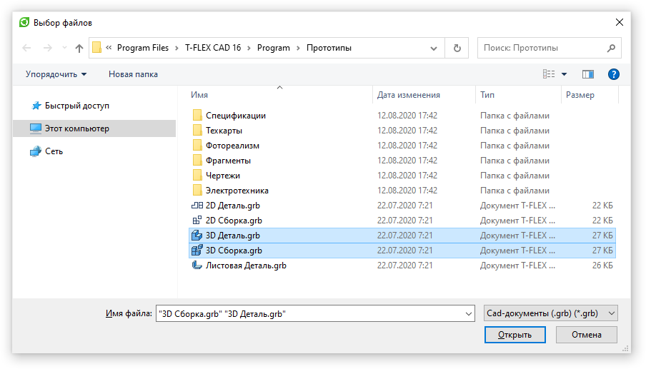

Руководство по T-FLEX DOCs Open API

|  |
| --- |
| Выбор и сохранение файла |

Пример работы с диалогом выбора файла

[СоздатьДиалогВыбораФайла([Заголовок])](6093E44C.htm)
- создает диалог выбора файла из проводника Windows

C#

[Копировать](# "Копировать")

```
ДиалогВыбораФайла диалогВыбораФайла = СоздатьДиалогВыбораФайла("Выбор файлов"); // Создаем диалог
диалогВыбораФайла.МножественныйВыбор = true; // Задаем возможность множественного выбора файлов в окне диалога
диалогВыбораФайла.НачальнаяПапка = @"C:\Program Files\T-FLEX CAD 16\Program\Прототипы"; // Задаем начальную папку, отображаемую диалоговым окном
диалогВыбораФайла.Фильтр = "Cad-документы (.grb)|*.grb"; // Фильтруем отображаемые файлы по расширению

if (диалогВыбораФайла.Показать())
{
    string[] именаФайлов = диалогВыбораФайла.ИменаФайлов; // Получаем выбранные файлы
}
```

Результат:



Пример работы с диалогом сохранения файла

[СоздатьДиалогСохраненияФайла([Заголовок])](5FC5830E.htm)
- создает диалог сохранения файла

C#

[Копировать](# "Копировать")

```
var диалог = СоздатьДиалогСохраненияФайла("Сохранение файла");

диалог.ИмяФайла = "Имя файла";
диалог.РасширениеПоУмолчанию = ".txt";
диалог.Фильтр = "Text files(*.txt)|*.txt|All files(*.*)|*.*";

if (диалог.Показать())
{
    string имяСохраняемогоФайла = диалог.ИмяФайла;
    // Сохраняем
}
```

[Авторское право © 1989-2026 АО "Топ Системы". Все права защищены.](http://www.tflex.ru/)