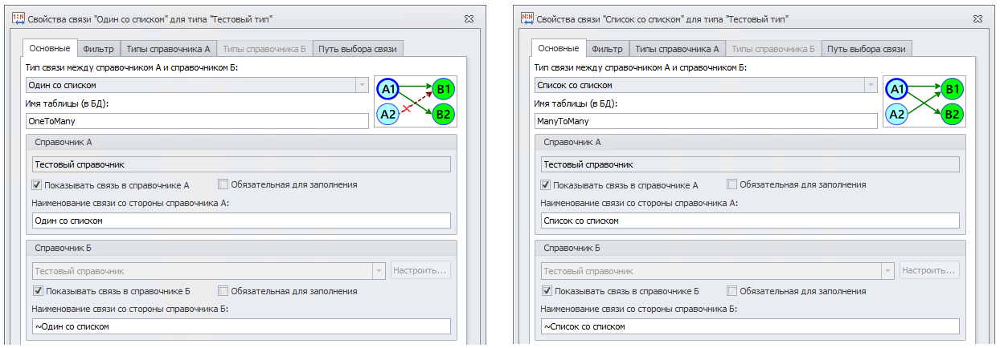

Руководство по T-FLEX DOCs Open API

|  |
| --- |
| Работа с объектами |

Объект является единицей хранения данных. Создание и поиск объектов осуществляются средствами справочника и описаны в разделе [«Справочники»](DEFD0FA1-83E9-4812-B789-104DB96CC5F6.htm)
Ниже приводятся примеры работы с объектами посредством API T-FLEX DOCs.

Редактирование объектов

В начале необходимо взять объект на редактирование (созданный объект с незафиксированными изменениями не нужно брать на редактирование).
В процессе редактирования можно задавать параметры и связи.
По окончании редактирования необходимо сохранить объект или отменить произведенные изменения.

| Внимание  Внимание |
| --- |
| При редактировании объектов справочника важно соблюдать парность вызовов методов взятия на редактирование и сохранения (отмены изменений).  Созданные объекты справочника уже находятся в состоянии редактирования. Вызов метода взятия на редактирование для них потребует еще одного сохранения.  Необходимость в парных вызовах обусловлена передачей данных между макросами. Объект справочника может быть передан из одного макроса в другой, где также содержится код по его редактированию.  Так как каждый макрос может независимо редактировать объект, система фиксирует и проверяет, чтобы каждому взятию на редактирование соответствовал свой вызов сохранения или отмены. |

C#

[Копировать](# "Копировать")

```
ReferenceObject changingObject = Context.ReferenceObject; // Получаем редактируемый объект

if (!changingObject.CanEdit) // Проверяем возможность редактирования объекта
    return;

changingObject.BeginChanges(); // Переводим объект в состояние редактирования
// Если объект только что загружен, можно использовать перегрузку BeginChanges(false), чтобы не перезагружать объект

try
{
    // В коде ниже необходимо заменить пустые глобальные идентификаторы (Guid.Empty) на конкретные идентификаторы параметров и связей

    changingObject[Guid.Empty].Value = 123; // Присваиваем значение параметру
    object value = changingObject[Guid.Empty].Value; // Получаем значение параметра

    // Мы можем получить значение конкретного типа:
    bool flag = changingObject[Guid.Empty].GetBoolean();

    ReferenceObject linkedObject = null; // Объект по связи
    changingObject.SetLinkedObject(Guid.Empty, linkedObject); // Подключаем объект по связи 1:1 или N:1
    changingObject.SetLinkedObject(Guid.Empty, null); // Отключаем объект по связи 1:1 или N:1

    changingObject.AddLinkedObject(Guid.Empty, linkedObject); // Подключаем объект по связи 1:N, N:N, на любой справочник
    changingObject.RemoveLinkedObject(Guid.Empty, linkedObject); // Отключаем объект по связи 1:N, N:N, на любой справочник

    List<ReferenceObject> linkedObjects = changingObject.GetObjects(Guid.Empty); // Получаем объекты списка или объекты по связи 1:N, N:N, на любой справочник
    ReferenceObject linkedObjectByLinkToOne = changingObject.GetObject(Guid.Empty); // Получаем объект по связи 1:1 или N:1

    _ = changingObject.EndChanges(); // Фиксируем окончание изменений
}
catch
{
    // При возникновении исключения отменяем изменения объекта в случае, если объект был взят на редактирование
    if (changingObject.Changing)
        changingObject.CancelChanges();

    throw;
}
```

Ссылки:

[TFlex.DOCs.Model.ReferencesReferenceObject](85856F0C.htm)

Упрощенное редактирование объектов

API T-FLEX DOCs предоставляет упрощенную реализацию редактирования объектов при помощи метода [Modify](6751894D.htm). В котором уже реализована отмена изменений в случае возникновения исключения.
Помимо этого, метод автоматически переводит объект в состояние редактирования и сохраняет его при условии, что объект не был взят на редактирование до вызова метода.
Следующие аргументы влияют на описанное на поведение метода:
- cancelOnError - автоматическая отмена изменений в случае возникновения исключения
- reload - отвечает за перезагрузку объекта при взятии на редактирование
- applyChanges - определяет, нужно ли применять изменения, оставив объект в редактировании

C#

[Копировать](# "Копировать")

```
ReferenceObject changingObject = Context.ReferenceObject; // Получаем редактируемый объект

if (!changingObject.CanEdit) // Проверяем возможность редактирования объекта
    return;

changingObject.BeginChanges(); // Переводим объект в состояние редактирования
// Если объект только что загружен, можно использовать перегрузку BeginChanges(false), чтобы не перезагружать объект

try
{
    // В коде ниже необходимо заменить пустые глобальные идентификаторы (Guid.Empty) на конкретные идентификаторы параметров и связей

    changingObject[Guid.Empty].Value = 123; // Присваиваем значение параметру
    object value = changingObject[Guid.Empty].Value; // Получаем значение параметра

    // Мы можем получить значение конкретного типа:
    bool flag = changingObject[Guid.Empty].GetBoolean();

    ReferenceObject linkedObject = null; // Объект по связи
    changingObject.SetLinkedObject(Guid.Empty, linkedObject); // Подключаем объект по связи 1:1 или N:1
    changingObject.SetLinkedObject(Guid.Empty, null); // Отключаем объект по связи 1:1 или N:1

    changingObject.AddLinkedObject(Guid.Empty, linkedObject); // Подключаем объект по связи 1:N, N:N, на любой справочник
    changingObject.RemoveLinkedObject(Guid.Empty, linkedObject); // Отключаем объект по связи 1:N, N:N, на любой справочник

    List<ReferenceObject> linkedObjects = changingObject.GetObjects(Guid.Empty); // Получаем объекты списка или объекты по связи 1:N, N:N, на любой справочник
    ReferenceObject linkedObjectByLinkToOne = changingObject.GetObject(Guid.Empty); // Получаем объект по связи 1:1 или N:1

    _ = changingObject.EndChanges(); // Фиксируем окончание изменений
}
catch
{
    // При возникновении исключения отменяем изменения объекта в случае, если объект был взят на редактирование
    if (changingObject.Changing)
        changingObject.CancelChanges();

    throw;
}
```

| Внимание  Внимание |
| --- |
| Метод Modify не учитывает поддержку справочником истории изменений. Методы, связанные с рабочим столом, необходимо вызывать явно в коде |

Ссылки:

[TFlex.DOCs.Model.ReferencesReferenceObject](85856F0C.htm)

Получение объектов по обратным связям

Обратные связи



C#

[Копировать](# "Копировать")

```
using System;
using TFlex.DOCs.Model.Macros;
using TFlex.DOCs.Model.References;

public class Macro(MacroContext context) : MacroProvider(context)
{
    public override void Run()
    {
        ReferenceObject currentObject = Context.ReferenceObject; // Получаем текущий объект

        if (currentObject is null)
            return;

        var swappedToOneLink = currentObject.Links.SwappedToOne[Guid.Empty]; // Находим обратную связь к 1 по Guid'у
        ReferenceObject linkedObject = swappedToOneLink?.LinkedObject; // Получаем объект по связи

        var swappedToManyLink = Context.ReferenceObject.Links.SwappedToMany[Guid.Empty]; // // Находим обратную связь к N по Guid'у

        if (swappedToManyLink is not null)
        {
            // Изначально объекты по связи не загружены, можно либо загрузить явно, либо объекты будут загружены при обращению к перечислителю
            // swappedToManyLink.Objects.Load();

            foreach (ReferenceObject referenceObject in swappedToManyLink.Objects)
            {
                // Действия над объектами...
            }
        }
    }
}
```

Получение подключений по связям

C#

[Копировать](# "Копировать")

```
ComplexHierarchyLink linkedComplexHierarchyLink = Context.ReferenceObject.GetLinkedComplexLink(Guid.Empty); // Для текущего объекта получаем связанное подключение по связи 1:1 или N:1
IReadOnlyCollection<ComplexHierarchyLink> linkedComplexHierarchyLinks = Context.ReferenceObject.GetLinkedComplexLinks(Guid.Empty); // Для текущего объекта получаем подключения по связи 1:N или N:N
```

Изменение типа объекта

Для изменения типа необходимо перевести объект в состояние редактирования, указав новый тип.
Метод [BeginChanges()](FC4543AF.htm), принимающий в качестве аргумента новый тип, возвращает объект с уже измененным типом.
Последующие операции (изменение параметров и связей, применение изменений) необходимо проводить над объектом, возвращенным из метода.

C#

[Копировать](# "Копировать")

```
using TFlex.DOCs.Model.Macros;
using TFlex.DOCs.Model.References;
using TFlex.DOCs.Model.References.Tasks;

public class Macro : MacroProvider
{
    public Macro(MacroContext context)
        : base(context)
    {
    }

    public override void Run()
    {
        TasksReference tasksReference = new TasksReference(Context.Connection); // Создаем экземпляр справочника "Темы и задачи"
        ReferenceObject task = tasksReference.FindOne(TasksReferenceObject.FieldKeys.Name, "Задача 1");  // Находим задачу по имени
        if (task is null)
            return;

        // Метод BeginChanges возвращает объект с новым типом, поэтому дальнейшее взаимодействие необходимо осуществлять с возвращенным объектом
        var theme = task.BeginChanges(tasksReference.Classes.Theme) as ThemeObject; // Переводим объект в состояние редактирования с указанием нового типа
        theme.Name.Value = "Тема 1";
        theme.EndChanges();
    }
}
```

Ссылки:

[TFlex.DOCs.Model.ReferencesReferenceObject](85856F0C.htm)

[TFlex.DOCs.Model.References.TasksTasksReference](B9901E82.htm)

[TFlex.DOCs.Model.References.TasksThemeObject](AE5FAE58.htm)

Удаление

Для удаления объекта предназначен метод Delete:

C#

[Копировать](# "Копировать")

```
// Удаление объекта с предварительной проверкой возможности удаления объекта
if (referenceObject.CanDelete)
    referenceObject.Delete();

// Если справочник поддерживает корзину, можем удалить объект из нее
if (referenceObject.Reference.ParameterGroup.SupportsRecycleBin)
    TFlex.DOCs.Model.Desktop.Desktop.ClearRecycleBin(referenceObject);
```

| Внимание  Внимание |
| --- |
| Обратите внимание, что данный метод действителен только для удаления неверсионных объектов.  Удаление версионных объектов описано в разделе ['Работа с версионными объектами'](4203a7d7-dff0-4821-b59e-b0e8073a2839.htm) |

Ссылки:

[TFlex.DOCs.Model.ReferencesReferenceObject](85856F0C.htm)

Разблокировка

Для разблокировки объекта предназначен метод [ReferenceObject.Unlock()](F48118D.htm)

C#

[Копировать](# "Копировать")

```
if (Context.ReferenceObject.CanUnlock) // Проверяем, возможно ли разблокировать объект
    Context.ReferenceObject.Unlock(); // Разблокировываем
```

| Внимание  Внимание |
| --- |
| Обратите внимание, что данный метод действителен только для разблокировки неверсионных объектов.  Для разблокировки версионных объектов необходимо произвести отмену изменений при помощи метода [ReferenceObject.UndoCheckOut()](E4FFFF71.htm) , пример доступен в разделе ['Работа с версионными объектами'](4203a7d7-dff0-4821-b59e-b0e8073a2839.htm) |

Ссылки:

[TFlex.DOCs.Model.ReferencesReferenceObject](85856F0C.htm)

Установка владельца

Для установки владельца объекта можно воспользоваться методом [SetOwnerUser](BD855EC0.htm).
Также, в API доступна пакетная установка владельца (см. [«Установка владельца для списка объектов справочника»](DEFD0FA1-83E9-4812-B789-104DB96CC5F6.htm#SetObjectsOwner)).

C#

[Копировать](# "Копировать")

```
using TFlex.DOCs.Model.Macros;
using TFlex.DOCs.Model.References;
using TFlex.DOCs.Model.References.Users;

public class Macro : MacroProvider
{
    public Macro(MacroContext context)
        : base(context)
    {
    }

    public override void Run()
    {
        ReferenceObject currentObject = Context.ReferenceObject; // Получаем текущий объект
        if (currentObject is null)
            return;

        User currentUser = Context.Connection.ClientView.GetUser(); // Получаем текущего пользователя
        if (currentObject.Reference.ParameterGroup.SupportsOwner // Проверяем, что справочник, которому принадлежит объект, поддерживает параметр "Владелец"
            && currentObject.SystemFields.Owner != currentUser) // и что текущий пользователь не является владельцем объекта
        {
            currentObject.SetOwnerUser(currentUser); // Устанавливаем в качестве владельца текущего пользователя
        }
    }
}
```

Ссылки:

[TFlex.DOCs.Model.ReferencesReferenceObject](85856F0C.htm)

[TFlex.DOCs.Model.References.UsersUser](DAC89B56.htm)

[ParameterGroupSupportsOwner](D21FC415.htm)

Свойства объектов

[ReferenceObject.IsNew](1A02C5FE.htm)
- возвращает значение, указывающее, является ли объект добавленным (с момента создания к объекту не применялись изменения).
Данное свойство удобно использовать в обработчиках событий

[ReferenceObject.Class](BD256107.htm)
- возвращает тип объекта

[ReferenceObject.HasChildren](D798DEFA.htm)
- возвращает значение, указывающее, имеются ли у объекта дочерние объекты.

[ReferenceObject.Parent](580FAB5A.htm)
- возвращает родительский объект. Работа с иерархией описана в разделе ['Работа с иерархией'](2152c584-1690-4920-a990-71a3b6876dfb.htm)

[ReferenceObject.NewParent](E5D97BCD.htm)
- возвращает новый родительский объект, к которому подключается текущий объект в справочнике с простой иерархией (иерархия объектов "Дерево")

[ReferenceObject.Children](CF0C5A3F.htm)
- возвращает коллекцию дочерних объектов. Работа с иерархией описана в разделе ['Работа с иерархией'](2152c584-1690-4920-a990-71a3b6876dfb.htm)

[ReferenceObject.IsInRecycleBin](5B9A45AD.htm)
- возвращает значение, указывающее, находится ли объект в корзине

[ReferenceObject.CanUnlock](52FFDF23.htm)
- возвращает значение, указывающее, возможно ли разблокировать объект

[ReferenceObject.CanDelete](B5DB8E3E.htm)
- возвращает значение, указывающее, возможно ли удаление объекта

| Внимание  Внимание |
| --- |
| Свойство CanDelete может использоваться для версионных объектов только если к ним ни разу не были применены изменения. В остальных случаях необходимо использовать CanCheckOut |

[Авторское право © 1989-2026 АО "Топ Системы". Все права защищены.](http://www.tflex.ru/)