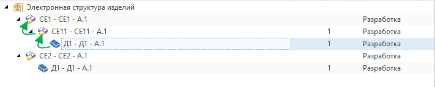

Руководство по T-FLEX DOCs Open API

|  |
| --- |
| Получение родительского объекта |

Пример получения конкретного родительского объекта для выделенного объекта в справочнике со сложной иерархией



C#

[Копировать](# "Копировать")

```
/*
Ссылки:
TFlex.DOCs.IoC.Infrastructure.dll
TFlex.DOCs.UI.Client.dll*/

using System.Linq;
using TFlex.DOCs.IoC.Infrastructure.Interfaces.ViewModels.Base;
using TFlex.DOCs.IoC.Infrastructure.Interfaces.ViewModels.References;
using TFlex.DOCs.Model.Macros;
using TFlex.DOCs.Model.References;
using TFlex.DOCs.UI.Client.Common.ViewModels;

public class ParentFromUI(MacroContext context) : MacroProvider(context)
{
    public override void Run()
    {
        if (Context is not UIMacroContext uiMacroContext) // Проверяем, выполняется ли макрос в графическом интерфейсе пользователя
            return;

        // Если необходимо обработать текущий выбранный объект справочника, то получаем из контекста макроса его модель представления
        // if (uiMacroContext?.ReferenceObjectViewModel is not IReferenceObjectViewModel referenceObjectViewModel)
        //    return;

        if (uiMacroContext.OwnerViewModel is not ISupportSelection supportSelectionViewModel) // Проверяем, поддерживает ли текущее окно выделение объектов
            return;

        var selectedObjectViewModels = supportSelectionViewModel.SelectedObjects.OfType<IReferenceObjectViewModel>(); // Получаем модели представления выбранных объектов

        foreach (var selectedObjectViewModel in selectedObjectViewModels)
        {
            // Получаем модель представления родительского объекта (на скриншоте - СЕ11 - СЕ11 - A.1)
            var parentVewModel = selectedObjectViewModel.Parent as IReferenceObjectViewModel;

            // Если необходимо для выбранного объекта получить корневой объект(на скриншоте - СЕ1 - СЕ1 - A.1):
            while (parentVewModel is not null)
            {
                if (parentVewModel.Parent is IReferenceObjectViewModel nextParent)
                    parentVewModel = nextParent;
                else
                    break;
            }

            if (parentVewModel is not null)
            {
                ReferenceObject parentObject = parentVewModel.ReferenceObject; // Из модели представления получаем объект справочника
                // Выполняем действия над родительским объектом
            }
        }
    }
}
```

[Авторское право © 1989-2026 АО "Топ Системы". Все права защищены.](http://www.tflex.ru/)