Создание

Для работы с макросами в системе T-FLEX DOCs существует специальный справочник "Макросы". Для создания нового макроса нужно воспользоваться командой "Создать" в справочнике. При создании макроса можно выбрать его тип - "Макрос" или "Макрос C#"

Создание макроса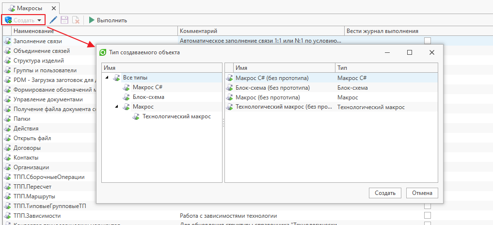
Редактирование

Редактирование макроса осуществляется в его диалоге свойств. Если объект макроса не находится в состоянии редактирования, то необходимо выполнить для него операцию "Взять на редактирование". Все сделанные изменения становятся доступны текущему пользователю после сохранения макроса. Для того чтобы изменения стали доступны другим пользователям системы, необходимо выполнить команду "Применить изменения". Для отмены изменений следует вызвать команду "Отменить изменения"

Диалог свойств макроса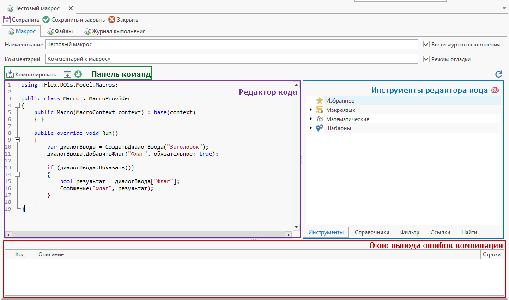

- Поля "Наименование" и "Комментарий" служат для ввода текстового описания макроса. Поле "Наименование" является обязательным для заполнения.
- Флажок "Вести журнал выполнения" служит для фиксирования в справочнике "Журнал выполнения макросов" данных о выполнении макроса:
  время запуска и завершения, имя пользователя, запустившего макрос, текст возникшей ошибки и др.
- Флажок "Режим отладки" служит для возможности подключения отладчика к макросу во время его выполнения.
- Панель команд содержит команды для работы с `макросом (см. раздел [«Панель команд»](#CommandBar)`)
- Редактор кода служит для редактирования текста программы.
  Он поддерживает базовые функции текстового редактора, такие как: копирование, вставка, удаление, поиск и замена текста,
  а также специальные возможности, упрощающие написание кода `программ (подсветку синтаксиса, сворачивание отдельных блоков кода, автоматическое дополнение вводимого текста, нумерацию строк)`.
- Инструменты редактора кода позволяют:

  - - добавлять в код готовые конструкции макроязыка, глобальные уникальные `идентификаторы (Guid'ы)` и наименования элементов структуры справочника
  - - подключать дополнительные библиотеки;
  - - создавать фильтры для справочников и переносить их текстовое представление в код
  - - осуществлять поиск по коду

  Более подробно с инструментами редактора кода можно ознакомиться в разделе [«Инструменты редактора кода»](#CodeEditorTools)
- Окно вывода ошибок компиляции содержит записи об ошибках, выявленных во время последней компиляции макроса.
  Каждая запись содержит описание ошибки и номер строки, в которой эта ошибка обнаружена.

  Ошибки компиляции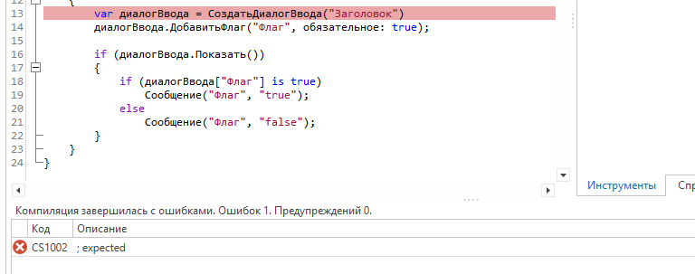
- Вкладка «Файлы» предназначена для подключения к макросу пользовательских `библиотек (.dll)`, исходного `кода (.cs)` или NuGet-пакетов, хранящихся в справочнике «Файлы».
  Вкладка доступна только для макросов типа "Макрос C#".
  Информация о создании Nuget-пакетов для макросов представлена в разделе [«Создание NuGet-пакета для макроса»](#NuGet)

  Подключение файлов-сборок из справочника "Файлы"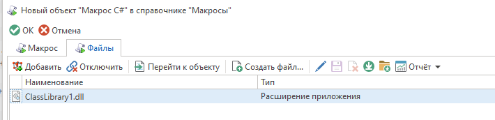
Панель командКоманды

- Кнопка "Компилировать" **(F6)** служит для предварительной компиляции исходного кода программы и позволяет проверить программу на наличие ошибок.
  Найденные ошибки отображаются в окне вывода ошибок компиляции, а также подсвечиваются в тексте программы.
- Кнопка "Открыть во внешнем редакторе" **(F12)** позволяет автоматически сгенерировать `решение (solution)` на основе редактируемого макроса и открыть его в ассоциированном `редакторе (Visual Studio, Visual Studio Code и т.д.)`.
- Кнопка "Синхронизировать из внешнего редактора" переносит все данные `решения (solution)`, сформированного командой "Открыть во внешнем редакторе", из внешнего редактора в диалог свойств макроса.
  К данным решения относится код макроса, а также дополнительные cs-файлы и ссылки
Инструменты редактора кода

#### Вкладка "Инструменты"

Вкладка "Инструменты" служит справочником готовых конструкций `кода (макроязык T-FLEX DOCs, а также операторы и конструкции языка C#)` для ввода в область редактора кода.
Нужную конструкцию кода можно перенести в область кода при помощи команды "Применить", двойного клика по основной кнопке мыши, либо при помощи механизма перетаскивания.
Конструкция кода будет добавлена на место `курсора (каретки)`.
Наиболее часто используемые конструкции можно добавить в "Избранное" при помощи одноименной команды.
Также, существует возможность использования макроязыка на английском языке. Для этого необходимо переключить язык при помощи команды на панели (в русской версии T-FLEX DOCs сами конструкции продолжат отображаться на русском языке, но в область редактора кода они будут добавляться на английском).

Вкладка "Инструменты"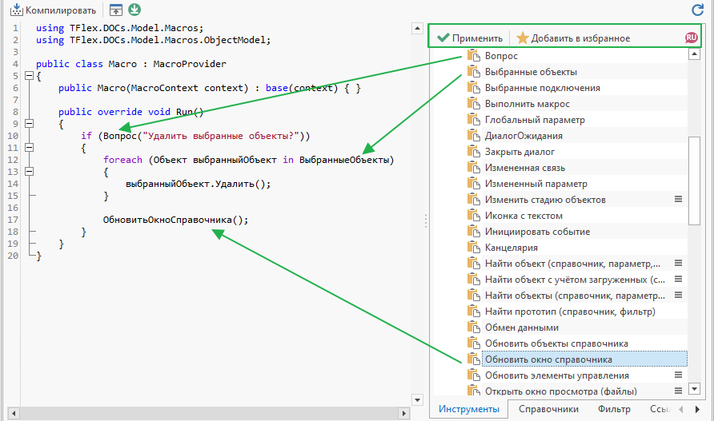

#### Вкладка "Справочники"

Данная вкладка позволяет получить пути к параметрам и связям справочника, а также наименования и глобальные `идентификаторы (Guid'ы)` самих справочников и их типов.
Добавить справочник можно, вызвав соответствующую команду в контекстном меню:

Контекстное меню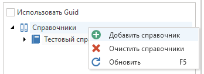

После этого необходимо выбрать элемент структуры `справочника (параметр/связь/справочник/тип)` и перенести его в редактор кода при помощи двойного клика по основной кнопке мыши, либо при помощи механизма `перетаскивания (Drag'n'Drop)`.
Для получения Guid'ов необходимо установить флаг "Использовать Guid"

Вкладка "Справочники"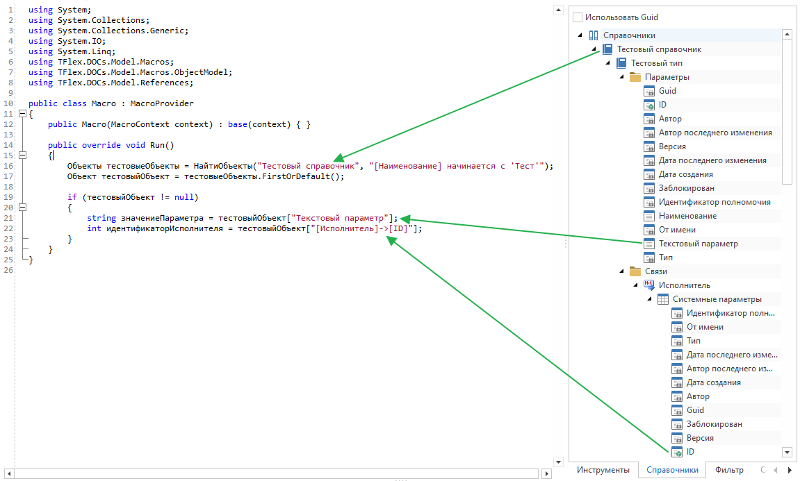

#### Вкладка "Фильтр"

Данная вкладка позволяет сформировать фильтр для определенного справочника, определить количество объектов, удовлетворяющих фильтру, вставить текстовое представление фильтра в редактор кода

1. Справочник, для которого формируется фильтр
2. Условия фильтра
3. Текстовое представление фильтра
4. Команды для взаимодействия со сформированным фильтром:

   - Копирование фильтра в буфер обмена
   - Вставка фильтра в редактор кода
   - Определение количества объектов справочника, удовлетворяющих условиям фильтра

Вкладка "Фильтр"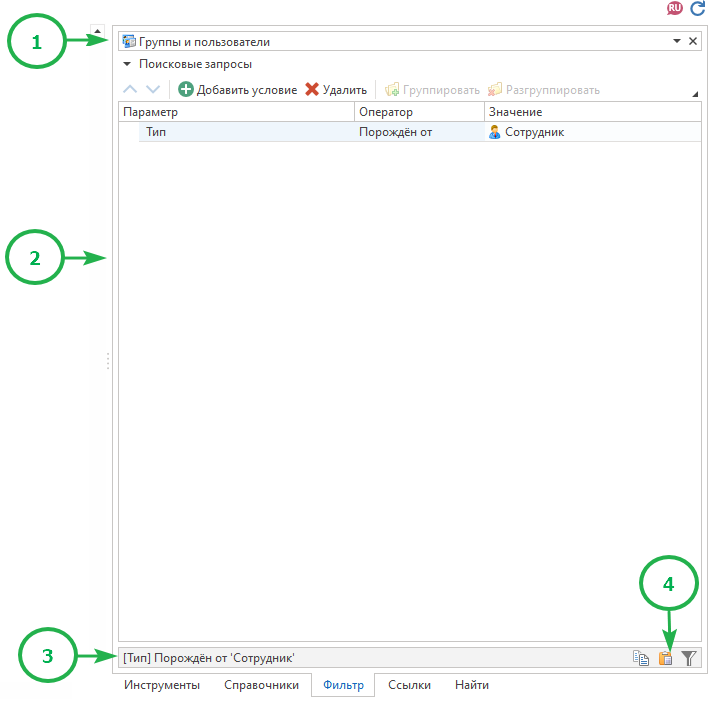

#### Вкладка "Ссылки"

Вкладка "Ссылки" предназначена для подключения к макросу дополнительных библиотек. Вкладка доступна только для макросов типа "Макрос C#".
Обычно используется для подключения системных библиотек, которые расположены в папке Program установленного клиента или `сервера (в зависимости от того, где компилируется и выполняется макрос)`

Подключение ссылок на библиотеки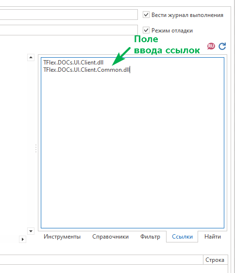

| Внимание |
| --- |
| - Если сборка подключена к макросу на вкладке "Файлы", то указывать ее на вкладке "Ссылки" не нужно - Каждая добавляемая сборка должна быть указана на новой строке |

#### Вкладка "Найти"

Данная вкладка позволяет осуществить поиск текста в редакторе кода и произвести его замену

Вложенная вкладка "Найти"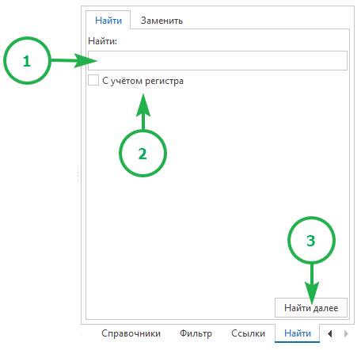

1. Поле ввода искомого текста
2. Поиск с учетом строчных и прописных букв
3. Поиск следующего совпадения

Вложенная вкладка "Заменить"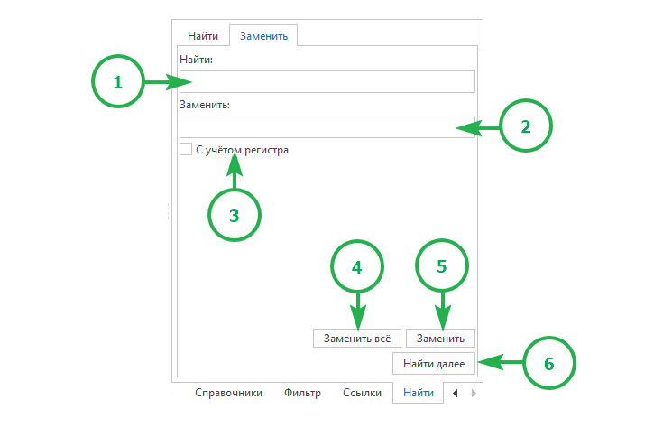

1. Поле ввода заменяемого текста
2. Поле ввода текста, который нужно использовать для замены
3. Поиск с учетом строчных и прописных букв
4. Замена всех совпадений в тексте
5. Замена первого найденного совпадения в тексте
6. Поиск следующего совпадения
Создание NuGet-пакета для макроса

NuGet-пакет представляет собой архивный файл с расширением .nupkg, который содержит скомпилированный `код (dll)` и другие файлы, связанные с этим кодом.
Для создания NuGet-пакета необходимо создать проект библиотеки классов:

Свойства проекта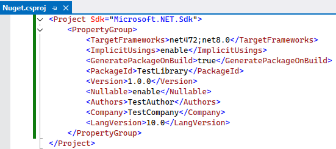Код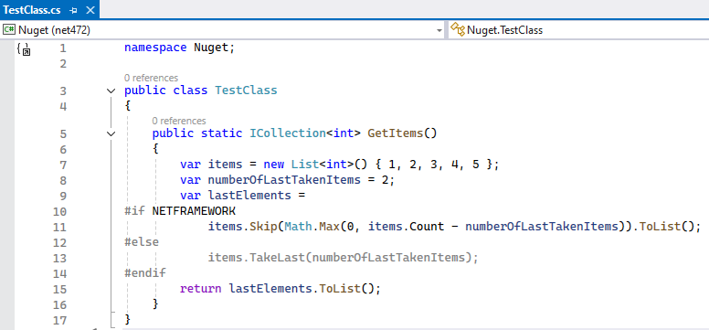Подключение NuGet-пакета к макросу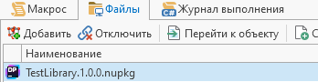Использование NuGet-пакета в макросе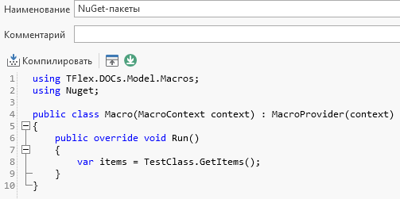

[