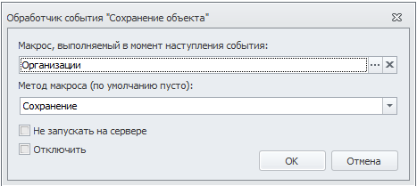
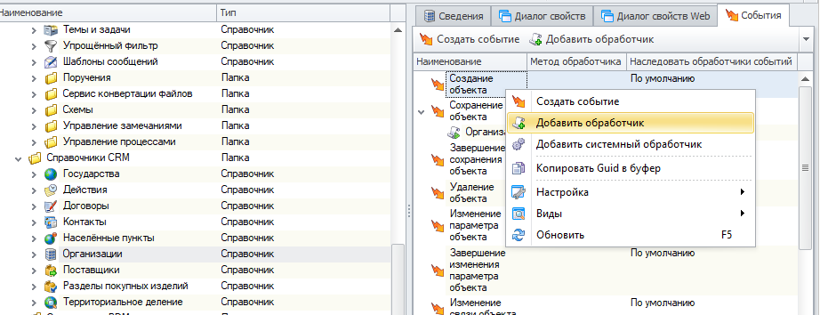
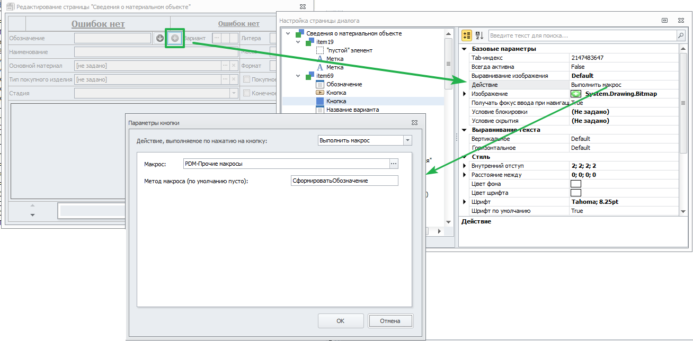
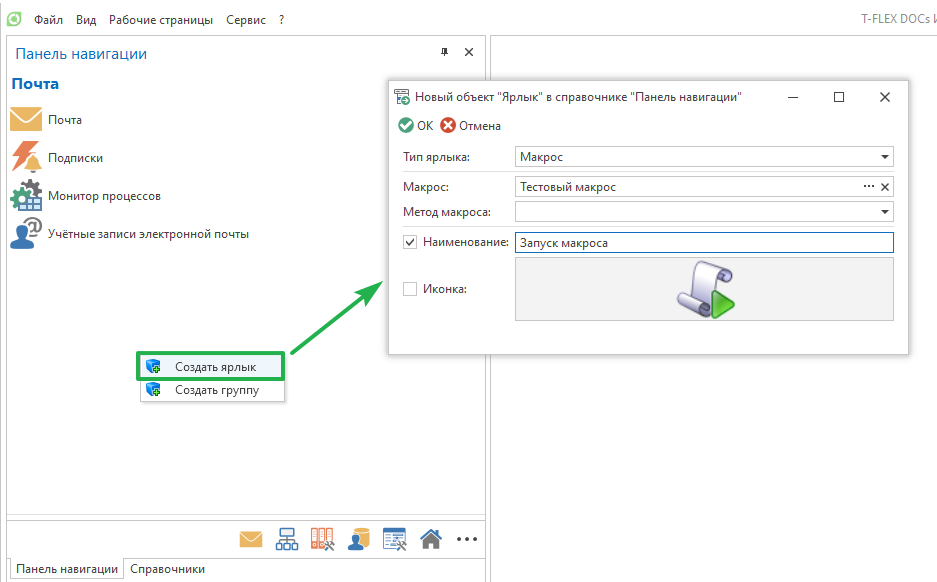
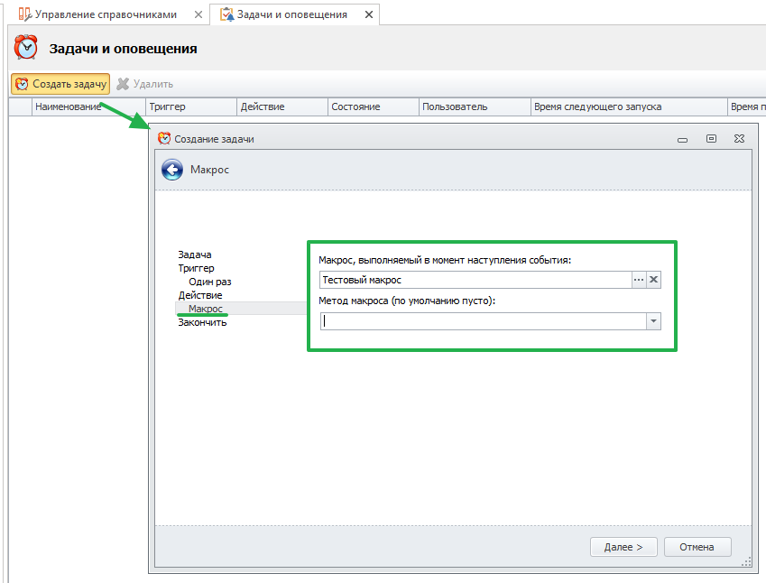
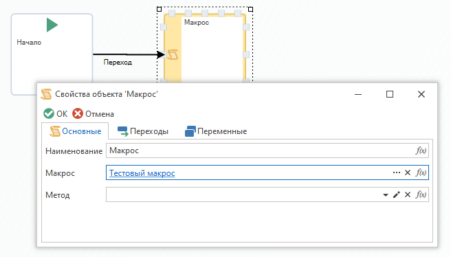
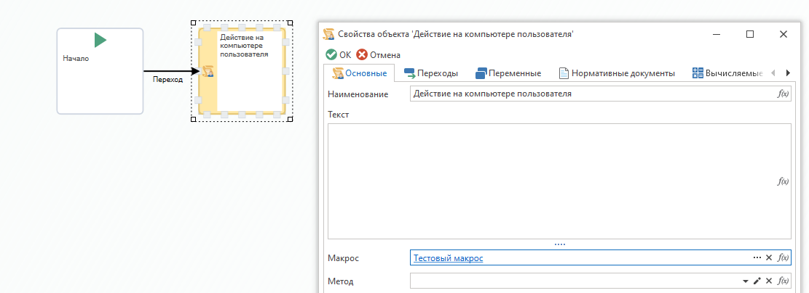

Макросы в T-FLEX DOCs вызываются при возникновении в системе определенных событий, для которых они выбраны в качестве обработчиков. При настройке макроса в качестве обработчика события или действия кроме самого макроса можно выбрать также его метод, который будет выполняться при возникновении события. Для макроса типа "Макрос" поле "Метод макроса" всегда остается пустым. Для макроса типа "Макрос C#" можно выбрать любой из его открытых методов без параметров. Если оставить поле "Метод макроса" пустым, будет выполнен метод Run().

Настройка макроса в качестве обработчика события справочника
Возможные варианты использования макросов:

Обработчик события справочника

Макрос вызывается при возникновении указанного события. Все действия, выполняемые макросом, выполняются от имени текущего пользователя.

Добавление обработчика события справочника

Действие кнопки или флага на странице пользовательского диалога

Макрос вызывается при нажатии на кнопку или при выборе флага на пользовательской странице. Все действия, выполняемые макросом, выполняются от имени текущего пользователя.

Настройка действия кнопки

Действие кнопки панели навигации

Макрос вызывается при нажатии на ярлык панели навигации. Все действия, выполняемые макросом, выполняются от имени текущего пользователя.

Настройка ярлыка

Действие задачи сервера

Макрос вызывается при запуске выполнения задачи на сервере. Все действия, выполняемые макросом, выполняются от имени системы.

Настройка действия задачи

Макрос в процедуре

Макрос вызывается при выполнении действия процесса, связанного с указанным этапом процедуры. Макрос выполняется на стороне сервера. Все действия, выполняемые макросом, выполняются от имени системы.
Исключением является макрос, заданный в блоке "Действие на компьютере пользователя". Такой макрос выполняется от имени текущего пользователя на стороне клиента.

Настройка макроса процедурыБлок "Действие на компьютере пользователя"

[. Все права защищены.](http://www.tflex.ru/)