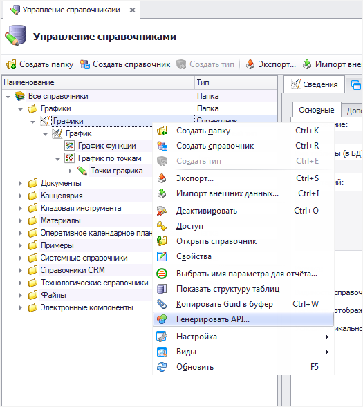
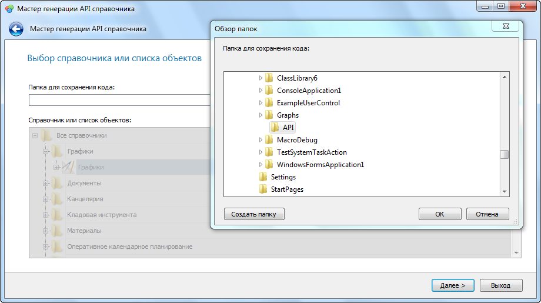
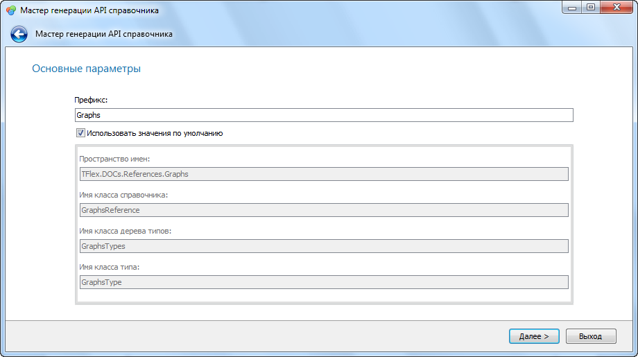
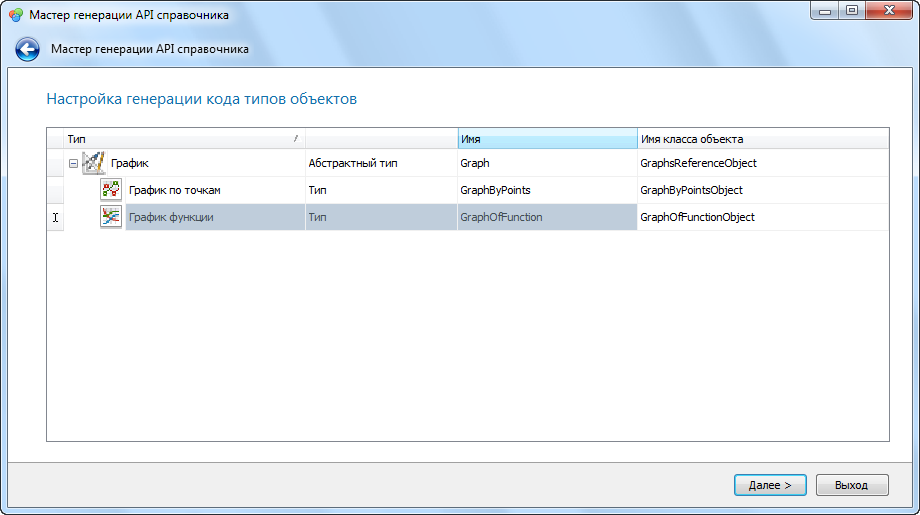
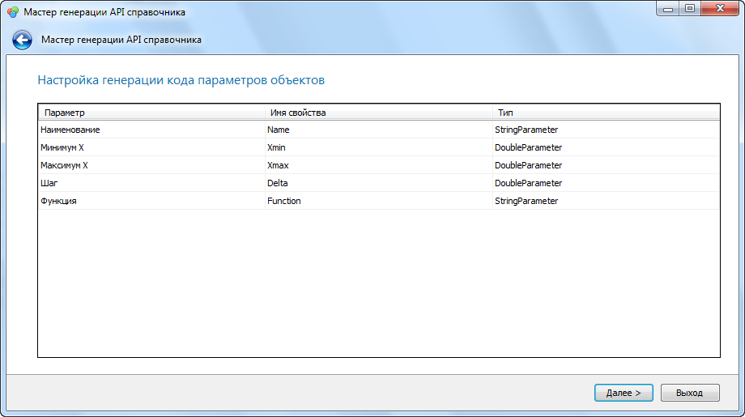
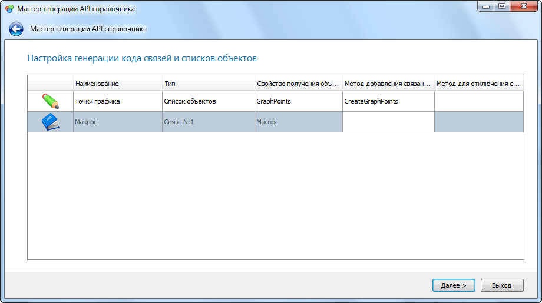
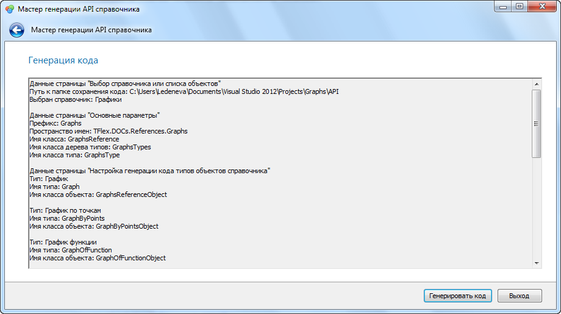
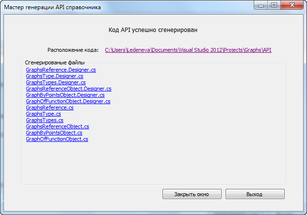

Для расширения функциональности справочника в приложении должны быть реализованы классы, описывающие структуру этого справочника (API справочника). T-FLEX DOCs позволяет сгенерировать такой API автоматически при помощи "Мастера генерации API справочника".
API для каждого справочника и списка объектов генерируется отдельно.

Порядок действий для генерации API справочника

1. В окне "Управление справочниками" требуется выбрать справочник или список объектов, для которого необходим API, и в подменю "Операции" вызвать команду "Генерировать API...". Будет запущен "Мастер генерации API справочника".

2. В первую очередь необходимо выбрать папку для сохранения сгенерированных файлов.

3. Затем нужно задать названия пространства имен и основных классов. Можно задать префикс, при помощи которого эти значения будут сформированы автоматически или ввести имена вручную (для этого нужно снять флаг "Использовать значения по умолчанию").

4. После этого для каждого типа необходимо задать название класса и имя свойства в дереве типов, отвечающее за доступ к этому классу.

5. Следующий шаг - задание имен свойств для параметров справочника.

6. Затем требуется создать свойства и методы для доступа к связанным объектам и спискам объектов.

7. Если все параметры заданы верно, можно генерировать код.

В результате описанных выше операций "Мастер генерации API справочника" создает набор классов для работы со справочником. Каждый класс разделяется на два файла - ClassName.Designer.cs и ClassName.cs. Первый файл содержит автоматически сгенерированный код, второй служит для реализации необходимой функциональности.

