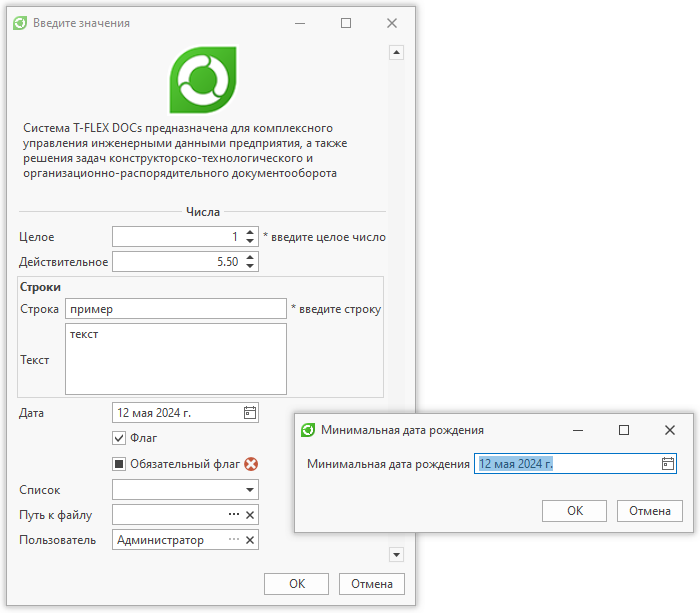

Команды для работы с диалогом ввода значений.

`СоздатьДиалогВвода(Заголовок диалога)`
- создает диалог ввода значений, возвращает объект
ДиалогВвода.

```

```csharp
ДиалогВвода диалог = СоздатьДиалогВвода("Введите значения");
```
```

`ДиалогВвода.ДобавитьГруппу(Имя группы)`
- добавляет группу-разделитель

```

```csharp
диалог.ДобавитьГруппу("текст");
```
```

`ДиалогВвода.ДобавитьЦелое(Имя поля ввода, значение [, обязательное])`
- добавляет поле ввода целых значений

```

```csharp
диалог.ДобавитьЦелое("Целое значение", 10);
диалог.ДобавитьЦелое("Обязательное целое значение", 10, true);
```
```

`ДиалогВвода.ДобавитьДействительное(Имя поля ввода, значение [, точность, обязательное])`
- добавляет поле ввода вещественных значений

```

```csharp
диалог.ДобавитьДействительное("Действительное значение", 5.5, 2);
```
```

`ДиалогВвода.ДобавитьСтроковое(Имя поля ввода, значение [, многострочное, обязательное])`
- добавляет поле ввода текстовых значений

```

```csharp
диалог.ДобавитьСтроковое("Строка", "пример");
диалог.ДобавитьСтроковое("Текст", "пример текста", true);
```
```

`ДиалогВвода.ДобавитьДату(Имя поля ввода, значение[, обязательное])`
- добавляет поле ввода даты

```

```csharp
диалог.ДобавитьДату("Дата", DateTime.Now);
```
```

`ДиалогВвода.ДобавитьФлаг(Имя поля ввода, значение[, обязательное])`
- добавляет флаг

```

```csharp
диалог.ДобавитьФлаг("Флаг", true);
```
```

`ДиалогВвода.ДобавитьВыборИзСписка(Имя поля ввода, значение[, значение])`

`ДиалогВвода.ДобавитьВыборИзСписка(Имя поля ввода, значение, обязательное, значение[, значение])`

- добавляет поле для выбора из списка значений

```

```csharp
диалог.ДобавитьВыборИзСписка("СписокЗначений", "Первое значение", "Второе значение");
```
```

`ДиалогВвода.ДобавитьВыборИзСправочника(Имя поля ввода, имя справочника[, имя параметра, значение, обязательное, корневой объект])`

`ДиалогВвода.ДобавитьВыборИзСправочника(Имя поля ввода, имя справочника[, имя параметра, значение, обязательное, фильтр, корневой объект])`

`ДиалогВвода.ДобавитьВыборИзСправочника(Имя поля ввода, имя справочника[, имя параметра, значение, обязательное, генератор фильтра, корневой объект])`

- добавляет поле для выбора объекта или значения параметра объекта из справочника

```

```csharp
Объект группаСотрудники = НайтиОбъект("Группы и пользователи", "Наименование", "Сотрудники");
диалог.ДобавитьВыборИзСправочника("Выбор объекта", "Группы и пользователи", корневойОбъект: группаСотрудники.ГлобальныйИдентификатор);
диалог.ДобавитьВыборИзСправочника("Выбор значения параметра", "Группы и пользователи", "ID");
```
```

`ДиалогВвода.ДобавитьПодборОбъекта(Имя поля ввода, имя справочника[, имя параметра, контекст релевантности, значение, обязательное, использовать фильтр 'Содержит'])`

`ДиалогВвода.ДобавитьПодборОбъекта(Имя поля ввода, имя справочника, имя параметра, контекст релевантности, значение, обязательное, генератор фильтра[, вид, использовать фильтр 'Содержит'])`

`ДиалогВвода.ДобавитьПодборОбъекта(Имя поля ввода, имя справочника, имя параметра, контекст релевантности, значение, обязательное, фильтр[, вид, использовать фильтр 'Содержит'])`

- добавляет поле ввода выбора объекта из справочника

```

```csharp
диалогВвода.ДобавитьПодборОбъекта("Выбор объекта", "Группы и пользователи", "Наименование", $"return \"TestDialog^{ТекущийПользователь["ID"]}\";");
диалогВвода.ДобавитьПодборОбъекта("Выбор объекта", "Группы и пользователи", "Наименование", "return \"TestDialog\";");
```
```

> Внимание Заданный 'Контекст релевантности' отвечает за отображение в начале списка наиболее часто выбираемых объектов.Контекст представляет собой ключ, по которому в системе хранится информация о частоте выбора объекта.Для установки контекста необходимо передать формулу, возвращающую строковое значение, которое и будет являться ключом.Один и тот же контекст можно использовать в нескольких диалогах.Контекст может быть персональным, к примеру, если будет содержать уникальное для текущего пользователя значение (Guid или Id).Аргумент 'использовать фильтр 'Содержит' отвечает за способ подбора объектов. По умолчанию (если значение аргумента false) используется фильтр, содержащий условие 'Начинается c'.Если необходимо, чтобы подбор осуществлялся по строке, содержащейся в значении параметра, то необходимо передать true.

`ДиалогВвода.ДобавитьКомментарий(Имя поля ввода, Текст комментария)`
- добавляет комментарий к полю ввода

```

```csharp
диалог.ДобавитьКомментарий("Имя поля", "Текст комментарий");
```
```

`ДиалогВвода.ДобавитьИзображение(Имя связи, количество строк)`
- добавляет в диалог связанное с текущим объектом изображение
`ДиалогВвода.ДобавитьИзображение(Объект справочника файлов, количество строк)`
- добавляет в диалог изображение из справочника файлов
`ДиалогВвода.ДобавитьИзображение(Объект справочника, путь к изображению, количество строк)`
- добавляет в диалог изображение, полученное по указанному пути от объекта
`ДиалогВвода.ИзменитьИзображение(Индекс, объект справочника[, путь к изображению])`
- заменяет изображение по его индексу

```

```csharp
int индексИзображения = диалог.ДобавитьИзображение("Файл", 10);

диалог.ДобавитьКнопку("Обновить изображение", (string имя) =>
{
    Объект новоеИзображение = НайтиОбъект("Изображения", "[ID] = 515");
    диалог.ИзменитьИзображение(индексИзображения, новоеИзображение, "Изображение");
}, true);
```
```

`ДиалогВвода.ДобавитьИконку(Объект справочника файлов[, количество строк])`
- добавляет в диалог иконку из справочника файлов
`ДиалогВвода.ДобавитьИконку(Объект справочника, путь к изображению[, количество строк])`
- добавляет в диалог иконку, полученную по указанному пути от объекта
`ДиалогВвода.ИзменитьИконку(Индекс, объект справочника[, путь к иконке])`
- заменяет иконку по ее индексу

```

```csharp
Объект иконка = НайтиОбъект("Изображения", "[ID] = 3");

if (иконка is null)
    return;

int индексИконки = диалог.ДобавитьИконку(иконка, "Иконка", 2);
```
```

`ДиалогВвода.ДобавитьТекст(Текст, Количество строк)`
- добавляет в диалог указанное количество строк текста

```

```csharp
диалог.ДобавитьТекст("Текст", 1);
```
```

`ДиалогВвода.ДобавитьМаску("(Имя поля ввода)", ["(Значение)"], ["(Маска)"], [(Обязательное)])`
- Добавляет поле ввода строки с маской. Работа с маской ввода описана в разделе «Маска ввода»

```

```csharp
диалог.ДобавитьМаску("Маска", "", "999");
```
```

`ДиалогВвода.ДобавитьМаску("(Имя поля ввода)", "(Значение)", "(Тип маски)", ["(Значение)"], [(Обязательное)])`
- Добавляет поле ввода строки с маской заданного типа. Работа с маской ввода описана в разделе «Маска ввода»

```

```csharp
диалог.ДобавитьМаску("Маска", "##0.## $", ТипМаски.Числовая);
```
```

`ДиалогВвода.ДобавитьВремя("(Имя поля ввода)", ["(Значение)"], [(Обязательное)])`
- добавляет поле ввода времени

```

```csharp
диалог.ДобавитьВремя("Время", DateTime.Now);
```
```

`ДиалогВвода.ДобавитьДатуИВремя("(Имя поля ввода)", ["(Значение)"], [(Обязательное)], ["(Маска)"])`
- добавляет поле ввода даты и времени с возможностью использовать маску ввода

```

```csharp
диалог.ДобавитьДатуИВремя("Дата и время", DateTime.Now);
```
```

`ДиалогВвода.ДобавитьКнопку("(Имя элемента управления)", (Обработчик события нажатия кнопки), [(Ширина кнопки)])`
- добавляет кнопку с обработчиком

```

```csharp
диалог.ДобавитьКнопку("Кнопка", new Action<string>((имя) =>
{
    // ...
}));
```
```

`ДиалогВвода.Значение(Имя поля ввода)`
- возвращает значение по имени поля ввода

```

```csharp
int целое = диалог.Значение("Целое значение");
```
```

ДиалогВвода
[Имя поля ввода]
- возвращает или задает значение поля ввода. Также позволяет изменить список возможных значений поля ввода типа "Выбор из списка"

```

```csharp
int целое = диалог["Целое значение"];
диалог["Действительное значение"] = целое;
диалог["Список значений"] = new string[] { "Третье значение", "Четвертое значение" };
```
```

`ДиалогВвода.ЗначениеИзменено`
- событие, возникающее при изменении значения поля в диалоге

```

```csharp
диалог.ЗначениеИзменено += (имяПоля, староеЗначение, новоеЗначение) =>
{
    if (имяПоля != "Строка")
        диалог["Строка"] = диалог["Целое"]*2;
};
```
```

`ДиалогВвода.ЗакрытиеДиалога`
- событие, возникающее при закрытии диалога

```

```csharp
диалог.ЗакрытиеДиалога += (bool нажатаКнопкаОк, ref bool закрытьДиалог) =>
{
    if (!нажатаКнопкаОк) // Если диалог закрывается через отмену
        закрытьДиалог = Вопрос("Вы уверены, что хотите закрыть диалог?"); // При помощи вопроса определяем необходимость закрытия диалога
};
```
```

`ДиалогВвода.УстановитьИконку(Наименование иконки)`

`ДиалогВвода.УстановитьИконку(Guid иконки)`

- устанавливает иконку из справочника "Изображения" в качестве иконки окна

```

```csharp
диалог.УстановитьИконку("Save");
```
```

`ДиалогВвода.УстановитьРазмер(Ширина, Высота)`
- изменяет размер диалога

```

```csharp
диалог.УстановитьРазмер(400, 100);
```
```

`ДиалогВвода.ОтобразитьПолосыПрокрутки(ВертикальнаяПолосаПрокрутки[, АвтоотображениеВертикальнойПолосыПрокрутки])`
- отображает полосы прокрутки для диалога ввода. Аргумент "АвтоотображениеВертикальнойПолосыПрокрутки" позволяет постоянно отображать полосу прокрутки, либо когда панель не может отобразить все содержимое

```

```csharp
диалог.ОтобразитьПолосыПрокрутки(true, false);
```
```

`ДиалогВвода.УстановитьВидимостьЭлемента(Имя элемента, Видимость)`
- устанавливает видимость элемента диалога

```

```csharp
диалог.УстановитьВидимостьЭлемента("Целое", false);
```
```

`ДиалогВвода.УстановитьДоступностьЭлемента(Имя элемента, Доступность)`
- устанавливает доступность элемента диалога

```

```csharp
диалог.УстановитьДоступностьЭлемента("Дата", false);
```
```

`ДиалогВвода.УстановитьОбязательнымДляЗаполнения(Имя элемента, Обязательность заполнения)`
- устанавливает обязательным для заполнения элемент диалога

```

```csharp
диалог.УстановитьОбязательнымДляЗаполнения("Исполнитель", true);
```
```

`ДиалогВвода.УстановитьФильтрЭлемента(Имя элемента, фильтр)`
- устанавливает фильтр для элемента по его наименованию. Фильтр можно задать для таких элементов, как "ПодборОбъекта" и "ВыборИзСправочника"

```

```csharp
диалог.УстановитьФильтрЭлемента("Выбор объекта", "[ID] > '2'");
```
```

`ДиалогВвода.ДобавитьПанель(имя панели[, заголовок, высота, вертикальная полоса прокрутки, автоотображение вертикальной полосы прокрутки])`
- добавляет панель на диалог
`ДиалогВвода.ДобавитьЭлементыНаПанель(имя панели, имена элементов)`
- добавляет элементы на указанную панель

```

```csharp
диалог.ДобавитьЦелое("Целое", 1);
диалог.ДобавитьЦелое("Целое2", 2);

диалог.ДобавитьДату("Дата", DateTime.Now);
диалог.ДобавитьФлаг("Флаг", true);

// Добавляем панели
диалог.ДобавитьПанель("Панель", "Заголовок панели"); // Первая панель с отображаемым заголовком, динамической высотой и без полосы прокрутки
диалог.ДобавитьПанель("Панель2", null, 130, true, false); // Для второй панели явно задаем высоту и включаем постоянное отображение полосы прокрутки

// Объединяем элементы на панелях
диалог.ДобавитьЭлементыНаПанель("Панель", "Целое", "Целое2");
диалог.ДобавитьЭлементыНаПанель("Панель2", "Дата", "Флаг");
```
```

> Внимание Сгруппировать на панели можно только те элементы, которые были добавлены на диалог последовательно, друг за другом.Объединить элементы "Целое" и "Дата", из примера выше, нельзя, т.к. между ними находится элемент "Целое2". При попытке такого объединения буде выдана ошибка "Элементы панели должны располагаться по порядку"

`ДиалогВвода.Показать()`
- отображает диалог ввода

```

```csharp
диалог.Показать();
```
```

Пример работы с диалогом ввода

```

```csharp
using System;
using TFlex.DOCs.Model.Macros;
using TFlex.DOCs.Model.Macros.ObjectModel;

public class Macro : MacroProvider
{
    public Macro(MacroContext context) : base(context) { }

    public override void Run()
    {
        ДиалогВвода диалог = СоздатьДиалогВвода("Введите значения");
        диалог.ОтобразитьПолосыПрокрутки(true, false);

        Объект иконка = НайтиОбъект("Изображения", "[Название] = 'Application'");

        if (иконка is not null)
            диалог.ДобавитьИконку(иконка, "Иконка", 2);

        диалог.ДобавитьТекст("Система T-FLEX DOCs предназначена для комплексного управления инженерными данными предприятия, "
            + "а также решения задач конструкторско-технологического и организационно-распорядительного документооборота", 5);

        диалог.ДобавитьГруппу("Числа");
        диалог.ДобавитьЦелое("Целое", 1);
        диалог.ДобавитьДействительное("Действительное", 5.5, 2);
        диалог.ДобавитьКомментарий("Целое", "* введите целое число");

        диалог.ДобавитьСтроковое("Строка", "пример");
        диалог.ДобавитьСтроковое("Текст", "текст", true, количествоСтрок: 3);
        диалог.ДобавитьКомментарий("Строка", "* введите строку");

        диалог.ДобавитьПанель("Строки", "Строки");
        диалог.ДобавитьЭлементыНаПанель("Строки", "Строка", "Текст");

        диалог.ДобавитьДату("Дата", DateTime.Now);
        диалог.ДобавитьФлаг("Флаг", true, использоватьВсюШирину: true);
        диалог.ДобавитьФлаг("Обязательный флаг", false, диалог["Флаг"], true); // Обязательный флаг, если 'Флаг' = true
        диалог.ДобавитьВыборИзСписка("Список", "Первое значение", "Второе значение");
        диалог.ДобавитьВыборИзСправочника("Путь к файлу", "Файлы", "Относительный путь");
        диалог.ДобавитьВыборИзСправочника("Пользователь", "Группы и пользователи", null, ТекущийПользователь, false, СформироватьФильтр);

        диалог.ЗначениеИзменено += (имяПоля, староеЗначение, новоеЗначение) =>
        {
            if (имяПоля == "Пользователь")
            {
                диалог.УстановитьВидимостьЭлемента("Целое", новоеЗначение is not null);

                if (новоеЗначение is not null)
                    диалог["Целое"] = (int)новоеЗначение["ID"];
            }
            else if (имяПоля == "Флаг")
            {
                диалог.УстановитьДоступностьЭлемента("Дата", новоеЗначение);
                диалог.УстановитьОбязательнымДляЗаполнения("Обязательный флаг", новоеЗначение);
            }

            диалог["Список"] = new string[] { "Третье значение", "Четвертое значение" };
        };

        диалог.ЗакрытиеДиалога += (bool нажатаКнопкаОк, ref bool закрытьДиалог) =>
        {
            if (!нажатаКнопкаОк)
                закрытьДиалог = Вопрос("Вы уверены, что хотите закрыть диалог?");
        };

        if (диалог.Показать())
        {
            int целое = диалог["Целое"];
            double действительное = диалог["Действительное"];
            string строка = диалог["Строка"];
            string текст = диалог["Текст"];
            DateTime дата = диалог["Дата"];
            bool флаг = диалог["Флаг"];
            bool обязательныйФлаг = диалог["Обязательный флаг"];
            object выборИзСписка = диалог["Список"];
            Объект пользователь = диалог["Пользователь"];
            string путьКФайлу = диалог["Путь к файлу"];

            string введенныеЗначения = $"""
              Введены значения:
                Целое: {целое}
                Действительное: {действительное}
                Строка: {строка}
                Текст: {текст}
                Дата: {дата}
                Флаг: {флаг}
                Обязательный флаг: {обязательныйФлаг}
                Выбор из списка: {выборИзСписка}
                Пользователь: {пользователь}
                Путь к файлу: {путьКФайлу}
              """;

            Сообщение("Пример диалога ввода", введенныеЗначения);
        }
        else
        {
            Сообщение("Пример диалога ввода", "Отмена!");
        }

        string СформироватьФильтр()
        {
            DateTime датаФильтра = DateTime.Today;
            ДиалогВвода вводДаты = СоздатьДиалогВвода("Минимальная дата рождения");
            вводДаты.ДобавитьДату("Минимальная дата рождения", датаФильтра);
            вводДаты.УстановитьРазмер(400, 0);
            string фильтр = "([Тип] = 'Сотрудник')";

            if (вводДаты.Показать())
            {
                датаФильтра = вводДаты["Минимальная дата рождения"];
                фильтр += $" И ([День рождения] >= '{датаФильтра}')";
            }

            return фильтр;
        }
    }
}
```
```

Результат: