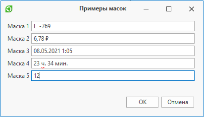

Маска ввода — это набор символов, определяющий формат входных данных.
По заданной маске валидируется введенный текст, а также маска позволяет заполнять параметры в удобной форме ввода

В диалоге ввода поддерживаются следующие типы масок:

- простая (данная маска используется в случаях, когда требуется строка с фиксированными форматом и длиной, например, почтовый индекс);
- регулярное выражение (формат входных данных определяется регулярным выражением);
- числовая (предназначена для ввода числовых значений [целое число, значения с плавающей запятой, валюты, проценты и т.д.] и для настройки их отображения);
- дата и время (для ввода значений даты и времени в различных форматах);
- промежуток времени (для ввода значений временных интервалов в различных форматах)
Простая маска ввода

Простая маска представляет собой строку, которая может состоять из метасимволов, специальных и литеральных символов.

**Метасимволы**

Метасимволы используются для представления ряда символов.
Когда метасимвол задан в определенной позиции в маске, пользователь может ввести любой символ из определяемого метасимволом диапазона только в эту позицию поля ввода

| Символ | Значение |
| --- | --- |
| L | Символ L требует алфавитный символ в данной позиции, заполнение обязательно |
| l | Символ l допускает алфавитный символ в данной позиции и не требует заполнения |
| A | Символ A требует буквенно-цифровой символ в данной позиции, заполнение обязательно |
| a | Символ a допускает буквенно-цифровой символ в данной позиции и не требует заполнения |
| C | Символ C требует произвольный символ в данной позиции, заполнение обязательно |
| c | Символ c допускает произвольный символ в данной позиции и не требует заполнения |
| 0 | Символ 0 требует только числовой символ в данной позиции, заполнение обязательно |
| 9 | Символ 9 допускает только числовой символ в данной позиции и не требует заполнения |
| # | Символ # допускает только числовой символ, "+" или "-" и не требует заполнения |

**Специальные символы**

Специальные символы используются для управления регистром входной строки и представления различных разделителей, а также символов валюты.

| Символ | Значение |
| --- | --- |
| > | Символ > преобразует в верхний регистр все следующие за ним символы до конца маски или до тех пор, пока не встретится символ < |
| < | Символ < преобразует в нижний регистр все следующие за ним символы до конца маски или до тех пор, пока не встретится символ > |
| <> | Если символы <> указываются вместе, то проверка регистра не выполняется, и данные форматируются с учетом регистра, используемого пользователем во время ввода данных |
| / | Символ / используется для разделения месяцев, дней и лет в датах |
| : | Символ : используется для разделения часов, минут и секунд в значениях времени. |
| $ | Символ $ используется для обозначения денежных значений |

**Литеральные символы**

Литеральными символами являются буквенные символы, не являющиеся метасимволами или специальными символами.
Литералы автоматически добавляются на позиции определенные маской. Курсор пропускает литеральные символы во время ввода.
Метасимволы и специальные символы также могут отображаться как литералы, если им предшествует обратная косая черта (\).

Пример работы с маской ввода

```

```csharp
ДиалогВвода диалогВвода = СоздатьДиалогВвода("Примеры масок");

// Простая маска, позволяющая ввести код, состоящий из двух частей, разделенных "-".
// Первая часть состоит из одного или двух буквенных символов, вторая из двузначного или трехзначного числа
диалогВвода.ДобавитьМаску("Маска 1", ">Ll-009", ТипМаски.Простая);

// Числовая маска.
// # - десятичная цифра, можно ввести в соответствующую позицию или оставить пустой. Пустые позиции не отображаются.
// 0 - в соответствующую позицию можно ввести десятичную цифру. Пустые заполнители представлены символом "0"
// $ - символ валюты (знака денежной единицы), зависящий от текущей культуры
диалогВвода.ДобавитьМаску("Маска 2", "##0.## $", ТипМаски.Числовая);

// Маска даты и времени.
// g -  дата + время (время в сокращенной записи, т.е. часы и минуты)
диалогВвода.ДобавитьМаску("Маска 3", "g", ТипМаски.ДатаИВремя);

// Маска промежутка времени
диалогВвода.ДобавитьМаску("Маска 4", "hh' ч. 'mm' мин.'", ТипМаски.ПромежутокВремени, "01 ч. 00 мин.");

// Маска в виде регулярного выражения, позволяющего вводить только числа в диапазоне от 1 до 24
диалогВвода.ДобавитьМаску("Маска 5", @"(1?[1-9])|([12][0-4])", ТипМаски.РегулярноеВыражение);

диалогВвода.Показать();
```
```

Результат:
> Примечание Информация о маске ввода более подробно изложена в документации на официальном сайтеDevExpress