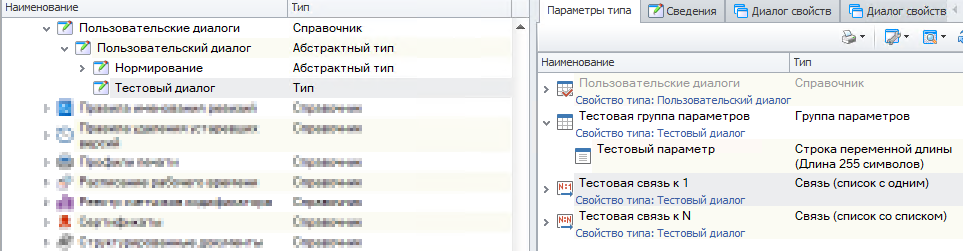
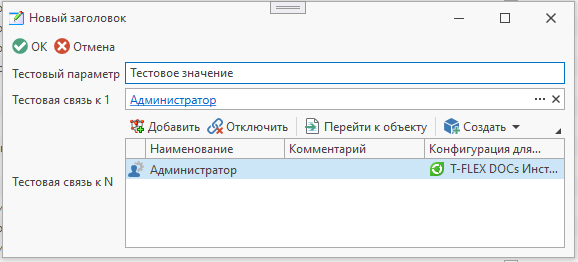

Пользовательские диалоги T-FLEX DOCs позволяют создавать пользовательские диалоговые окна, которые могут содержать связи с различными справочниками либо использоваться для ввода значений, не связанных с данными какого-либо справочника.
Особенность пользовательских диалогов заключается в том, что для каждого пользователя в системе создается только один диалог конкретного типа.
Метод `ПолучитьПользовательскийДиалог()` при первом обращении создает для пользователя диалог указанного типа, а при последующих вызовах возвращает этот созданный диалог.

Пример работы с пользовательским диалогомПользовательский диалог

Код

C#

```csharp
using TFlex.DOCs.Model.Macros;
using TFlex.DOCs.Model.Macros.ObjectModel;

public class Macro : MacroProvider
{
    public Macro(MacroContext context) : base(context) { }

    public override void Run()
    {
        // Получаем пользовательский диалог по наименованию типа
        ПользовательскийДиалог пользовательскийДиалог = ПолучитьПользовательскийДиалог("Тестовый диалог", вернутьПустойДиалог: true);
        // Пользовательский диалог является объектом справочника, поэтому при каждом сохранении диалога значения параметров и объекты связей фиксируются.
        // Если необходимо сбрасывать значения при каждом открытии по аналогии с диалогом ввода, то для аргумента 'вернутьПустойДиалог' нужно задать значение 'true'

        if (пользовательскийДиалог is null) // Если пользовательский диалог не был найден, выходим
            return;

        // Редактируем параметры пользовательского диалога
        пользовательскийДиалог.Изменить();

        пользовательскийДиалог.Заголовок = "Новый заголовок"; // Устанавливаем новый заголовок пользовательского диалога
        пользовательскийДиалог.ПоказыватьПодтверждениеПриОтмене = false; // Скрываем подтверждение действия при отмене как в диалоге ввода
        пользовательскийДиалог["Тестовый параметр"] = "Тестовое значение"; // Устанавливаем значение параметра

        пользовательскийДиалог.Подключить("Тестовая связь к n", ТекущийПользователь); // Подключаем объект по связи к N
        пользовательскийДиалог.СвязанныйОбъект["Тестовая связь к 1"] = ТекущийПользователь; // Задаем объект по связи к 1

        // Пользовательский диалог можно сохранить также, как и любой другой объект справочника:
        //пользовательскийДиалог.Сохранить();

        // Можно отобразить диалог свойств пользовательского диалога, завершить в нем редактирование и сохранить:
        if (пользовательскийДиалог.ПоказатьДиалог()) // Если изменения в диалоге сохранены (нажата кнопка "Ок"), то выполняем необходимую логику
        {
            // Получаем данные из диалога:
            string тестовыйПараметр = пользовательскийДиалог["Тестовый параметр"];
            Объекты объекты = пользовательскийДиалог.СвязанныеОбъекты["Тестовая связь к N"];
            Объект объект = пользовательскийДиалог.СвязанныйОбъект["Тестовая связь к 1"];
        }
    }
}
```csharp
Результат отображения диалога
См. также

#### Ссылки

`ПолучитьПользовательскийДиалог(String, Boolean)`ПользовательскийДиалог

[