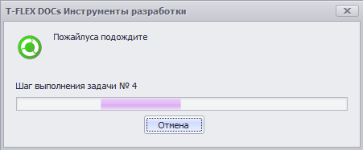

Пример работы с диалогом ожидания

ДиалогОжидания
- Объект для доступа к диалогу ожидания (WaitingDialogAccessor )

```csharp
// Показывает окно ожидания с кнопкой "Отмена"
ДиалогОжидания.Показать("Пожалуйста, подождите", true);

// Симуляция выполнения долгой задачи
for (int i = 1; i <= 5; i++)
{
    // Устанавливает текст над шкалой прогресса
    if (!ДиалогОжидания.СледующийШаг("Шаг выполнения задачи № " + i)) // Возвращает false, если нажата кнопка "Отмена"
        return;

    // Приостанавливает текущий поток на 2 секунды
    System.Threading.Thread.Sleep(TimeSpan.FromSeconds(2));
}

// Скрывает окно ожидания
ДиалогОжидания.Скрыть();
```

> Внимание Данный диалог можно использовать только в макросах C# (тип макроса "Макрос C#")

Результат: