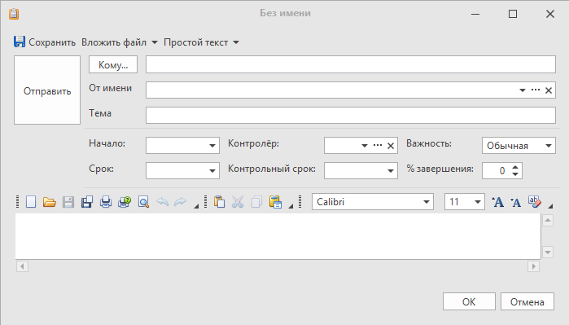

Пример вызова диалога свойств для объекта

`ПоказатьДиалогСвойств(Объект, false)`
- Отображает диалог свойств указанного объекта. Возвращает значение true, если в диалоге нажата кнопка "OK" или false, если нажата кнопка "Отмена".

`
- ``csharp
bool результат = ПоказатьДиалогСвойств(ТекущийОбъект, false); // Если свойства объекта необходимо открыть в новом окне (новая вкладка), то второй аргумент должен быть true
Сообщение("Сообщение", "Нажата кнопка \"{0}\"", результат ? "OK" : "Отмена");
`
- ``

Пример вызова диалога свойств для задания

`ПоказатьДиалогСвойств(Задание)`
- Отображает диалог свойств указанного задания. Возвращает значение true, если в диалоге нажата кнопка "OK" или false, если нажата кнопка "Отмена".

`
- ``csharp
Задание задание = СоздатьЗадание();
ПоказатьДиалогСвойств(задание);

// Или

ЗаданиеКанцелярии заданиеКанцелярии = Канцелярия.СоздатьЗадание();
ПоказатьДиалогСвойств(заданиеКанцелярии);
`
- ``

Результат: