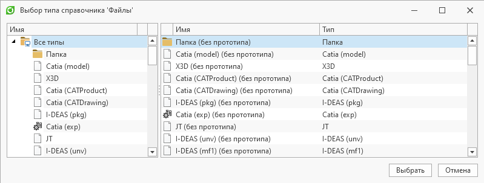

Для получения типов справочника доступен упрощенный вариант, позволяющий получить один выбранный в диалоге тип: «Упрощенное получение типа» .
Также имеется возможность создания настраиваемого диалога: «Пример работы с диалогом выбора типа»

Упрощенное получение типа

`ПоказатьДиалогВыбораТипа(Имя или Guid справочника[, заголовок])`
- Отображает диалог выбора типа объекта справочника. Возвращает тип объекта справочника, если диалог был закрыт нажатием на кнопку "OК" в противном случае - значение null

`
- ``csharp
ТипОбъекта тип = ПоказатьДиалогВыбораТипа("Файлы", "Выбор типа справочника 'Файлы'");

if (тип is not null)
    Сообщение("Тип", "Выбранный тип: " + тип.Имя);
`
- ``

Результат:
Пример работы с диалогом выбора типа

`ПоказатьДиалогВыбораТипа(Имя или Guid справочника[, заголовок])`
- Отображает диалог выбора типа объекта справочника. Возвращает тип объекта справочника, если диалог был закрыт нажатием на кнопку "OК" в противном случае - значение null

`
- ``csharp
using System;
using TFlex.DOCs.Model.Macros;
using TFlex.DOCs.Model.Macros.ObjectModel;
using TFlex.DOCs.Model.References.Nomenclature;

public class Macro(MacroContext context) : MacroProvider(context)
{
    private readonly Guid[] _разрешенныеТипы =
    [
        // Можно указывать явно Guid'ы типов, либо воспользоваться определенными в системе:
        new("87078af0-d5a1-433a-afba-0aaeab7271b5"), // Стандартное изделие
        NomenclatureTypes.Keys.Assembly, // Сборочная единица
        NomenclatureTypes.Keys.Detail, // Деталь
        NomenclatureTypes.Keys.StandardItem
    ];

    public void ВыбратьТипыИзДиалога()
    {
        var диалог = СоздатьДиалогВыбораТипов("Электронная структура изделий"); // Создаем диалог выбора типов из справочника 'Электронная структура изделий'
        диалог.ВыборАбстрактныхТипов = false; // Отключаем выбор абстрактных типов
        диалог.ВыборФлажками = true; // Включаем выбор флажками
        диалог.АвтоВыборФлажками = true; // Устанавливаем возможность автоматической простановки флажков для дочерних объектов. Автовыбор флажками возможен только в случае, когда ВыборФлажками = true
        диалог.РазрешенныеТипы = _разрешенныеТипы; // Устанавливаем набор типов для выбора
        // Задаем типы, которые будут выбраны по умолчанию при открытии диалога
        ТипОбъекта[] заранееВыбранныеТипы = ПолучитьТипыОбъектов("Электронная структура изделий", ["Деталь", "Сборочная единица"]);
        диалог.ВыбранныеТипы = заранееВыбранныеТипы;

        if (!диалог.Показать()) // Отображаем диалог
            return;

        ТипОбъекта[] выбранныеТипы = диалог.ВыбранныеТипы; // Получаем выбранные в диалоге типы
    }
}
`
- ``