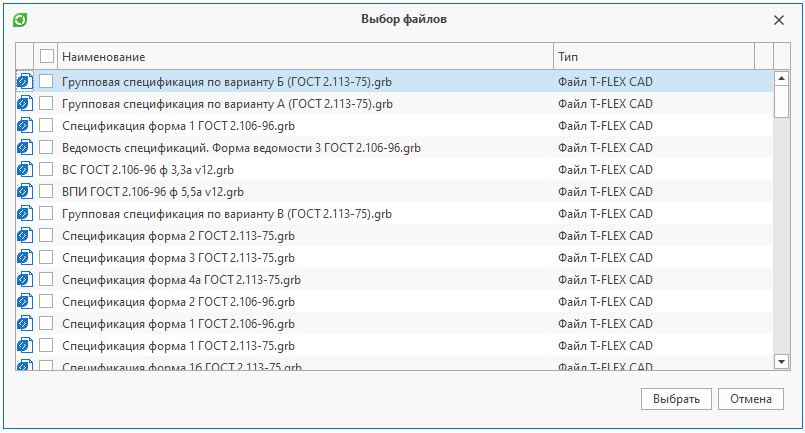

Пример работы с диалогом выбора объектов

`СоздатьДиалогВыбораОбъектов("Имя или Guid справочника")`
- Создает диалог выбора объектов по наименованию или Guid'у справочника. Возвращает созданный диалог выбора объектов

```

csharp
using TFlex.DOCs.Model.Macros;
using TFlex.DOCs.Model.Macros.ObjectModel;

public class Macro : MacroProvider
{
    public Macro(MacroContext context) : base(context) { }

    public override void Run()
    {
        ДиалогВыбораОбъектов диалог = СоздатьДиалогВыбораОбъектов("Файлы");
        диалог.Заголовок = "Выбор файлов"; // Устанавливаем заголовок окна
        диалог.Вид = "Список"; // Устанавливаем вид, с которым открывается справочник
        диалог.Каталог = "Картотека по годам"; // Устанавливаем каталог, с которым открывается справочник
        диалог.ПапкаКаталога = "2018"; // Устанавливаем папку каталога, с которой открывается справочник
        диалог.МножественныйВыбор = true; // Устанавливаем возможность множественного выбора объектов в окне диалога
        диалог.Фильтр = "[Тип] Порождён от 'Документ системы T-FLEX CAD'"; // Устанавливаем фильтр, с которым открывается справочник
        диалог.ВыборФлажками = true; // Устанавливаем возможность выбора объектов при помощи флажков. Выбор флажками возможен только в случае, когда МножественныйВыбор = true
        диалог.ПоказатьПанельКнопок = false; // Скрываем панель кнопок
        диалог.АвтоВыборФлажками = true; // Устанавливаем возможность автоматической простановки флажков при выборе объектов. Автовыбор флажками возможен только в случае, когда ВыборФлажками = true и МножественныйВыбор = true

        // Задаем объекты, которые будут выбраны в диалоге по умолчанию. Для установки выбранных объектов необходимо задать МножественныйВыбор = true
        диалог.ВыбранныеОбъекты = НайтиОбъекты("Файлы", "[ID] Входит в список '10, 11'");

        // Показываем диалоговое окно. Если диалог закрыт кнопкой "Ок", метод возвращает true; в противном случае - false
        if (диалог.Показать())
        {
            foreach (Объект выбранныйОбъект in диалог.ВыбранныеОбъекты) // Получаем выбранные в диалоге объекты
            {
                // Действие над выбранным объектом
            }

            // Для справочника со сложной иерархией можно получить выбранные подключения
            foreach (Подключение выбранноеПодключение in диалог.ВыбранныеПодключения)
            {
                // Действие над выбранным подключением
                Объект дочернийОбъект = выбранноеПодключение.ДочернийОбъект;
            }
        }
    }
}
```

Результат: