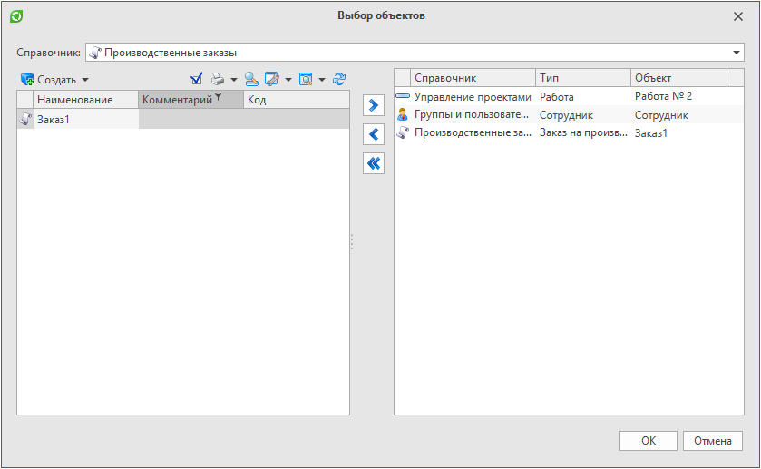

Пример работы с диалогом выбора объектов из справочников

`СоздатьДиалогВыбораОбъектовИзСправочников()`
- Создает и возвращает диалог выбора объектов из справочников.

`
- ``csharp
// Создает диалог выбора объектов из справочников
ДиалогВыбораОбъектовИзСправочников диалог = СоздатьДиалогВыбораОбъектовИзСправочников();
диалог.Заголовок = "Выбор объектов из справочников"; // Возвращает или устанавливает заголовок окна

// Показывает диалоговое окно. Возвращает true, если диалог закрыт кнопкой "Ок", в противном случае - значение false
if (диалог.Показать())
{
    foreach (Объект выбранныйОбъект in диалог.ВыбранныеОбъекты)
    {
        // Действие над выбранным объектом
    }
}
`
- ``

Результат: