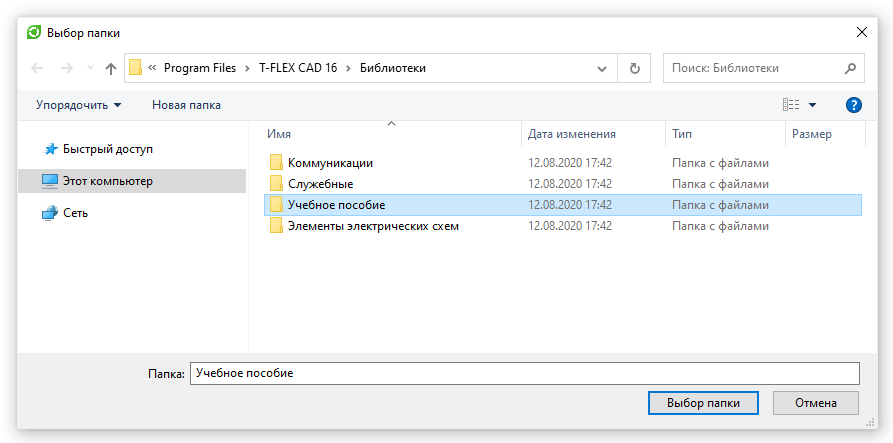

Пример работы с диалогом выбора папки

`СоздатьДиалогВыбораПапки([Заголовок])`
- Создает диалог выбора папки из проводника Windows

```csharp
ДиалогВыбораПапки диалог = СоздатьДиалогВыбораПапки("Выбор папки");
диалог.НачальнаяПапка = @"C:\Program Files\T-FLEX CAD 16\Библиотеки"; // Задаем начальную папку, отображаемую диалоговым окном

if (диалог.Показать())
{
    string выбраннаяПапка = диалог.ИмяПапки; // Получаем выбранную в диалоге папку
}
```

Результат: