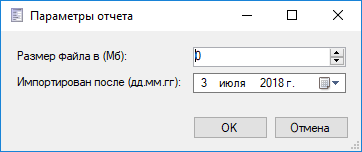
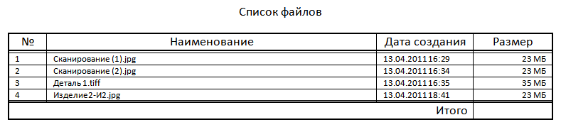

В данном примере рассмотрена генерация отчета из кода макроса.

Пример генерации отчета с заданными параметрамиC#

```csharp
/* Дополнительные ссылки
TFlex.DOCs.Common.dll
TFlex.Reporting.dll */

using System;
using System.Collections.Generic;
using System.Linq;
using TFlex.DOCs.Model.Macros;
using TFlex.DOCs.Model.Macros.ObjectModel;
using TFlex.DOCs.Model.References;
using TFlex.DOCs.Model.References.Files;
using TFlex.DOCs.Model.References.Reporting;
using TFlex.DOCs.Model.Search;
using TFlex.DOCs.Model.Structure;
using ReferenceObjectWithLink = TFlex.DOCs.Model.References.Reporting.ReferenceObjectWithLink;

public class Macro : MacroProvider
{
    // Guid объекта отчета
    private readonly Guid _reportId = new Guid("ad7d10c2-0766-4998-b42c-b6a565d5b2f1");
    // Guid параметра размер файла
    private readonly Guid _fileSizeId = new Guid("1cc37816-33dc-4de4-bcfd-645041795012");

    public Macro(MacroContext context)
        : base(context)
    {
    }

    public override void Run()
    {
        // Создаем диалог для ввода параметров
        ДиалогВвода pd = СоздатьДиалогВвода("Параметры отчета");

        string sizeFile = "Размер файла в (Мб):";
        string importAfter = "Импортирован после (дд.мм.гг):";

        pd.ДобавитьЦелое(sizeFile, 0, true);
        pd.ДобавитьДату(importAfter, DateTime.Now, true);

        if (!pd.Показать())
            return;

        int fileSize = pd.Значение(sizeFile); // Размер файла в (Мб)
        DateTime importDate = pd.Значение(importAfter); // Дата импорта

        var fileReference = new FileReference(Context.Connection); // Создаем экземпляр справочника "Файлы" для поиска объектов
        List<ReferenceObject> foundObjects;

        using (Filter filter = new Filter(fileReference.ParameterGroup)) // Формируем фильтр
        {
            // Размер файла
            filter.Terms.AddTerm(fileReference.ParameterGroup[_fileSizeId], ComparisonOperator.GreaterThanOrEqual, fileSize);

            // Дата создания
            filter.Terms.AddTerm(fileReference.ParameterGroup[SystemParameterType.CreationDate],
                ComparisonOperator.GreaterThan, importDate);

            foundObjects = fileReference.Find(filter); // Применяем фильтр
        }

        if (foundObjects.Count == 0)
            Ошибка("Вывод отчета с заданным фильтром", "Нет файлов удовлетворяющих заданному условию");

        // Создаем список объектов справочника с информацией о подключении к родительским объектам
        var referenceObjectWithLinks = foundObjects.Select(obj => new ReferenceObjectWithLink(obj));

        // Формируем контекст отчета на основе найденных объектов
        ReportGenerationContext reportContext = ReportGenerationContextFactory.CreateContext(referenceObjectWithLinks); // Формируем контекст отчета на основе найденных объектов
        reportContext.OpenFile = true; // Указываем необходимость открытия файла после генерации отчета

        Report report = Context.Connection.References.Reports.Find(_reportId) as Report; // Ищем отчет в справочнике отчетов
        if (report is null)
            Ошибка("Вывод отчета с заданным фильтром", "Не найден отчет");

        // Генерируем отчет с заданным контекстом
        report.Generate(reportContext);
    }
}
```csharp
Окно установки значений параметров для поиска объектовСгенерированный отчет:
См. также

#### Ссылки

TFlex.DOCs.Model.MacrosMacroProviderTFlex.DOCs.Model.Macros.ObjectModelДиалогВводаTFlex.DOCs.ModelServerConnectionTFlex.DOCs.Model.ReferencesReferenceTFlex.DOCs.Model.ReferencesReferenceObjectTFlex.DOCs.Model.SearchFilterTFlex.DOCs.Model.References.ReportingReferenceObjectWithLinkTFlex.DOCs.Model.References.ReportingReportGenerationContextTFlex.DOCs.Model.References.ReportingReport

[