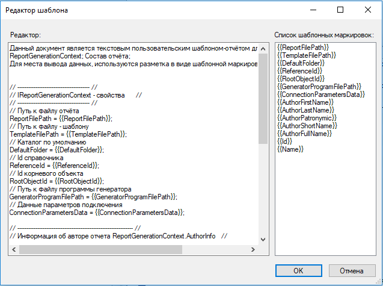

В данном примере рассмотрен способ реализации пользовательского генератора отчётов.
Для создания пользовательского генератора отчётов необходимо:
1) Создать dll - сборку, в которой нужно реализовать интерфейс IReportGenerator или ICustomizableReportGenerator.
2) Скопировать полученную сборку 'ВашаСборка.dll' в каталог - место установки клиента T-FLEX DOCs.
3) Создать пользовательский генератор отчетов в справочнике "Генераторы отчётов" T-FLEX DOCs.
4) Создать новый отчёт и выбрать в качестве генератора созданный генератор отчётов.
5) Добавить шаблон к отчёту, который будет заполняться пользовательским генератором отчётов.

Пример реализации интерфейса ICustomizableReportGenerator для пользовательского генератора отчётов

```csharp
using System;
using System.IO;
using System.Windows.Forms;
using TFlex.DOCs.Model.References.Reporting;
using TFlex.Reporting;

namespace CustomReporting
{
    public class CustomReportGenerator : ICustomizableReportGenerator
    {
        public string DefaultReportFileExtension => "txt";

        // Генерировать отчёт
        public void Generate(IReportGenerationContext context)
        {
            // Получаем путь к файлу отчёта
            string reportFilePath = context.ReportFilePath;
            // Получаем путь к файлу - шаблону
            string templateFilePath = context.TemplateFilePath;

            if (!File.Exists(templateFilePath))
                throw new Exception("Не найден путь к шаблону");

            // Получаем содержимое в файле - шаблоне
            string contentTemplate = File.ReadAllText(templateFilePath);

            if (string.IsNullOrEmpty(contentTemplate))
                throw new Exception($"Пустой шаблон {Path.GetFileName(templateFilePath)}");

            // Приведем объект интерфейса  IReportGenerationContext к ReportGenerationContext
            // для возможности получения его параметров
            ReportGenerationContext rgc = (ReportGenerationContext)context;

            /*
             * Заполняем содержимое шаблона для вывода в отчёт
            */

            // Путь к файлу отчёта
            SetValueInReport("ReportFilePath", rgc.ReportFilePath, ref contentTemplate);
            // Путь к файлу - шаблону
            SetValueInReport("TemplateFilePath", rgc.TemplateFilePath, ref contentTemplate);
            // Каталог по умолчанию
            SetValueInReport("DefaultFolder", rgc.DefaultFolder, ref contentTemplate);
            // Id справочника
            SetValueInReport("ReferenceId", rgc.ReferenceId, ref contentTemplate);
            // Id корневого объекта
            SetValueInReport("RootObjectId", rgc.ReferenceId, ref contentTemplate);
            // Путь к файлу программы генератора
            SetValueInReport("GeneratorProgramFilePath", rgc.GeneratorProgramFilePath, ref contentTemplate);
            // Данные параметров подключения
            SetValueInReport("ConnectionParametersData", rgc.ConnectionParametersData, ref contentTemplate);

            // Информация об авторе отчета
            if (rgc.AuthorInfo != null)
            {
                IAuthorInfo ai = rgc.AuthorInfo;

                // Имя автора
                SetValueInReport("AuthorFirstName", ai.AuthorFirstName, ref contentTemplate);
                // Фамилия автора
                SetValueInReport("AuthorLastName", ai.AuthorLastName, ref contentTemplate);
                // Отчество автора
                SetValueInReport("AuthorPatronymic", ai.AuthorPatronymic, ref contentTemplate);
                // Короткое имя автора
                SetValueInReport("AuthorShortName", ai.AuthorShortName, ref contentTemplate);
                // Полное имя автора
                SetValueInReport("AuthorFullName", ai.AuthorFullName, ref contentTemplate);
            }

            // Информация о справочнике отчёта
            if (rgc.Reference != null)
            {
                var rf = rgc.Reference;

                // Id справочника
                SetValueInReport("Id", rf.Id, ref contentTemplate);
                // Наименование справочника
                SetValueInReport("Name", rf.Name, ref contentTemplate);
            }

            // Шаблонная маркировка для заполнения контента отчёта данными из справочника
            string contentReport = "ContentReport";

            // Выбор данных из справочника на основе режима 'Состав отчёта'
            switch (rgc.ContentType)
            {
                case ReportContentType.Default:
                    // Реализация настроечного параметра - Состав отчёта: -> "По умолчанию"
                    SetValueInReport(contentReport,
                        "ReportContentType.Default - 'По умолчанию'", ref contentTemplate);
                    break;
                case ReportContentType.Reference:
                    // Реализация настроечного параметра - Состав отчёта: -> "Весь справочник"
                    SetValueInReport(contentReport,
                        "ReportContentType.Reference - 'Весь справочник'", ref contentTemplate);
                    break;
                case ReportContentType.SingleObject:
                    // Реализация настроечного параметра - Состав отчёта: -> "Один объект"
                    SetValueInReport(contentReport,
                        "ReportContentType.SingleObject - 'Один объект'", ref contentTemplate);
                    break;
                case ReportContentType.ObjectList:
                    // Реализация настроечного параметра - Состав отчёта: -> "Выбранные объекты"
                    SetValueInReport(contentReport,
                        "ReportContentType.ObjectList - 'Выбранные объекты'", ref contentTemplate);
                    break;
                case ReportContentType.ObjectHierarchy:
                    // Реализация настроечного параметра - Состав отчёта: -> "Выбранные объекты с иерархией"
                    SetValueInReport(contentReport,
                        "ReportContentType.ObjectHierarchy - 'Выбранные объекты с иерархией'", ref contentTemplate);
                    break;
                case ReportContentType.InludedObjects:
                    // Реализация настроечного параметра - Состав отчёта: -> "Выбранные и входящие объекты"
                    SetValueInReport(contentReport,
                        "ReportContentType.InludedObjects - 'Выбранные и входящие объекты'", ref contentTemplate);
                    break;
                case ReportContentType.FirstLevelInludedObjects:
                    // Реализация настроечного параметра - Состав отчёта: -> "Выбранные и входящие объекты первого уровня"
                    SetValueInReport(contentReport,
                        "ReportContentType.FirstLevelInludedObjects - 'Выбранные и входящие объекты первого уровня'", ref contentTemplate);
                    break;
                case ReportContentType.ObjectHierarchyOnly:
                    // Реализация настроечного параметра - Состав отчёта: -> "Только иерархия объектов"
                    SetValueInReport(contentReport,
                        "ReportContentType.ObjectHierarchyOnly - 'Только иерархия объектов'", ref contentTemplate);
                    break;
                case ReportContentType.InludedObjectsOnly:
                    // Реализация настроечного параметра "InludedObjectsOnly"
                    SetValueInReport(contentReport,
                        "ReportContentType.InludedObjectsOnly - 'Только входящие объекты'", ref contentTemplate);
                    break;
                case ReportContentType.FirstLevelInludedObjectsOnly:
                    // Реализация настроечного параметра - Состав отчёта: -> "Выбранные и входящие объекты первого уровня"
                    SetValueInReport(contentReport,
                        "ReportContentType.FirstLevelInludedObjects - 'Выбранные и входящие объекты первого уровня'", ref contentTemplate);
                    break;
            }

            // Записать содержимое в файл отчёта
            File.WriteAllText(reportFilePath, contentTemplate);
        }

        public bool EditTemplateProperties(ref byte[] data, IReportGenerationContext context, IWin32Window owner)
        {
            throw new NotImplementedException();
        }

        // Установить значение в содержимое отчёта
        private void SetValueInReport(string templateMark, object value, ref string contentReport)
        {
            if (value == null)
                contentReport = contentReport.Replace("{{" + templateMark + "}}", "NULL");
            else
                contentReport = contentReport.Replace("{{" + templateMark + "}}", value.ToString());
        }

        // Редактировать шаблон отчёта в форме
        public bool CustomizeDesign(ref byte[] data, IReportGenerationContext context, IWin32Window owner)
        {
            // Получаем путь к файлу - шаблону
            string templateFilePath = context.TemplateFilePath;

            if (!File.Exists(templateFilePath))
                throw new Exception("Не найден путь к шаблону");

            // Получаем содержимое в файле - шаблоне
            string contentTemplate = File.ReadAllText(templateFilePath);

            if (string.IsNullOrEmpty(contentTemplate))
                throw new Exception($"Пустой шаблон {Path.GetFileName(templateFilePath)}");

            // Вызвать форму редактора
            using (var editor = new CustomReportGeneratorEditor())
            {
                // Установить текст редактора
                editor.EditorText = contentTemplate;
                // Заполнить список шаблонными маркировками
                editor.SetMarkList(new[]
                {
                    "{{ReportFilePath}}", // Путь к файлу отчёта
                    "{{TemplateFilePath}}", // Путь к файлу - шаблону
                    "{{DefaultFolder}}", // Каталог по умолчанию
                    "{{ReferenceId}}", // Id справочника
                    "{{RootObjectId}}", // Id корневого объекта
                    "{{GeneratorProgramFilePath}}",  // Путь к файлу программы генератора
                    "{{ConnectionParametersData}}", // Данные параметров подключения
                    "{{AuthorFirstName}}", // Имя автора
                    "{{AuthorLastName}}", // Фамилия автора
                    "{{AuthorPatronymic}}", // Отчество автора
                    "{{AuthorShortName}}", // Короткое имя автора
                    "{{AuthorFullName}}", // Полное имя автора
                    "{{Id}}", // Id справочника
                    "{{Name}}" // Наименование справочника
                });

                if (editor.ShowDialog(owner) != DialogResult.OK)
                    return false;

                // Записать содержимое в файл отчёта
                File.WriteAllText(templateFilePath, editor.EditorText);
            }

            return true;
        }
    }
}
```

Ссылки:

`TFlex.ReportingIReportGenerator`
`TFlex.ReportingICustomizableReportGenerator`

`TFlex.ReportingIAuthorInfo`

`TFlex.DOCs.Model.References.ReportingReportGenerationContext`

`TFlex.DOCs.Model.ReferencesReference`

Пример кода редактора шаблонов для пользовательского генератора отчётов

```csharp
using System.Windows.Forms;

namespace CustomReporting
{
    // Редактор для пользовательского генератора отчётов
    public class CustomReportGeneratorEditor : Form
    {
        private Button _okButton;
        private TextBox _editorTextBox;
        private ListBox _markListBox;
        private Label _markListLabel;
        private Label _editorLabel;
        private Button _cancelButton;

        public CustomReportGeneratorEditor()
        {
            InitializeComponent();
        }

        // Текст редактора
        public string EditorText
        {
            get { return _editorTextBox.Text; }
            set { _editorTextBox.Text = value; }
        }

        // Список шаблонных маркировок
        public void SetMarkList(string[] markList)
        {
            _markListBox.Items.Clear();

            foreach (var mark in markList)
            {
                _markListBox.Items.Add(mark);
            }
        }

        private void InitializeComponent()
        {
            this._okButton = new System.Windows.Forms.Button();
            this._cancelButton = new System.Windows.Forms.Button();
            this._editorTextBox = new System.Windows.Forms.TextBox();
            this._markListBox = new System.Windows.Forms.ListBox();
            this._markListLabel = new System.Windows.Forms.Label();
            this._editorLabel = new System.Windows.Forms.Label();
            this.SuspendLayout();
            //
            // Ok_button
            //
            this._okButton.Anchor = ((System.Windows.Forms.AnchorStyles)((System.Windows.Forms.AnchorStyles.Bottom | System.Windows.Forms.AnchorStyles.Right)));
            this._okButton.DialogResult = System.Windows.Forms.DialogResult.OK;
            this._okButton.Location = new System.Drawing.Point(456, 406);
            this._okButton.Name = "_okButton";
            this._okButton.Size = new System.Drawing.Size(80, 23);
            this._okButton.TabIndex = 0;
            this._okButton.Text = "OK";
            this._okButton.UseVisualStyleBackColor = true;
            //
            // Cancel_button
            //
            this._cancelButton.Anchor = ((System.Windows.Forms.AnchorStyles)((System.Windows.Forms.AnchorStyles.Bottom | System.Windows.Forms.AnchorStyles.Right)));
            this._cancelButton.DialogResult = System.Windows.Forms.DialogResult.Cancel;
            this._cancelButton.Location = new System.Drawing.Point(545, 406);
            this._cancelButton.Name = "_cancelButton";
            this._cancelButton.Size = new System.Drawing.Size(80, 23);
            this._cancelButton.TabIndex = 1;
            this._cancelButton.Text = "Отмена";
            this._cancelButton.UseVisualStyleBackColor = true;
            //
            // Editor_textBox
            //
            this._editorTextBox.AcceptsReturn = true;
            this._editorTextBox.AcceptsTab = true;
            this._editorTextBox.Anchor = ((System.Windows.Forms.AnchorStyles)((((System.Windows.Forms.AnchorStyles.Top | System.Windows.Forms.AnchorStyles.Bottom)
            | System.Windows.Forms.AnchorStyles.Left)
            | System.Windows.Forms.AnchorStyles.Right)));
            this._editorTextBox.Location = new System.Drawing.Point(12, 38);
            this._editorTextBox.Multiline = true;
            this._editorTextBox.Name = "_editorTextBox";
            this._editorTextBox.ScrollBars = System.Windows.Forms.ScrollBars.Both;
            this._editorTextBox.Size = new System.Drawing.Size(435, 355);
            this._editorTextBox.TabIndex = 2;
            this._editorTextBox.WordWrap = false;
            //
            // Mark_listBox
            //
            this._markListBox.Anchor = ((System.Windows.Forms.AnchorStyles)(((System.Windows.Forms.AnchorStyles.Top | System.Windows.Forms.AnchorStyles.Bottom)
            | System.Windows.Forms.AnchorStyles.Right)));
            this._markListBox.FormattingEnabled = true;
            this._markListBox.Location = new System.Drawing.Point(456, 38);
            this._markListBox.Name = "_markListBox";
            this._markListBox.Size = new System.Drawing.Size(169, 355);
            this._markListBox.TabIndex = 3;
            this._markListBox.Click += new System.EventHandler(this.Mark_listBox_Click);
            //
            // MarkList_label
            //
            this._markListLabel.Anchor = ((System.Windows.Forms.AnchorStyles)((System.Windows.Forms.AnchorStyles.Top | System.Windows.Forms.AnchorStyles.Right)));
            this._markListLabel.AutoSize = true;
            this._markListLabel.Location = new System.Drawing.Point(453, 19);
            this._markListLabel.Name = "_markListLabel";
            this._markListLabel.Size = new System.Drawing.Size(172, 13);
            this._markListLabel.TabIndex = 4;
            this._markListLabel.Text = "Список шаблонных маркировок:";
            //
            // Editor_label
            //
            this._editorLabel.AutoSize = true;
            this._editorLabel.Location = new System.Drawing.Point(13, 19);
            this._editorLabel.Name = "_editorLabel";
            this._editorLabel.Size = new System.Drawing.Size(58, 13);
            this._editorLabel.TabIndex = 5;
            this._editorLabel.Text = "Редактор:";
            //
            // CustomReportGeneratorEditor
            //
            this.AcceptButton = this._okButton;
            this.CancelButton = this._cancelButton;
            this.ClientSize = new System.Drawing.Size(634, 441);
            this.Controls.Add(this._editorLabel);
            this.Controls.Add(this._markListLabel);
            this.Controls.Add(this._markListBox);
            this.Controls.Add(this._editorTextBox);
            this.Controls.Add(this._cancelButton);
            this.Controls.Add(this._okButton);
            this.Name = "CustomReportGeneratorEditor";
            this.ShowIcon = false;
            this.Text = "Редактор шаблона";
            this.ResumeLayout(false);
            this.PerformLayout();

        }

        private void Mark_listBox_Click(object sender, System.EventArgs e)
        {
            // индекс в координатах
            int index = _markListBox.IndexFromPoint(((MouseEventArgs)e).Location);

            if (index <= 0) return;

            _editorTextBox.SelectedText = _markListBox.Items[index].ToString();
        }
    }
}
```

Окно редактора шаблонов отчета для пользовательского генератора отчётов
Пример шаблона для отчёта, который будет заполняться пользовательским генератором отчётов

```csharp
Данный документ является текстовым пользовательским шаблоном-отчётом для вывода значений из:
ReportGenerationContext; Состав отчёта;
Для места вывода данных, используются разметка в виде шаблонной маркировки "{{Шаблонная маркировка}}"

// ---------------------------------------------------------------- //
// ReportGenerationContext - свойства                              //
// ---------------------------------------------------------------- //
// Путь к файлу отчёта
ReportFilePath = {{ReportFilePath}};
// Путь к файлу - шаблону
TemplateFilePath = {{TemplateFilePath}};
// Каталог по умолчанию
DefaultFolder = {{DefaultFolder}};
// Id справочника
ReferenceId = {{ReferenceId}};
// Id корневого объекта
RootObjectId = {{RootObjectId}};
// Путь к файлу программы генератора
GeneratorProgramFilePath = {{GeneratorProgramFilePath}};
// Данные параметров подключения
ConnectionParametersData = {{ConnectionParametersData}};

// ---------------------------------------------------------------- //
// Информация об авторе отчета ReportGenerationContext.AuthorInfo;  //
// ---------------------------------------------------------------- //
// Имя автора
AuthorFirstName = {{AuthorFirstName}};
// Фамилия автора
AuthorLastName = {{AuthorLastName}};
// Отчество автора
AuthorPatronymic = {{AuthorPatronymic}};
// Короткое имя автора
AuthorShortName = {{AuthorShortName}};
// Полное имя автора
AuthorFullName = {{AuthorFullName}};

// ----------------------------------------------------------------  //
// Информация о справочнике отчёта ReportGenerationContext.Reference //
// ----------------------------------------------------------------  //
// Id справочника
Id = {{Id}};
// Наименование справочника
Name = {{Name}};

// ---------------------------------------------------------------- //
// Состав отчёта                                                    //
// ---------------------------------------------------------------- //
{{ContentReport}}
```