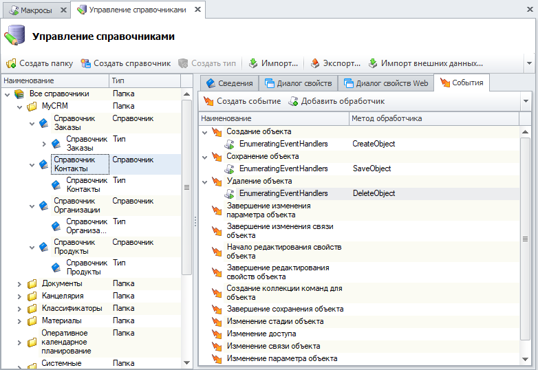

Последовательность действий может быть любой, события возникают как результат какого-либо действия.
Если на событие не назначен никакой обработчик (макрос или системный обработчик), то при выполнении этого действия ничего происходить не будет

Название события отражает момент его возникновения.
Ниже приведено соответствие между событиями и моментом их возникновения:

- Создание объекта - при создании нового объекта (например, нажатии на кнопку Создать;
- Сохранение объекта - возникает перед сохранением (например, нажатии ОК в диалоге создания объекта);
- Завершение сохранения объекта - после успешного сохранения объекта на сервер;
- Изменение параметра объекта - при изменении параметра;
- Завершение изменения параметра объекта - после изменения параметра;
- Изменение связи объекта - при изменении связи;
- Завершение изменения связи объекта - после изменения связи;
- Начало редактирование свойств объекта - при открытии свойств объекта;
- Завершение редактирования свойств объекта - при закрытии диалога свойств;
- Создание подключения - при создании входящего объекта или подключении объекта к родителю(например, при создании детали в составе сборочной единицы);
- Удаление подключения - отключение(удаление из состава) или удаление входящего объекта(например, отключение);
- Применение изменений - команда 'Применить изменения';
- Завершение применения изменений - возникает после применения изменений объекта;
- Отмена изменений - команда 'Отменить изменения';
- Создание ревизии объекта - при создании ревизии объекта;
- Изменение стадии объекта - при изменении стадии объекта;
- Формирование списка команд - при формировании набора команд для панели и контекстного меню, срабатывает на каждом уровне вложенности (для каждой группы команд);
- Восстановление объекта из корзины - при восстановлении объекта из корзины;

Обратите внимание, что одно действие может вызывать несколько событий.
Например, при создании новой детали в составе сборочной единицы будет инициировано два события: создание объекта и создание подключения

Пример обработчиков событий справочника в коде макроса.

В данном примере рассмотрен вызов пользовательского макроса 'EnumeratingEventHandlers' по событиям типа - "Справочник".
Макрос вызывается при возникновении указанного события. Все действия, выполняемые макросом, выполняются от имени текущего пользователя

Добавление обработчика события справочника

`
- ``csharp
using System;
using TFlex.DOCs.Model.Macros;

public class EnumeratingEventHandlers : MacroProvider
{
    public EnumeratingEventHandlers(MacroContext context)
        : base(context)
    { }

    public override void Run() { }

    // Обработчик события 'Создание объекта'
    public void CreateObject()
    {
        Сообщение("Создание", String.Format("Создание объекта справочника {0} ", ТекущийОбъект.Справочник.Имя));
    }

    // Обработчик события 'Сохранение объекта'
    public void SaveObject()
    {
        Сообщение("Сохранение", String.Format("Сохранение объекта справочника {0} ", ТекущийОбъект.Справочник.Имя));
    }

    // Обработчик события 'Удаление объекта'
    public void DeleteObject()
    {
        Сообщение("Удаление", String.Format("Удаление объект справочника {0} ", ТекущийОбъект.Справочник.Имя));
    }
}
`
- ``

См. также

#### Ссылки

- `TFlex.DOCs.Model.MacrosMacroProvider`
- `TFlex.DOCs.Model.MacrosMacroContext`