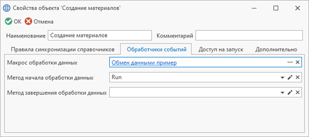

Обработчики событий

В правиле обмена данными имеется возможность добавить обработчики на события процесса обработки данных. Макрос и метод начала обработки данных добавляются во вкладке "Обработчики событий" диалога свойств правила обмена данными

Вкладка "Обработчики событий"

Пример добавления обработчиков для метода начала обработки данных

```csharp
/*
TFlex.DOCs.SynchronizerReference.dll
TFlex.DOCs.Model.Entities.dll
System.Xml.Linq.dll*/

using System;
using System.Collections.Generic;
using System.Xml.Linq;
using TFlex.DOCs.Model.References;
using TFlex.DOCs.Model.Search.Path;
using TFlex.DOCs.Synchronization.Macros;
using TFlex.DOCs.Synchronization.OneC;
using TFlex.DOCs.Synchronization.SyncData;
using TFlex.DOCs.Synchronization.SyncData.Behaviors;
using TFlex.DOCs.Synchronization.SyncData.Xml;
using TFlex.DOCs.Synchronization.SyncData.Xml.OneC;

public class Macro9(ExchangeDataMacroContext context) : ExchangeDataMacroProvider(context)
{
    /// <summary>Метод начала обработки данных на вкладке обработчиков событий</summary>
    public override void Run()
    {
        var behaviors = Context.Settings.Behaviors; // Получаем действия обработки данных

        behaviors.Add(new StartProviderBehavior(OnStart)); // Добавляем действие запуска обмена данными
        behaviors.Add(new FinishProviderBehavior(OnFinish)); // Добавляем действие завершения обмена данными

        behaviors.Add(new LoadDirectionBehavior("Электронная структура изделий", ModifyLoadDirection)); // Добавляем изменение настроек направления загрузки
        behaviors.Add(new LoadSettingsBehavior("Электронная структура изделий", ModifyLoadSettings)); // Добавляем изменение настроек загрузки

        // Добавляем параметр в настройки загрузки
        behaviors.Add(new ParameterToLoadSettingsBehavior("Электронная структура изделий", new Guid("Guid параметра")));

        // Обработчик исключения дублей объектов справочника источника по параметрам справочника
        behaviors.Add(new InputObjectsDistinctBehavior(Context.Connection, "Электронная структура изделий", "Guid параметра"));

        // Добавляем действие после загрузки связей объектов
        behaviors.Add(new AfterLoadLinksBehavior("Электронная структура изделий", AfterLoadLinks));

        // Добавляем действие связи синхронизируемого объекта после чтения связи с исходного объекта
        behaviors.Add(new ProcessingRelationAfterReadBehavior("Электронная структура изделий", "Техпроцессы", ProcessingRelationAfterRead));

        // Добавляем поиск объекта после того, как он не был найден
        behaviors.Add(new ProcessingObjectSearchBehavior("Электронная структура изделий", ProcessingObjectSearch));

        // Добавляем поиск объектов после того, как они не были найдены
        behaviors.Add(new ProcessingObjectsSearchBehavior("Электронная структура изделий", ProcessingObjectsSearch));

        // Добавляем действие синхронизируемого объекта при найденном реестре для другого справочника или найденных дублей реестров
        behaviors.Add(new ProcessingObjectRegisterAnotherExistsBehavior("Электронная структура изделий", ProcessingObjectRegisterAnotherExists));

        // Добавляем действие параметра синхронизируемого объекта перед конвертацией
        behaviors.Add(new ProcessingParameterBeforeConversionBehavior("Электронная структура изделий", "Масса", ProcessingParameterBeforeConversion));

        // Добавляем действие синхронизируемого объекта перед конвертацией
        behaviors.Add(new ProcessingObjectBeforeConversionBehavior("Электронная структура изделий", ProcessingObjectBeforeConversion));

        // Добавляем действие связи синхронизируемого объекта перед конвертацией
        behaviors.Add(new ProcessingRelationBeforeConversionBehavior("Электронная структура изделий", "Техпроцессы", ProcessingRelationBeforeConversion));

        // Добавляем замену значений синхронизируемого параметра по параметру другого справочника
        var findPath = ReferencePath.Parse("[Единицы измерения].[Guid]", Context.Connection); // Путь по справочнику для поиска объекта
        var valuePath = ReferencePath.Parse("[Единицы измерения].[Сокращённое наименование]", Context.Connection); // Путь по справочнику для значения результата
        behaviors.Add(new ReplaceParameterValueBatchBehavior("Электронная структура изделий", "Единица измерения", findPath, valuePath));

        // Добавляем действие параметра синхронизируемого объекта перед установкой значения
        behaviors.Add(new ProcessingParameterBeforeSetBehavior("Электронная структура изделий", "Масса", ProcessingParameterBeforeSet));

        // Добавляем действие связи синхронизируемого объекта после начала редактирования объекта
        behaviors.Add(new ProcessingRelationAfterBeginChangingBehavior("Электронная структура изделий", "Техпроцессы", ProcessingRelationAfterBeginChanging));

        // Задаем файл в параметр синхронизируемого объекта
        behaviors.Add(new AttachFileParameterBehavior("Электронная структура изделий", "Параметр для файла", AttachFileParameter));

        // Добавляем проверку заполнения значения параметра по условию
        behaviors.Add(new CheckParameterBehavior("Электронная структура изделий", "Масса", CheckParameter));

        // Добавляем действие проверки удаления неиспользуемого подключения
        behaviors.Add(new CanRemoveHierarchyLinkBehavior("Электронная структура изделий", CanRemoveHierarchyLink));

        // Добавляем действие синхронизируемого объекта перед сохранением реестра
        behaviors.Add(new ProcessingObjectRegisterConversionBehavior("Электронная структура изделий", ProcessingObjectRegisterConversion));

        // Добавляем проверку обязательного заполнения значения параметра
        behaviors.Add(new RequiredParameterBehavior("Электронная структура изделий", "Масса"));

        // Добавляем действие синхронизируемого объекта перед сохранением
        behaviors.Add(new ProcessingObjectBeforeSavingBehavior("Электронная структура изделий", ProcessingObjectBeforeSaving));

        // Добавляем действие синхронизируемого подключения перед сохранением
        behaviors.Add(new ProcessingHierarchyLinkBeforeSavingBehavior("Электронная структура изделий", BeforeSavingHierarchyLink));

        // Добавляем действие параметра синхронизируемого объекта после конвертации
        behaviors.Add(new ProcessingParameterAfterConversionBehavior("Электронная структура изделий", "Масса", ProcessingParameterAfterConversion));

        // Добавляем действие связи синхронизируемого объекта после конвертации
        behaviors.Add(new ProcessingRelationAfterConversionBehavior("Электронная структура изделий", "Техпроцессы", ProcessingRelationAfterConversion));

        // Добавляем действие синхронизируемого объекта после конвертации
        behaviors.Add(new ProcessingObjectAfterConversionBehavior("Электронная структура изделий", ProcessingObjectAfterConversion));

        // Добавляем действие при чтении xml
        behaviors.Add(new XmlReadDataBehavior(XmlReadData));

        // Добавляем действие при записи xml
        behaviors.Add(new XmlWriteDataBehavior(XmlWriteData));

        // Добавляем действие чтения заголовка по формату обмена EnterpriseData от 1С
        behaviors.Add(new ReadEnterpriseDataBehavior(ReadEnterpriseData));

        // Добавляем действие записи заголовка по формату обмена EnterpriseData от 1С
        behaviors.Add(new WriteEnterpriseDataBehavior(WriteEnterpriseData));
    }

    /// <summary>Действие запуска обмена данными</summary>
    private void OnStart(SyncDataProvider dataProvider) { }

    /// <summary>Действие завершения обмена данными</summary>
    private void OnFinish(SyncDataProvider dataProvider) { }

    /// <summary>Изменяет настройки направления загрузки</summary>
    /// <param name="loadDirection">Направление загрузки</param>
    private void ModifyLoadDirection(ref RelationLoadSettings.RecursiveLoadDirection loadDirection) { }

    /// <summary>Изменяет настройки загрузки</summary>
    private void ModifyLoadSettings(LoadSettings loadSettings) { }

    /// <summary>Действие после загрузки связей объектов</summary>
    private void AfterLoadLinks(SyncDataReferenceInfo dataReferenceInfo, IReadOnlyCollection<ReferenceObject> objects) { }

    /// <summary>Действие связи синхронизируемого объекта после чтения связи с исходного объекта</summary>
    private void ProcessingRelationAfterRead(SyncDataRelation dataRelation) { }

    /// <summary>Поиск объекта после того, как он не был найден</summary>
    private void ProcessingObjectSearch(SyncDataObject dataObject) { } // Заполнить dataObject.ReceiverObject = referenceObject

    /// <summary>Поиск объектов после того, как они не были найдены</summary>
    private void ProcessingObjectsSearch(IReadOnlyCollection<SyncDataObject> dataObjects) { } // Заполнить dataObject.ReceiverObject = referenceObject

    /// <summary>Действие синхронизируемого объекта при найденном реестре для другого справочника или найденных дублей реестров</summary>
    private void ProcessingObjectRegisterAnotherExists(SyncDataObject dataObject, SyncRegisterPairInfo[] registerPairs) { }

    /// <summary>Действие параметра синхронизируемого объекта перед конвертацией</summary>
    private void ProcessingParameterBeforeConversion(SyncDataParameter dataParameter) { }

    /// <summary>Действие синхронизируемого объекта перед конвертацией</summary>
    private void ProcessingObjectBeforeConversion(SyncDataObject dataObject) { }

    /// <summary>Действие связи синхронизируемого объекта перед конвертацией</summary>
    private void ProcessingRelationBeforeConversion(SyncDataRelation dataRelation) { }

    /// <summary>Действие параметра синхронизируемого объекта перед установкой значения</summary>
    private void ProcessingParameterBeforeSet(SyncDataParameter dataParameter) { }

    /// <summary>Действие связи синхронизируемого объекта после начала редактирования объекта</summary>
    private void ProcessingRelationAfterBeginChanging(SyncDataRelation dataRelation) { }

    /// <summary>Задание файла в параметр синхронизируемого объекта</summary>
    private SyncDataFileInfo AttachFileParameter(SyncDataObject dataObject) => new(@"C:\Test.csv");

    /// <summary>Проверка заполнения значения параметра по условию</summary>
    private string CheckParameter(SyncDataParameter dataParameter) => null; // Сообщение ошибки

    /// <summary>Действие проверки удаления неиспользуемого подключения</summary>
    private bool CanRemoveHierarchyLink(SyncDataObject dataObject, ComplexHierarchyLink hierarchyLink) => true;

    /// <summary>Действие синхронизируемого объекта перед сохранением реестра</summary>
    private void ProcessingObjectRegisterConversion(SyncDataObject dataObject) { }

    /// <summary>Действие синхронизируемого объекта перед сохранением</summary>
    private void ProcessingObjectBeforeSaving(SyncDataObject dataObject) { }

    /// <summary>Действие синхронизируемого подключения перед сохранением</summary>
    private void BeforeSavingHierarchyLink(SyncDataHierarchyLink dataHierarchyLink) { }

    /// <summary>Действие параметра синхронизируемого объекта после конвертации</summary>
    private void ProcessingParameterAfterConversion(SyncDataParameter dataParameter) { }

    /// <summary>Действие связи синхронизируемого объекта после конвертации</summary>
    private void ProcessingRelationAfterConversion(SyncDataRelation dataRelation) { }

    /// <summary>Действие синхронизируемого объекта после конвертации</summary>
    private void ProcessingObjectAfterConversion(SyncDataObject dataObject) { }

    /// <summary>Действие при чтении xml</summary>
    private void XmlReadData(XDocument xDocument) { }

    /// <summary>Действие при записи xml</summary>
    private void XmlWriteData(XDocument xDocument) { }

    /// <summary>Действие чтения заголовка по формату обмена EnterpriseData от 1С</summary>
    private void ReadEnterpriseData(EnterpriseDataHeader header) { }

    /// <summary>Действие записи заголовка по формату обмена EnterpriseData от 1С</summary>
    private EnterpriseDataHeader WriteEnterpriseData() => new();
}
```