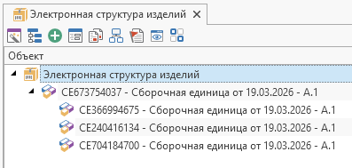

Пример создания и подключения объекта к родителю в справочнике со сложной иерархией.

В данном примере рассмотрена процедура подключения объекта к родителю в справочнике со сложной иерархией.
Ниже показано, как использовать метод
CreateChildLink
класса
ReferenceObject
для создания подключения к дочернему объекту.

```csharp
using System;
using System.Collections.Generic;
using TFlex.DOCs.Model.Desktop;
using TFlex.DOCs.Model.Macros;
using TFlex.DOCs.Model.References;
using TFlex.DOCs.Model.References.Nomenclature;

public class Macro(MacroContext context) : MacroProvider(context)
{
    public override void Run()
    {
        var nomenclatureReference = new NomenclatureReference(Context.Connection); // Справочник "Электронная структура изделий"
        ReferenceObject parentObject = CreateNewNomenclatureObject(nomenclatureReference); // Создаем родительский объект

        if (parentObject is null)
            return;

        int childObjectsCount = 3;
        List<ReferenceObject> newObjects = new List<ReferenceObject>(childObjectsCount + 1) { parentObject };

        // Создаем дочерние объекты
        for (int i = 1; i <= childObjectsCount; i++)
        {
            ReferenceObject newChild = CreateNewNomenclatureObject(nomenclatureReference); // Создаем дочерний объект

            if (newChild is null)
                continue;

            newObjects.Add(newChild);

            // Создаем подключение от родительского объекта к дочернему
            NomenclatureHierarchyLink hLink = parentObject.CreateChildLink(newChild) as NomenclatureHierarchyLink;

            if (hLink is null)
                continue;

            hLink.Amount.Value = i; // Устанавливаем параметры подключения (Количество)
            hLink.EndChanges(); // Фиксируем изменения
        }

        Desktop.CheckIn(newObjects, "Применение изменений", false); // Применяем изменения
    }

    /// <summary>Создает объект "Сборочная единица" в справочнике ЭСИ</summary>
    /// <returns>Созданный объект ЭСИ</returns>
    public ReferenceObject CreateNewNomenclatureObject(NomenclatureReference nomenclatureReference)
    {
        if (nomenclatureReference is null)
            return null;

        // Создаем новый объект "Сборочная единица"
        var classAssembly = nomenclatureReference.Classes.Assembly; // Получаем тип "Сборочная единица"
        NomenclatureObject newNomenclature = nomenclatureReference.CreateReferenceObject(classAssembly) as NomenclatureObject;

        // Устанавливаем параметры объекта
        newNomenclature.Name.Value = "Сборочная единица от " + DateTime.Now.ToShortDateString();
        newNomenclature.Denotation.Value = "СЕ" + new Random().Next();

        _ = newNomenclature.EndChanges(); // Фиксируем изменения

        return newNomenclature;
    }
}
```

Результат работы макроса:
Пример создания и подключения объекта к родителю в ЭСИ при использовании механизма связанных справочников
> Внимание Данный пример работает на устаревшем механизме, основанном на взаимодействии справочника ЭСИ со связанными справочниками (Документы, Материалы, Электронные компоненты и т.д.)

```csharp
using System;
using TFlex.DOCs.Model.Macros;
using TFlex.DOCs.Model.References;
using TFlex.DOCs.Model.References.Documents;
using TFlex.DOCs.Model.References.Nomenclature;

public class Macro : MacroProvider
{
    private readonly DocumentReference _documentReference; // Справочник Документы
    private readonly NomenclatureReference _nomenclatureReference; // Справочник "Электронная структура изделий"

    public Macro(MacroContext context) : base(context)
    {
        _documentReference = new DocumentReference(Context.Connection);
        _nomenclatureReference = new NomenclatureReference(Context.Connection);
    }

    public override void Run()
    {
        ReferenceObject parentObject = CreateNewNomenclatureObject(); // Создаем родительский объект

        if (parentObject is null)
            return;

        for (int i = 1; i < 5; i++)
        {
            ReferenceObject newChild = CreateNewNomenclatureObject(); // Создаем дочерний объект

            if (newChild is null)
                continue;

            NomenclatureHierarchyLink hLink = parentObject.CreateChildLink(newChild) as NomenclatureHierarchyLink; // Создаем подключение к дочернему объекту

            if (hLink is null)
                continue;

            hLink.Amount.Value = i; // Устанавливаем параметры подключения (Количество)
            hLink.EndChanges(); // Сохраним изменения
        }
    }

    /// <summary>
    /// Создает объект "Сборочная единица" в справочнике Документы и подключает его к ЭСИ
    /// </summary>
    /// <returns>Объект ЭСИ</returns>
    public ReferenceObject CreateNewNomenclatureObject()
    {
        if (_documentReference is null || _nomenclatureReference is null)
            return null;

        // Создаем новый объект "Сборочная единица"
        EngineeringDocumentObject newDocument =
            _documentReference.CreateReferenceObject(_documentReference.Classes.Assembly) as EngineeringDocumentObject;

        if (newDocument is null)
            return null;

        newDocument.Name = "Сборочная единица от " + DateTime.Now.ToShortDateString(); // Устанавливаем параметры объекта
        newDocument.Denotation = "СЕ" + new Random().Next();

        _ = newDocument.EndChanges(); // Сохраняем изменения

        NomenclatureObject newNomenclature = _nomenclatureReference.CreateNomenclatureObject(newDocument); // Подключаем к ЭСИ

        // Если связанный объект ЭСИ (newDocument) сохранен, то и объект ЭСИ, созданный при помощи CreateNomenclatureObject, тоже будет сохранен.
        // Если к связанному объекту ЭСИ не были применены изменения (EndChanges()), то объект ЭСИ добавляется в набор сохранения объектов вместе со связанным объектом.
        // В этом случае надо сохранить изменения в наборе:

        //if (newNomenclature.SaveSet is not null)
        //    newNomenclature.SaveSet.EndChanges();

        return newNomenclature;
    }
}
```

См. также

#### Ссылки

`TFlex.DOCs.Model.MacrosMacroProvider``TFlex.DOCs.ModelServerConnection``TFlex.DOCs.Model.References.DocumentsDocumentReference``TFlex.DOCs.Model.References.NomenclatureNomenclatureReference``TFlex.DOCs.Model.ReferencesReferenceObject``TFlex.DOCs.Model.References.DocumentsEngineeringDocumentObject``TFlex.DOCs.Model.References.NomenclatureNomenclatureObject`