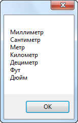

Пример работы с фильтром

В данном примере рассмотрена работа со стандартным классом фильтра DOCs
[TFlex.DOCs.Model.SearchFilter](9E5EA472.htm)
Ниже показано, как создать экземпляр данного класса и воспользоваться им для фильтрации объектов стандартного справочника "Единицы измерения" по типу

C#[Копировать](# "Копировать")

```
using System.Collections.Generic;
using System.Linq;
using System.Text;
using TFlex.DOCs.Model.Classes;
using TFlex.DOCs.Model.Macros;
using TFlex.DOCs.Model.References.Units;
using TFlex.DOCs.Model.Search;
using TFlex.DOCs.Model.Structure;

public class WorkWithFilter : MacroProvider
{
    public WorkWithFilter(MacroContext context)
        : base(context)
    { }

    public override void Run()
    {
        UnitReference unitReference = Context.Connection.References.Units; // Создаем экземпляр справочника «Единицы измерения»
        ClassObject typeLength = unitReference.Classes.Length; // Находим тип «Длина»

        using var filter = new Filter(unitReference.ParameterGroup); // Создаем фильтр
        //Добавляем условие поиска - «Тип = Длина»
        filter.Terms.AddTerm(unitReference.ParameterGroup[SystemParameterType.Class],
            ComparisonOperator.Equal, typeLength);

        // Получаем список объектов (в качестве условия поиска - сформированный фильтр) и приводим к типу «Единицы измерения»
        List<Unit> units = unitReference.Find(filter).OfType<Unit>().ToList();
        // Выводим наименования
        var strBuilder = new StringBuilder();

        foreach (Unit unit in units)
        {
            strBuilder.AppendLine(unit.Name);
        }

        Сообщение("Работа с фильтром", strBuilder.ToString());
    }
}
```

Результат:
См. также

#### Ссылки

[TFlex.DOCs.Model.MacrosMacroProvider](E9A25D72.htm)[TFlex.DOCs.ModelServerConnection](EAA7893.htm)[TFlex.DOCs.ModelReferenceInfo](D99B90CD.htm)[TFlex.DOCs.Model.ReferencesReference](26AE86E6.htm)[TFlex.DOCs.Model.ClassesClassObject](828E76B1.htm)[TFlex.DOCs.Model.SearchFilter](9E5EA472.htm)

[. Все права защищены.](http://www.tflex.ru/)