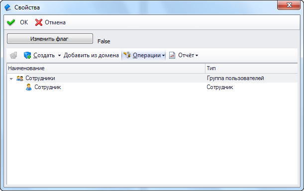

В T-FLEX DOCs есть возможность создавать пользовательские элементы управления для использования в диалогах и пользовательских страницах. Ниже приведен пример создания такого элемента управления.

Пример элемента управления пользователяЭлемент управленияC#[Копировать](# "Копировать")

```
/* Дополнительные библиотеки
System.Drawing.dll
System.Windows.Forms.dll
TFlex.DOCs.Model.dll
TFlex.DOCs.UI.Common.dll
TFlex.DOCs.UI.Controls.dll
TFlex.DOCs.UI.Objects.dll
TFlex.DOCs.UI.Types.dll*/

using System;
using System.ComponentModel;
using System.Windows.Forms;
using System.Xml.Serialization;
using TFlex.DOCs.Model;
using TFlex.DOCs.Model.Configuration;
using TFlex.DOCs.Model.References.Users;
using TFlex.DOCs.UI.Common;
using TFlex.DOCs.UI.Controls.References;
using TFlex.DOCs.UI.Objects.ReferenceModel;
using TFlex.DOCs.UI.Objects.ReferenceModel.VisualRepresentation;
using TFlex.DOCs.UI.Objects.Settings;
using TFlex.DOCs.Model.References;

namespace TFlex.DOCs.UI.Controls.LayoutControls
{
    public class ExampleLayoutControlUserControl :
        // Наследуемся от BaseUserControl т.к. там реализован интерфейс IControl, т.е. чтение/сохранение настроек
        Templates.BaseUserControl,
        IUserLayoutControlItem
    {
        private Label _settingsLabel;
        private Panel _usersGroupControl;
        private Button _showUsersButton;
        private readonly IContainer components = null;

        public ExampleLayoutControlUserControl()
        {
            // Добавляем описание настроек для работы сериализатора
            XmlSerializerManager.RegisterTypes(new[]
            {
                typeof(ExampleLayoutControlUserControlSettingsData)
            });

            InitializeComponent();
            CreateVisualRepresentationControl();
        }

        // Обработчик события нажатия на кнопку. Создает элемент управления со справочными данными
        private void _showUsersButton_Click(object sender, EventArgs e)
        {
            UserSettingsFlag = !UserSettingsFlag;
            _settingsLabel.Text = UserSettingsFlag.ToString();
        }

        // Создает элемент управления со справочными данными
        private void CreateVisualRepresentationControl()
        {
            VisualRepresentationControl = new ReferenceVisualRepresentationControl();
            _usersGroupControl.Controls.Add(VisualRepresentationControl);
        }

        // Инициализирует элемент управления со справочными данными
        private void InitializeVisualRepresentationControl()
        {
            if (VisualRepresentationControl == null)
                return;

            VisualRepresentationControl.Dock = DockStyle.Fill;
            VisualRepresentationControl.SupportAsyncImplement = false;
            VisualRepresentationControl.SetApplicationFormView(Application);
            VisualRepresentationControl.CreateTreeVisualRepresentation(ServerGateway.Connection.References.Users, GetCurrentParentObject());

            VisualRepresentation.IsReadOnlyControl = VisualRepresentation.IsReadOnlyObjects = ReadOnly;
            VisualRepresentationControl.Initialize();
        }

        // Возвращает элемент управления со справочными данными
        public ReferenceVisualRepresentationControl VisualRepresentationControl { get; private set; }

        // Возвращает визуальное представление справочника
        public IReferenceCompositeVisualRepresentation VisualRepresentation
        {
            get
            {
                return VisualRepresentationControl == null ? null : VisualRepresentationControl.VisualRepresentation;
            }
        }

        // Возвращает первую группу пользователей, в которую входит автор редактируемого объекта
        private ReferenceObject GetCurrentParentObject()
        {
            ReferenceObject parentObject = null;

            if (ReferenceUIObject != null)
            {
                User author = ReferenceUIObject.ReferenceObject.SystemFields.Author;
                parentObject = author.Parent;
            }

            return parentObject;
        }

        // Вызывается при изменении редактируемого объекта для обновления данных в элементе управления
        private void OnChangedParent()
        {
            if (VisualRepresentation == null)
                return;

            VisualRepresentation.SetRootObject(GetCurrentParentObject());
            VisualRepresentation.IsReadOnlyControl = VisualRepresentation.IsReadOnlyObjects = ReadOnly;
            VisualRepresentation.Refresh(true);
        }

        protected override void Dispose(bool disposing)
        {
            if (disposing)
            {
                if (components != null)
                    components.Dispose();

                if (VisualRepresentationControl != null)
                {
                    VisualRepresentationControl.Dispose();
                    VisualRepresentationControl = null;
                }
            }
            base.Dispose(disposing);
        }

        #region IUserLayoutControlItem Members

        // Возвращает или задает главное окно приложения
        public IApplicationFormView Application { get; set; }

        // Возвращает или задает объект, для которого отображаются свойства в элементе управления
        public IReferenceUIObject ReferenceUIObject { get; set; }

        // Возвращает или задает значение, указывающее, является ли элемент управления доступным только для чтения
        public bool ReadOnly { get; set; }

        // Выполняется при инициализации элемента управления
        public void Initialize()
        {
            InitializeVisualRepresentationControl();
            _settingsLabel.Text = UserSettingsFlag.ToString();
        }

        #endregion

        #region ILayoutControlSupportReload Members

        // Вызывается при обновлении объекта, свойства которого отображаются в элементе управления
        public void RefreshData()
        {
            if (VisualRepresentation != null)
                VisualRepresentation.Refresh(true);
        }

        // Вызывается при изменении объекта, свойства которого отображаются в элементе управления
        // changeUiObject - Измененный объект
        // context - Контекст вызова. Содержит данные о строке в списке или узле в дереве, который отображает данный объект
        // isReadOnly - Значение, указывающее, является ли элемент управления доступным только для чтения
        public void Reload(IDesktopUIObject changeUiObject, Templates.ControlActionContext context, bool isReadOnly)
        {
            ReferenceUIObject = changeUiObject as IReferenceUIObject;
            ReadOnly = isReadOnly;
            OnChangedParent();
        }

        #endregion

        #region Пример работы с настройками

        // Флаг для сохранения в настройках элемента управления
        public bool UserSettingsFlag { get; private set; }

        protected override IControlSettings CreateSettings()
        {
            return new PersistControlSettings<ExampleLayoutControlUserControlSettingsData>(this);
        }

        // Возвращает экземпляр класса для работы с настройками элемента управления
        [Browsable(false), DesignerSerializationVisibility(DesignerSerializationVisibility.Hidden)]
        public new ExampleLayoutControlUserControlSettingsData SettingsData
        {
            get { return Settings.Data as ExampleLayoutControlUserControlSettingsData; }
        }

        // Сохраняет настройки элемента управления
        public override void SaveSettings()
        {
            SettingsData.UserFlag = UserSettingsFlag;
            base.SaveSettings();
        }

        // Загружает настройки элемента управления
        public override void LoadSettings()
        {
            base.LoadSettings();
            UserSettingsFlag = SettingsData.UserFlag;
        }

        // Класс для сохранения настроек элемента управления
        [XmlType("ExampleLayoutControlUserControlSettings")]
        public class ExampleLayoutControlUserControlSettingsData : PersistControlSettingsData
        {
            public ExampleLayoutControlUserControlSettingsData()
            {
                UserFlag = true;
            }

            [XmlAttribute]
            [DefaultValue(true)]
            public bool UserFlag { get; set; }

        }

        #endregion

        private void InitializeComponent()
        {
            _showUsersButton = new Button();
            _settingsLabel = new Label();
            _usersGroupControl = new Panel();
            SuspendLayout();
            //
            // _showUsersButton
            //
            _showUsersButton.Location = new System.Drawing.Point(0, 0);
            _showUsersButton.Name = "_showUsersButton";
            _showUsersButton.Size = new System.Drawing.Size(175, 23);
            _showUsersButton.TabIndex = 0;
            _showUsersButton.Text = "Изменить флаг";
            _showUsersButton.UseVisualStyleBackColor = true;
            _showUsersButton.Click += _showUsersButton_Click;
            //
            // _settingsLabel
            //
            _settingsLabel.AutoSize = true;
            _settingsLabel.Location = new System.Drawing.Point(181, 10);
            _settingsLabel.Name = "_settingsLabel";
            _settingsLabel.Size = new System.Drawing.Size(35, 13);
            _settingsLabel.TabIndex = 0;
            _settingsLabel.Text = "label1";
            //
            // _usersGroupControl
            //
            _usersGroupControl.Anchor = AnchorStyles.Top | AnchorStyles.Bottom | AnchorStyles.Left | AnchorStyles.Right;
            _usersGroupControl.AutoSize = true;
            _usersGroupControl.Location = new System.Drawing.Point(0, 30);
            _usersGroupControl.Name = "_usersGroupControl";
            _usersGroupControl.Size = new System.Drawing.Size(285, 233);
            _usersGroupControl.TabIndex = 0;
            //
            // ExampleLayoutControlUserControl
            //
            ClientSize = new System.Drawing.Size(284, 262);
            Controls.Add(_showUsersButton);
            Controls.Add(_settingsLabel);
            Controls.Add(_usersGroupControl);
            Name = "ExampleLayoutControlUserControl";
            ResumeLayout(false);
            PerformLayout();
        }
    }
}
```

[. Все права защищены.](http://www.tflex.ru/)