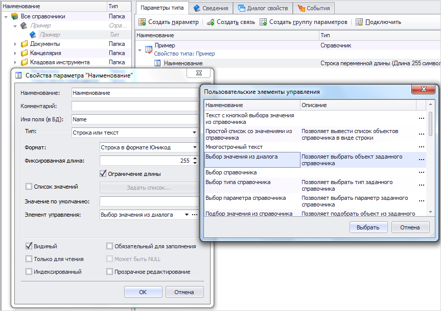
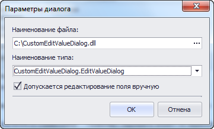
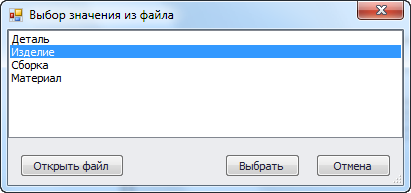

В T-FLEX DOCs имеется возможность подключения пользовательских диалогов для выбора значений параметров объектов. Ниже приведен пример создания такого диалога.

Пример диалога выбора значения параметра.

В диалоге свойств параметра объекта имеется возможность изменить элемент управления для выбора значения параметра.
Один из вариантов элемента управления - выбор значения из диалога.

Список элементов управления для выбора значения параметра.

В настройках этого элемента управления нужно указать путь к сборке со страницами диалогов T-FLEX DOCs и имя класса, описывающего нужный диалог.

Параметры диалога.

В качестве примера рассмотрим диалог выбора значения параметра, позволяющий получить значение из текстового файла, выбранного пользователем.

Внешний вид диалога.

Исходный код примера с комментариями представлен ниже.

C#

```csharp
/* Дополнительные библиотеки
DevExpress.Utils.v20.1.dll
System.Drawing.dll
System.Windows.Forms.dll
TFlex.DOCs.Common.dll
TFlex.DOCs.Model.dll
TFlex.DOCs.UI.Common.dll
TFlex.DOCs.UI.Controls.dll
TFlex.DOCs.UI.Objects.dll
TFlex.DOCs.UI.Types.dll*/

using System;
using System.ComponentModel;
using System.IO;
using System.Linq;
using System.Windows.Forms;
using System.Xml.Serialization;
using TFlex.DOCs.Model.Configuration;
using TFlex.DOCs.UI.Common.Templates;
using TFlex.DOCs.UI.Controls.RepositoryManagers;
using TFlex.DOCs.UI.Objects.Settings;

namespace CustomEditValueDialog
{
    public class EditValueDialog :
        BaseDialog,
        IEditValueDialogView
    {
        private ListBox _listBox1;
        private Button _btnOpenFile;
        private Button _btnOk;
        private Button _btnCancel;

        // Первоначальное значение параметра
        private object _value;

        public EditValueDialog()
        {
            // Добавляем описание настроек для работы сериализатора
            XmlSerializerManager.RegisterType(typeof(ExampleEditValueDialogSettingData));
            InitializeComponent();
        }

        // Возвращает или задает выбранное в списке значение
        public object SelectedValue
        {
            get
            {
                return _listBox1.SelectedItem;
            }
            set
            {
                SetSelectedValue(value);
            }
        }

        // Обработчик события нажатия на кнопку "Открыть файл"
        private void btnOpenFile_Click(object sender, EventArgs e)
        {
            using (var dialog = new OpenFileDialog())
            {
                dialog.Filter = "Текстовые файлы|*.txt";

                if (dialog.ShowDialog(this) == DialogResult.OK)
                {
                    FilePath = dialog.FileName;
                    FillListEditFromFile();
                    SetSelectedValue(_value);
                }
            }
        }

        // Заполняет список строками из файла
        private void FillListEditFromFile()
        {
            if (!string.IsNullOrEmpty(FilePath) && File.Exists(FilePath))
            {
                var lines = File.ReadAllLines(FilePath).Cast<object>().ToArray();
                _listBox1.Items.Clear();
                _listBox1.Items.AddRange(lines);
            }
        }

        // Устанавливает указанное значение в качестве выбранного значения списка (в случае, если оно есть в списке)
        // value - Значение
        private void SetSelectedValue(object value)
        {
            if (value != null)
            {
                int idx = _listBox1.FindString(value.ToString());

                if (idx != -1)
                    _listBox1.SetSelected(idx, true);
            }
        }

        #region IEditValueDialogView

        // Возвращает значение для записи в параметр DOCs
        object IEditValueDialogView.GetResultValue()
        {
            return SelectedValue;
        }

        // Инициализирует диалог текущим значением параметра DOCs
        // value - Значение параметра DOCs
        // returns: Значение true, если инициализация прошла успешно; в противном случае - значение false
        bool IEditValueDialogView.InitializeValue(object value)
        {
            _value = value;
            return true;
        }

        #endregion

        #region Хранимые настройки диалога

        // Возвращает или задает путь к файлу
        public string FilePath { get; private set; }

        protected override IWindowSettings CreateSettings()
        {
            return new PersistWindowSettings<ExampleEditValueDialogSettingData>(this);
        }

        // Сохраняет настройки диалога
        public override void SaveSettings()
        {
            SettingData.ValueListFilePath = FilePath;
            base.SaveSettings();
        }

        // Загружает настройки диалога
        public override void LoadSettings()
        {
            base.LoadSettings();
            FilePath = SettingData.ValueListFilePath;
            FillListEditFromFile();
            SelectedValue = _value;
        }

        // Объект, хранящий настройки диалога
        [Browsable(false), DesignerSerializationVisibility(DesignerSerializationVisibility.Hidden)]
        public ExampleEditValueDialogSettingData SettingData
        {
            get
            {
                return Settings.Data as ExampleEditValueDialogSettingData;
            }
        }

        // Класс, описывающий сохраняемые настройки диалога
        [XmlType("ExampleEditValueDialogSettingData")]
        public class ExampleEditValueDialogSettingData : PersistWindowSettingsData
        {
            [XmlAttribute]
            public string ValueListFilePath { get; set; }
        }

        #endregion

        private void InitializeComponent()
        {
            _listBox1 = new ListBox();
            _btnOpenFile = new Button();
            _btnOk = new Button();
            _btnCancel = new Button();
            SuspendLayout();
            //
            // _listBox1
            //
            _listBox1.Anchor = AnchorStyles.Top | AnchorStyles.Bottom | AnchorStyles.Left | AnchorStyles.Right;
            _listBox1.FormattingEnabled = true;
            _listBox1.Location = new System.Drawing.Point(0, 0);
            _listBox1.Name = "_listBox1";
            _listBox1.Size = new System.Drawing.Size(536, 225);
            _listBox1.TabIndex = 0;
            //
            // _btnOpenFile
            //
            _btnOpenFile.Anchor = AnchorStyles.Bottom | AnchorStyles.Left;
            _btnOpenFile.Location = new System.Drawing.Point(12, 231);
            _btnOpenFile.Name = "_btnOpenFile";
            _btnOpenFile.Size = new System.Drawing.Size(104, 23);
            _btnOpenFile.TabIndex = 1;
            _btnOpenFile.Text = "Открыть файл";
            _btnOpenFile.UseVisualStyleBackColor = true;
            _btnOpenFile.Click += btnOpenFile_Click;
            //
            // _btnOk
            //
            _btnOk.Anchor = AnchorStyles.Bottom | AnchorStyles.Right;
            _btnOk.DialogResult = DialogResult.OK;
            _btnOk.Location = new System.Drawing.Point(358, 231);
            _btnOk.Name = "_btnOk";
            _btnOk.Size = new System.Drawing.Size(75, 23);
            _btnOk.TabIndex = 2;
            _btnOk.Text = "Выбрать";
            _btnOk.UseVisualStyleBackColor = true;
            //
            // _btnCancel
            //
            _btnCancel.Anchor = AnchorStyles.Bottom | AnchorStyles.Right;
            _btnCancel.DialogResult = DialogResult.Cancel;
            _btnCancel.Location = new System.Drawing.Point(449, 231);
            _btnCancel.Name = "_btnCancel";
            _btnCancel.Size = new System.Drawing.Size(75, 23);
            _btnCancel.TabIndex = 3;
            _btnCancel.Text = "Отмена";
            _btnCancel.UseVisualStyleBackColor = true;
            //
            // EditValueDialog
            //
            ClientSize = new System.Drawing.Size(536, 262);
            Controls.Add(_btnCancel);
            Controls.Add(_btnOk);
            Controls.Add(_btnOpenFile);
            Controls.Add(_listBox1);
            Name = "EditValueDialog";
            ShowIcon = false;
            Text = "Выбор значения из файла";
            ResumeLayout(false);
        }
    }
}
```csharp
[