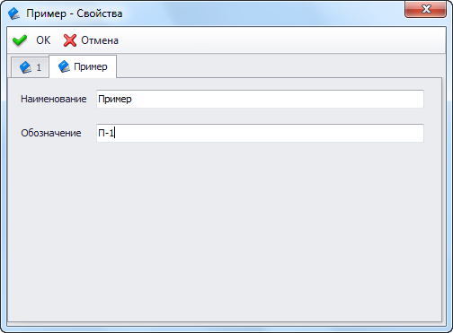

В T-FLEX DOCs существует возможность подключать к диалогу свойств объекта внешние пользовательские страницы. Ниже приведен пример создания такой страницы.

Пример внешней страницы диалога свойств объектаСтраница диалога

```

csharp
/* Дополнительные библиотеки
DevExpress.Offece.v20.1.Core.dll
DevExpress.Utils.v20.1.dll
System.Drawing.dll
System.Windows.Forms.dll
TFlex.DOCs.Model.dll
TFlex.DOCs.UI.Controls.dll
TFlex.DOCs.UI.Objects.dll
TFlex.DOCs.UI.Types.dll
 */

using System;
using System.Windows.Forms;
using TFlex.DOCs.UI.Controls.LayoutControls;
using TFlex.DOCs.Model.References;
using TFlex.DOCs.UI.Objects.ReferenceModel;

namespace CustomPropertyDialogPage
{
    public class MyPage : DesignLayoutPage
    {
        private TextBox _tbName;
        private TextBox _tbDenotation;
        private Label _labelName;
        private Label _labelDenotation;

        public MyPage()
        {
            InitializeComponent();
        }

        // Возвращает или задает объект диалога свойств
        public ReferenceUIObject ReferenceUiObject { get; private set; }

        // Возвращает объект справочника, отображаемый в диалоге
        public ReferenceObject ReferenceObject
        {
            get
            {
                return ReferenceUiObject == null ? null : ReferenceUiObject.ReferenceObject;
            }
        }

        // Возвращает справочник, в который входит текущий объект
        public Reference Reference
        {
            get
            {
                return ReferenceObject == null ? null : ReferenceObject.Reference;
            }
        }

        // Возвращает или задает наименование объекта
        public string ObjectName
        {
            get
            {
                return _tbName.Text;
            }
            set
            {
                _tbName.Text = value;
            }
        }

        // Возвращает или задает обозначение объекта
        public string ObjectDenotation
        {
            get
            {
                return _tbDenotation.Text;
            }
            set
            {
                _tbDenotation.Text = value;
            }
        }

        // Инициализирует страницу диалога свойств объекта
        // uiObject - Объект
        // context - Контекст вызова диалога
        public override void Initialize(TFlex.DOCs.UI.Objects.IObject uiObject, TFlex.DOCs.UI.Controls.Templates.ControlActionContext context)
        {
            base.Initialize(uiObject, context);
            ReferenceUiObject = uiObject as ReferenceUIObject; //Получаем объект диалога
            SetDataToPage();
        }

        // Вызывается при заполнении полей диалога данными объекта
        public override void SetDataToPage()
        {
            base.SetDataToPage();
            if (ReferenceObject == null)
                throw new ArgumentNullException("ReferenceObject");
            ObjectName = ReferenceObject.GetObjectValue("[Наименование]").ToString();
            ObjectDenotation = ReferenceObject.GetObjectValue("[Обозначение]").ToString();
        }

        // Вызывается при заполнении параметров объекта данными из диалога
        public override void ReadPageData()
        {
            base.ReadPageData();

            if (Reference == null)
                throw new ArgumentNullException("Reference");

            var nameParamInfo = Reference.ParameterGroup.OneToOneParameters.FindByName("Наименование");
            ReferenceObject[nameParamInfo].Value = ObjectName;
            var denotParamInfo = Reference.ParameterGroup.OneToOneParameters.FindByName("Обозначение");
            ReferenceObject[denotParamInfo].Value = ObjectDenotation;
        }

        private void InitializeComponent()
        {
            _tbName = new TextBox();
            _tbDenotation = new TextBox();
            _labelName = new Label();
            _labelDenotation = new Label();
            SuspendLayout();
            //
            // tbName
            //
            _tbName.Anchor = AnchorStyles.Top | AnchorStyles.Left | AnchorStyles.Right;
            _tbName.Location = new System.Drawing.Point(98, 13);
            _tbName.Name = "_tbName";
            _tbName.Size = new System.Drawing.Size(218, 21);
            _tbName.TabIndex = 0;
            //
            // tbDenotation
            //
            _tbDenotation.Anchor = AnchorStyles.Top | AnchorStyles.Left | AnchorStyles.Right;
            _tbDenotation.Location = new System.Drawing.Point(98, 51);
            _tbDenotation.Name = "_tbDenotation";
            _tbDenotation.Size = new System.Drawing.Size(218, 21);
            _tbDenotation.TabIndex = 1;
            //
            // labelName
            //
            _labelName.AutoSize = true;
            _labelName.Location = new System.Drawing.Point(12, 16);
            _labelName.Name = "_labelName";
            _labelName.Size = new System.Drawing.Size(80, 13);
            _labelName.TabIndex = 2;
            _labelName.Text = "Наименование";
            //
            // labelDenotation
            //
            _labelDenotation.AutoSize = true;
            _labelDenotation.Location = new System.Drawing.Point(12, 54);
            _labelDenotation.Name = "_labelDenotation";
            _labelDenotation.Size = new System.Drawing.Size(74, 13);
            _labelDenotation.TabIndex = 3;
            _labelDenotation.Text = "Обозначение";
            //
            // MyPage
            //
            Controls.Add(_labelDenotation);
            Controls.Add(_labelName);
            Controls.Add(_tbDenotation);
            Controls.Add(_tbName);
            IsReadOnly = false;
            Name = "MyPage";
            PropertiesInDesign = "ReferenceId=00000000-0000-0000-0000-000000000000;ParameterGroupGuid=00000000-0000" +
                                 "-0000-0000-000000000000;IsReadOnly=False;AutoConnect=False;";
            Size = new System.Drawing.Size(335, 86);
            ResumeLayout(false);
            PerformLayout();
        }
    }
}
```