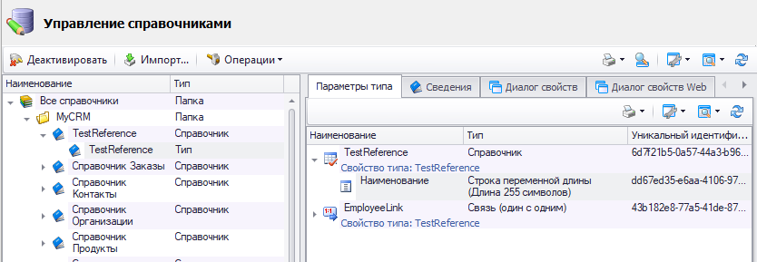
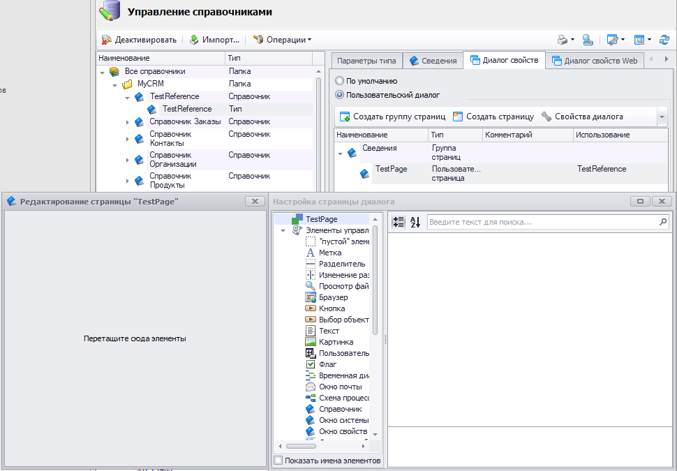
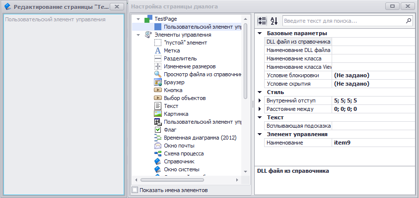
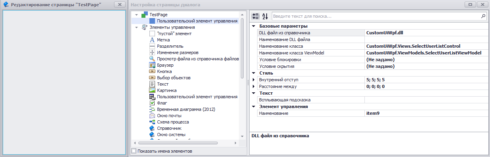
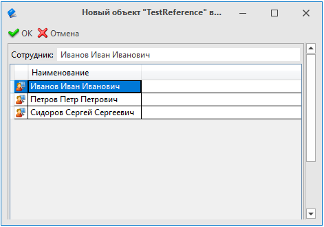

В T-FLEX DOCs имеется возможность создания пользовательских элементов управления для использования в диалогах и пользовательских страницах. Ниже приведен пример создания такого элемента управления.

Пример элемента управления пользователя

Для реализации пользовательского элемента управления необходимо:

1. Создать новый .NET Framework проект - Библиотека классов
2. В новом проекте подключить ссылки на библиотеки T-FLEX DOCs, которые расположены в
   каталоге с установленным клиентом "{Ваш путь до места установки}\Program", а также необходимые зависимости .NET Framework:

   - TFlex.DOCs.Model.dll;
   - TFlex.DOCs.IoC.Infrastructure.dll;
   - TFlex.DOCs.UI.Client.dll;
   - TFlex.DOCs.UI.Client.Common.dll;
   - TFlex.DOCs.UI.Utils.dll;
   - TFlex.DOCs.UI.Utils.Common.dll;
   - WindowsBase.dll;
   - PresentationCore.dll;
   - PresentationFramework.dll;
   - System.Xaml.dll;
   - System.Xml.dll;
   - System.dll;
   - System.Core.dll
3. Удалить новый сгенерированный файл класса "Class1.cs" и создать 2 новых каталога в проекте: Views; ViewModels
4. Создать в папке ViewModels новый класс, код которого расположен ниже
5. Создать новый элемент "Пользовательский элемент управления (WPF)" в папке Views, код которого расположен ниже
Пример кода ViewsModels

```

```csharp
using System;
using System.Collections.Generic;
using System.Collections.ObjectModel;
using System.Linq;
using System.Threading;
using TFlex.DOCs.Model;
using TFlex.DOCs.Model.References;
using TFlex.DOCs.Model.References.Users;
using TFlex.DOCs.UI.Client.Common.ViewModels.Base;
using TFlex.DOCs.UI.Client.Common.ViewModels.Layout.Common;
using TFlex.DOCs.UI.Client.Common.ViewModels.References;
using TFlex.DOCs.UI.Utils.Helpers;

namespace CustomUiWpf.ViewModels
{
    public class SelectUserListViewModel : ViewModel, IUserControlViewModel
    {
        /// <summary> Наименование выбранного пользователя </summary>
        private string _selectedUserName;

        /// <summary> Выбранный пользователь в списке доступных пользователей </summary>
        private UserViewModel _selectedUser;

        /// <summary> Объект справочника "TestReference"</summary>
        private ReferenceObject _referenceObject;

        /// <summary> Guid справочника "TestReference" </summary>
        private readonly Guid _referenceGuid = new("6d7f21b5-0a57-44a3-b96e-1afd15c52368");

        /// <summary> Guid связи N:1 "EmployeeLink" типа "Пользователи" справочника "TestReference" на "Группы и пользователи"</summary>
        private readonly Guid _employeeLinkGuid = new("43b182e8-77a5-41de-87dd-d9aed2f24893");

        public SelectUserListViewModel() : base(null)
        { }

        public SelectUserListViewModel(LayoutViewModel owner) : base(owner)
        { }

        public SelectUserListViewModel(ViewModel owner, ServerConnection connection = null) : base(owner, connection)
        { }

        /// <summary>
        /// Наименование выбранного пользователя
        /// </summary>
        public string SelectedUserName
        {
            get => _selectedUserName;
            set => SetPropertyValue(ref _selectedUserName, value);
        }

        /// <summary>
        /// Выбранный пользователь в списке доступных пользователей
        /// </summary>
        public UserViewModel SelectedUser
        {
            get => _selectedUser;
            set
            {
                SelectedUserName = value == null ? String.Empty : value.FullName;
                SetPropertyValue(ref _selectedUser, value);
                SetUserToLink();
            }
        }

        /// <summary>
        /// Список доступных пользователей
        /// </summary>
        public ObservableCollection<UserViewModel> AvailableUsersList { get; set; } = new ObservableCollection<UserViewModel>();

        public object LoadData(DataObjectViewModel viewModel, CancellationToken cancellationToken)
        {
            ReferenceObject referenceObject = GetReferenceObject(viewModel);

            if (referenceObject is not null)
            {
                var userReference = new UserReference(Connection);

                ReferenceObject userObject = referenceObject.GetObject(_employeeLinkGuid);

                List<User> users = userReference.GetAllUsers().ToList();

                DispatcherHelper.CheckBeginInvokeOnUI(() =>
                {
                    LoadData(userObject, users);
                    _referenceObject = referenceObject;
                });
            }

            return viewModel;
        }

        public void RefreshUI(object loadedData, CancellationToken cancellationToken)
        {
        }

        public void ReadDataToObject(DataObjectViewModel viewModel)
        {
            ReferenceObject referenceObject = GetReferenceObject(viewModel);

            if (referenceObject is null)
                return;

            _referenceObject = referenceObject;

            SetUserToLink();
        }

        // Система определяет возможность редактирования пользовательского ЭУ (к примеру, обработав условия блокировки) и результат передает в данный метод,
        // тем самым позволяя самостоятельно настроить блокировку элементов, входящих в пользовательский ЭУ
        public void SetEditable(bool editable) { }

        private void LoadData(ReferenceObject userObject, List<User> users)
        {
            AvailableUsersList.Clear();
            SelectedUser = null;

            foreach (var user in users)
            {
                var newUser = new UserViewModel { Id = user.SystemFields.Id, FullName = user.FullName };
                AvailableUsersList.Add(newUser);
            }

            if (userObject is User u)
            {
                var newUser = new UserViewModel { Id = u.SystemFields.Id, FullName = u.FullName };
                SelectedUser = newUser;
            }
        }

        private ReferenceObject GetReferenceObject(DataObjectViewModel viewModel)
        {
            if (viewModel is not ReferenceObjectViewModel rvm)
                return null;

            if (rvm.ReferenceObject.Reference.ParameterGroup.Guid != _referenceGuid)
                return null;

            return rvm.ReferenceObject;
        }

        /// <summary>
        /// Установить по связи "Employee" объект справочника "Группы и пользователи"
        /// объекту справочника "TestReference"
        /// </summary>
        private void SetUserToLink()
        {
            if (_referenceObject is null || !_referenceObject.Changing || _selectedUser is null)
                return;

            var userReference = new UserReference(Connection);

            User user = userReference.Find(_selectedUser.Id) as User;

            if (user is not null)
                _referenceObject.SetLinkedObject(_employeeLinkGuid, user);
        }
    }

    public class UserViewModel
    {
        /// <summary>Id объекта справочника "Группы и пользователи"</summary>
        public int Id { get; set; }

        /// <summary>Наименование</summary>
        public string FullName { get; set; }
    }
}
```
```

Пользовательский элемент управления (WPF)XAML

```

```csharp
<
                  UserControl x:Class="CustomUiWpf.Views.SelectUserListControl"
             xmlns="http://schemas.microsoft.com/winfx/2006/xaml/presentation"
             xmlns:x="http://schemas.microsoft.com/winfx/2006/xaml"
             xmlns:mc="http://schemas.openxmlformats.org/markup-compatibility/2006"
             xmlns:tdu="http://schemas.tflex.ru/docs/xaml/utils"
             xmlns:componentModel="clr-namespace:System.ComponentModel;assembly=WindowsBase"
             xmlns:vm="clr-namespace:CustomUiWpf.ViewModels"
             xmlns:d="http://schemas.microsoft.com/expression/blend/2008"
             mc:Ignorable="d"
             d:DesignWidth="220"
             d:DesignHeight="100">
    <UserControl.Resources>
        <ResourceDictionary>
            <CollectionViewSource x:Key="AvailableUsers"
                                  Source="{Binding Path=(vm:SelectUserListViewModel.AvailableUsersList)}">
                <CollectionViewSource.SortDescriptions>
                    <componentModel:SortDescription PropertyName="FullName" />
                </CollectionViewSource.SortDescriptions>
            </CollectionViewSource>
        </ResourceDictionary>
    </UserControl.Resources>
    <Border Margin="1" BorderThickness="1" BorderBrush="DarkGray">
        <Grid Margin="2">
            <Grid.ColumnDefinitions>
                <ColumnDefinition Width="Auto"/>
                <ColumnDefinition></ColumnDefinition>
            </Grid.ColumnDefinitions>
            <Grid.RowDefinitions>
                <RowDefinition Height="Auto" MinHeight="25" />
                <RowDefinition/>
            </Grid.RowDefinitions>

            <TextBlock Grid.Column="0" Grid.Row="0"  Foreground="Black" VerticalAlignment="Center" Margin="2"
                       Text="Сотрудник:"/>

            <TextBox Grid.Column="1" Grid.Row="0" Margin="2 3 2 3" IsReadOnly="True"
                          Text="{Binding Path=(vm:SelectUserListViewModel.SelectedUserName)}"/>

            <DataGrid Grid.Column="0" Grid.ColumnSpan="2" Grid.Row="1"
                      AutoGenerateColumns="False"
                      CanUserAddRows="False"
                      CanUserSortColumns="False"
                      SelectionMode="Single"
                      IsReadOnly="True"
                      SelectedItem="{Binding Path=(vm:SelectUserListViewModel.SelectedUser)}"
                      ItemsSource="{Binding Source={StaticResource AvailableUsers}}">
                <DataGrid.Columns>
                    <DataGridTemplateColumn Width="18" CanUserResize="False" CanUserSort="False">
                        <DataGridTemplateColumn.CellTemplate>
                            <DataTemplate>
                                <Image Source="{tdu:IconSource Name=UsersMonitor, Type=ImageSource}" />
                            </DataTemplate>
                        </DataGridTemplateColumn.CellTemplate>
                    </DataGridTemplateColumn>
                    <DataGridTextColumn Binding="{Binding FullName}" Header="Наименование"/>
                </DataGrid.Columns>
            </DataGrid>

        </Grid>
    </Border>
</UserControl>
```
```

Пример добавления пользовательского элемента управления в диалог свойств справочника

1. Импортировать собранную сборку в справочник "Файлы"
2. Перейти в "Управление справочниками", выбрать тип нужного нам справочника

   
3. Открыть настройку редактирования пользовательской страницы на вкладке "Диалог свойств"

   
4. Перенести на пользовательскую страницу и добавить "Пользовательский элемент управления"

   
5. Указать настройки - "DLL файл из справочника", "Наименование класса" и "Наименование класса ViewModel"

   
6. Открыть диалог свойств, где расположен пользовательский элемент управления

   